# STM32

## 1、STM32基础介绍

* **STM32F103C8T6**


* **STM32外设**


* GPIO：通用的IO口


* 芯片命名规则：


* 启动配置


## 2、STM32工程项目建立


## 3、GPIO的基本结构

### 3.0 什么是输入和输出

- **输入（Input）**：指 STM32 通过特定的引脚**接收外部信号**。外部设备（如按键、传感器等）产生的电信号可以**通过这些引脚**传输到 STM32 内部，STM32 根据接收到的信号进行相应的处理。
- **输出（Output）**：则是 STM32 **通过引脚向外部设备发送信号**。STM32 可以**控制这些引脚输出不同的电平**（高电平或低电平），从而驱动外部设备（如 LED 灯、继电器等）工作。


### 3.1 APB2APB2外设总线

>其中左边的是APB2外设总线,也就是stm32系统结构图的如下位置：


***

* 在STM32中，所有的GPIO都是挂载在APB2外设总线上的

* 每个GPIO外设，总共有16的引脚，编号是从0到15

### 3.2 GPIO引脚


### 3.3 GPIO引寄存器

>在每个GPI0模块内，主要包含了寄存器和驱动器这些东西
>
>寄存器就是一段特殊的存储器，内核可以通过APB2总线对寄存器进行读写

* 寄存器奇存器的每一位对应一个引脚,如下图：


输出寄存器写1，对应的引脚就会输出高电平，写0，就输出低电平

读取也是同一个道理


>
>
>因为STM32是32位的单片机，所以STM32内部的寄存器都是32位的
>
>但这个端口只有16位，所以这个寄存器只有低16位对应的有端口


### 3.4 驱动器

>
>
>驱动器来负责增大驱动能力

## 4、GPIO位结构


 >
 >
 >左边是寄存器，中间是驱动器，右边是IO口


>上面是输入部分，下面是输出部分


### 4.1 IO口输入


>
>
>两个保护二极管，这个是对输入电压进行限幅的
>
>上面这个二极管接VDD，3.3V，下面接VSS，0V

1、如果 **输入电压** 比3.3V还要高，那上方这个二极管就会导通,输入电压产生的电流就会直接流入VDD,而不会流入内部电路,这样可以避免过高的电屈对内部这些电路产生伤害，如图：


2、如果输入电压比0V还要低，电流会从VSS直接流出去，而不会从内部电路汲取电流，也是可以保护内部电路的。


3、如果输入电压在0~3.3V之间，那两个二极管均不会导通，这时二极管对电路没有影响，**这就是保护二极管的用途**


### 4.2 上拉与下拉电阻

>具体解释可跳转 6.4.3上下拉电阻和分压原理
>
>


>
>
>如果上面导通、下面断开，就是上拉输入模式


>
>
>如果下面导通、上面断开，就是下拉输入模式

>如果两个都断开，就是浮空输入模式


* 上下拉电阻的实际作用在于，如果输入啥都不接，这时输入就会处于一种浮空的状态，引脚的输入电平极易受外界干扰而改变
* 如果接入上拉电阻，当引脚悬空时，**还有上拉电阻来保证引脚的高电平，如图：**

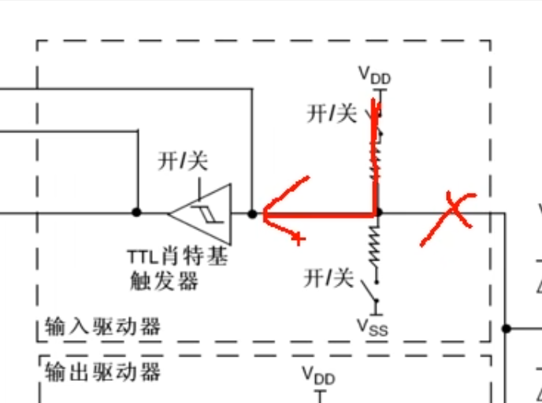

>上拉电阻是将不确定的信号通过一个电阻连接到电源，以保证在无信号输入或信号输入状态不确定时，引脚能够处于确定的高电平状态。
>
>正因如此，所以上拉输入可以称作是默认为高电平的输入模式


>下拉电阻同理


### 4.3 施密特触发器

* 这个施密特触发器的作用就是**对输入电压进行整形的**

>它的执行逻辑是，如果输入电压大于某一阀值，输出就会瞬间升为高电平
>
>如果输入电压小于某一阈值，输出就会瞬间降为低电平


### 4.4 连接到片上外设的端口


* 其中有模拟输入，这个是连接到ADC上的，因为ADC需要接收模拟量，所以这根线是接到施密特触发器**前面**的，如图：


* 另一个是复用功能输入，这个是连接到其他需要读取端口的外设上的，比如串口的输入引脚等，这根线接收的是数字量，所以在施密特触发器**后面**。

### 4.5 输出部分


1、如果选择通过**输出数据寄存器**进行控制，就是普通的IO口输出

>写这个数据寄存器的某一位就可以操作对应的某个端口了

>
>
>注意，这个输出数据奇存器只能同时控制16个端口，并且这个寄存器只能整体读写


2、**位设置/清除寄存器**，这个可以用来单独操作输出数据寄存器的某一位，而不影响其它位

>
>
>如果我们要对某一位进行置1的操作，在位设置寄存器的对应位写1即可,剩下不需要操作的位写0
>
>这样就会自动将输出数据寄存器中对应位置为1，而剩下写0的位则保持不变


* 如果想对某一位进行清0的操作，就在**位清除寄存器**的对应位写1即可


### 4.6 MOS管

>
>
>输出控制之后就接到了两个MOS管


>
>
>这个MOS管就是一种电子开关,信号来控制开关的导通和关闭，开关负责将IO口接到VDD或者VSS
>
>在这里可以选择推挽、开漏或关闭三种输出方式


1、在推挽输出模式下，P-MOS和N-MOS均有效

* 数据寄存器为1时，上管导通，下管断开，输出直接接到VDD，就是输出高电平


* 数据寄存器为0时，上管断开，下管导通，输出直接接到VSS，
  就是输出低电平


>
>
>这种模式下。高低电平均有较强的驱动能力。所以推挽输出模式也可以叫强推输出模式


2、在**开漏输出模式**下，这个**P-MOS**是无效的，只有**N-MOS**在工作

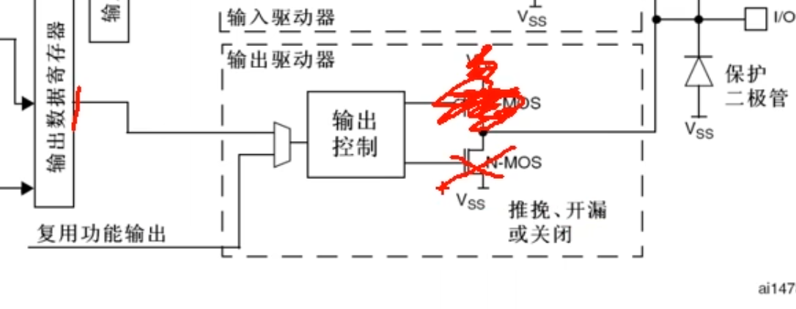

* 当数据寄存器为1时，下管断开，这时输出相当于断开，也就是高阻模式
* 数据寄存器为0时，下管导通，输出直接接到VSS，也就是输出低电平


>
>
>开漏模式可以作为通信协议的驱动方式,在多机通信的情况下，这个模式可以避免各个设备的相互干扰

 

* 另外开漏模式还可以用于输出5V的电平信号

>当输出低电平时，由内部的N-MOS直接接VSS
>
>
>
>当输出高电平时，由外部的上拉电阻拉高至5V,这样就可以输出5V的电平信号，用于兼容一些5V电平的设备


### 4.7 GPIO工作模式


## 5、STLINK与单片机

>首先将STLINK与USBch340的驱动安装好
>
>然后使用杜邦线将STLINK与stm32最小系统版按照手册连接：

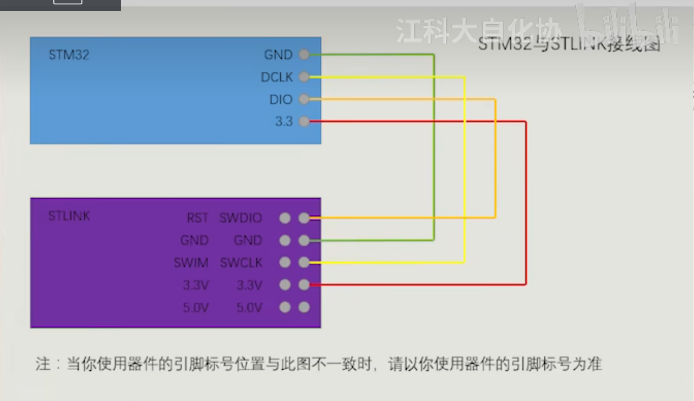

如图：


6.1寄存器点亮PC13

```c
#include "stm32f10x.h"                  

int main(void)
{
	RCC->APB2ENR = 0X00000010;
	GPIOC->CRH = 0X00300000;
	GPIOC->ODR = 0X00002000;
	while (1)
	{
	
	}	
}

```

6.2库函数点亮

```c
#include "stm32f10x.h"                  // Device header

int main(void)
{
	RCC_APB2PeriphClockCmd(RCC_APB2Periph_GPIOC,ENABLE);
	GPIO_InitTypeDef GPIO_InitStructure;	//定义GPIO结构体
	GPIO_InitStructure.GPIO_Mode = GPIO_Mode_Out_PP;
	GPIO_InitStructure.GPIO_Pin = GPIO_Pin_13;
	GPIO_InitStructure.GPIO_Speed = GPIO_Speed_50MHz; 
	
	GPIO_Init(GPIOC,&GPIO_InitStructure);
	GPIO_SetBits(GPIOC, GPIO_Pin_13);//置为高电平，灯灭
	//GPIO_ResetBits(GPIOC, GPIO_Pin_13); //置为低电平
	while (1)
	{
	
	}	
}

```


## 6、面包板实现电路连接

#### 6.1 点亮单个LED

>电源点亮LED


>接线图如下：


使用跳线将上下4排供电引脚通过最小系统板获取电源：


如图：


>在keil中创建完工程文件之后，如下：

>操作STM32的GPIO总共需要3个步骤：
>
>1、第一步，使用RCC开启GPIO的时钟
>
>2、使用GPlO_Init函数初始化GPIO
>
>3、使用输出或者输入的函数控制GPIO口

```c
RCC_APB2PeriphClockCmd(RCC_APB2Periph_GPIOA,ENABLE);
```

>首先开启APB2外设时钟，注意参数中，第一个是GPIOA，因为我们面包板上LED连接的是A0口，然后使能ENABLE。这样时钟就开启了

```C
RCC_APB2PeriphClockCmd(RCC_APB2Periph_GPIOA,ENABLE);
	
	GPIO_InitTypeDef GPIO_InitStructure; //定义结构体
	
	GPIO_InitStructure.GPIO_Mode =  GPIO_Mode_Out_PP;
	GPIO_InitStructure.GPIO_Pin = GPIO_Pin_0;
	GPIO_InitStructure.GPIO_Speed = GPIO_Speed_50MHz; 
	GPIO_Init(GPIOA, &GPIO_InitStructure);
```

>
>
>其中，因为我们使用的是GPIOA的0号引脚，所以这里用的是GPIO_Pin_0

> 这个GPIOA外设的0号引脚就自动被配置为推挽输出、50MHz的速度了

LED闪烁代码完整如下：

```c
#include "stm32f10x.h"                  // Device header
#include "Delay.h"

int main(void)	
{
	RCC_APB2PeriphClockCmd(RCC_APB2Periph_GPIOA,ENABLE);
	
	GPIO_InitTypeDef GPIO_InitStructure; //定义结构体
	
	GPIO_InitStructure.GPIO_Mode =  GPIO_Mode_Out_PP;
	GPIO_InitStructure.GPIO_Pin = GPIO_Pin_0;
	GPIO_InitStructure.GPIO_Speed = GPIO_Speed_50MHz; 
	GPIO_Init(GPIOA, &GPIO_InitStructure);
	
	while (1)
	{
		GPIO_WriteBit(GPIOA,GPIO_Pin_0,Bit_RESET); //Bit_RESET是置低电平
		Delay_ms(500);
		GPIO_WriteBit(GPIOA,GPIO_Pin_0,Bit_SET); 
		Delay_ms(500);
	}	
}
```

>注意是LED的长脚接正极，短脚接A0口


#### 6.2 LED流水灯


>
>
>对于8个引脚的选择，可以使用按位或 的操作，GPIO_Pin_0 | GPIO_Pin_1 | GPIO_Pin_2 
>
>因为GPIO_Pin_0 = 0x0001
>
>GPIO_Pin_1 = 0x0002
>
>GPIO_Pin_2 = 0x0004
>
>按照16转2进制后的 按位或运算 ， 可以使得三个端口的位均保持为1，其余位为0

>
>
>直接选择GPIO_Pin_All，可以选择所有的引脚

代码如下：

```C
#include "stm32f10x.h"                
#include "Delay.h" //自己添加延迟函数的头文件C文件

int main(void)	
{
				       RCC_APB2PeriphClockCmd(RCC_APB2Periph_GPIOA,ENABLE);
	
	GPIO_InitTypeDef GPIO_InitStructure; //定义结构体
	
	GPIO_InitStructure.GPIO_Mode =  GPIO_Mode_Out_PP;
	GPIO_InitStructure.GPIO_Pin = GPIO_Pin_All; //这里引脚全选
	GPIO_InitStructure.GPIO_Speed = GPIO_Speed_50MHz; 
	GPIO_Init(GPIOA, &GPIO_InitStructure);
	
	
	
	while (1)
	{
		GPIO_Write(GPIOA,~0X0001); //因为低电平点亮，所以全部按位取反
		Delay_ms(500);
		GPIO_Write(GPIOA,~0X0002);
		Delay_ms(500);
		GPIO_Write(GPIOA,~0X0004);
		Delay_ms(500);
		GPIO_Write(GPIOA,~0X0008);
		Delay_ms(500);
		GPIO_Write(GPIOA,~0X0010);
		Delay_ms(500);
		GPIO_Write(GPIOA,~0X0020);
		Delay_ms(500);
		GPIO_Write(GPIOA,~0X0040);
		Delay_ms(500);
		GPIO_Write(GPIOA,~0X0080);
		Delay_ms(500);
	}	
}
```

图片如下：


#### 6.3 蜂鸣器


接线如下：


代码如下：

```C
#include "stm32f10x.h"                  // Device header
#include "Delay.h"

int main(void)	
{
	RCC_APB2PeriphClockCmd(RCC_APB2Periph_GPIOB,ENABLE);
	
	GPIO_InitTypeDef GPIO_InitStructure; //定义结构体
	
	GPIO_InitStructure.GPIO_Mode =  GPIO_Mode_Out_PP;
	GPIO_InitStructure.GPIO_Pin = GPIO_Pin_12; 
	GPIO_InitStructure.GPIO_Speed = GPIO_Speed_50MHz; 
	GPIO_Init(GPIOB, &GPIO_InitStructure);

	while (1)
	{
		GPIO_ResetBits(GPIOB,GPIO_Pin_12);
		Delay_ms(500);
		GPIO_SetBits(GPIOB,GPIO_Pin_12);
		Delay_ms(500);
		
	}	
}
```


#### 6.4 按键

##### 6.4.1 按键抖动


>最简单的处理方法，加一段延时，略过这个抖动时间即可


##### 6.4.2 传感器模块


>
>
>但电阻的变化不容易直接被观察，所以我们通常将传感器元件与定值电阻进行串联分压
>
>这样就可以得到模拟电压的输出了，对电路来说，检测电压就非常容易了
>
>另外这个模块还可以通过电压比较器，来对这个模拟电压进行二值化,这样就可以得到数字电压输出了

* 下图是传感器模块的基本电路：


* 对于下图的部分：


* **N1**就是传感器元件所代表的的可变电阻，它的阻值可以根据环境的光线、温度等模拟量进行变化

* **R1**，是和N1进行分压的定值电阻

>R1和N1串联，一端接在VCC正极，一端接在GND负极，构成了基本的分压电路

* 左边这个**C2**是一个滤波电容，它是为了给中间的电压输出进行滤波的

##### 6.4.3 上下拉电阻和分压原理

>用**分压定理**来分析一下传感器电阻的阻值变化对输出电压的影响：

>
>
>1、当这个N1阻值变小时，下拉作用就会增强，中间的AO端的电压就会拉低
>
>极端情况下，N1阻值为0，AO输出被完全下拉，输出0v


>
>
>当N1阻值变大，下拉作用就会减弱，中间的引脚由于R1的上拉作用，电压就会升高


>
>
>极端情况下，N1阻值无穷大，相当于断路，输出电压被R1拉高至VCC

* 简而言之，AO处的电压就是N1的分压，N1的阻值越大，串联分压的电压也就越大，AO的分压也就越高

* 也就是**串联分压**

##### 6.4.4 按键的接法


**图1：**

>当按键按下时，PA0被直接下拉到GND，此时读取PA0口的电压就是低电平
>
>当按键松手时，PA0被悬空，引脚电压会不确定，所以在这种接法下，必须要求PA0是**上拉输入**的模式，否则会出现引脚电压不确定的错误现象

* 如果PA0是上拉输入模式，引脚再悬空，PA0就是高电平


>
>
>所以这种方式下，按下按键，引脚为低电平，松手，引脚为高电平


**图2：**

相比较第一个图，在这里外部接了一个上拉电阻


>
>
>将上拉电阻想成一个弹簧，将端口向上拉
>
>当按键松手时，引脚由于上拉作用，自然保持为高电平


>当按键按下时，引脚直接接到GND，也就是一股无穷大的力把这个引脚往下拉
>
>弹簧肯定对抗不了无穷大的力，所以引脚就为低电平


* 这种状态下，引脚不会出现悬空状态
* 所以此时PA0引脚可以配置为浮空输入或者上拉输入


**图3：**(用得少)

>PA0通过按键接到3.3V


* 要求PA0必须要配置成**下拉输入**的模式


当按键按下时，引脚为高电平，松手时，引脚回到默认值低电平


**图4(用的少)：**

>外置了下拉电阻
>
>这个接法PA0需要配置为下拉输入模式或者浮空输入模式


##### 6.4.5 C语言类型拓展


#### 6.5按键控制LED

>接线图如下：


* 按键一端接GPIO口，另一端接GND，这是图1的接法
* 两个LED分别接在了PA1和PA2两个口上，LED一端接GPIO口，另一端接VCC，就是低电平点亮的接法


>可以看到，这里的引脚一端接的是B11和B1的口，另一端接入的则是GND
>
>这时按下按键，引脚电平为0，是低电平有效


##### 6.5.1代码部分

>
>
>创建完工程后，需要在这个工程上完成LED和按键的驱动代码
>
>但是如果把这两部分驱动代码都混在主函数里面，那代码就太乱了，不容易管理，也不容易移植，所以对于这种驱动代码而言，我们一般都会把它封装起来，单独放在另外的.c和h文件里
>
>这就是模块化编程的方式

>
>
>具体就是 ，在工程文件夹创建一个Hardware文件夹，在keil中，新建一个组，将Hardware添加，让后照常添加路径，最后就可以在keil中在Hardware中添加 .C.h文件了


* 在LED.h中：

```C
#ifndef __LED_H //如果没有定义LED这个字符串
#define __LED_H //那么就定义这个字符串
 
void LED_Init(void);
#endif	

```


* 在LED.C中：初始化LED的函数如下：

```C
#include "stm32f10x.h"                  // Device header

void LED_Init(void) //led初始化函数
{
	RCC_APB2PeriphClockCmd(RCC_APB2Periph_GPIOA,ENABLE); 
	
	GPIO_InitTypeDef GPIO_InitStructure;
	GPIO_InitStructure.GPIO_Mode = GPIO_Mode_Out_PP ;
	GPIO_InitStructure.GPIO_Pin = GPIO_Pin_1 | GPIO_Pin_2;
	GPIO_InitStructure.GPIO_Speed = GPIO_Speed_50MHz ;
	GPIO_Init(GPIOA,&GPIO_InitStructure);
	//因为LED初始化默认低电平，这样可以让LED一开始不亮
	GPIO_SetBits(GPIOA,GPIO_Pin_1 | GPIO_Pin_2); 

}

```

* LED的点亮函数：

```C
void LED1_ON(void)
{
	GPIO_ResetBits(GPIOA,GPIO_Pin_1);
}

void LED2_ON(void)
{
	GPIO_ResetBits(GPIOA,GPIO_Pin_2);
}

void LED1_OFF(void)
{
	GPIO_SetBits(GPIOA,GPIO_Pin_1);
}

void LED2_OFF(void)
{
	GPIO_SetBits(GPIOA,GPIO_Pin_2);
}

```

* 记得还要在.h文件中声明一下


* 按键的代码如下：

  >key.h:

  ```c
  #ifndef __KEY_H
  #define __KEY_H
  
  void Key_Init(void);
  uint8_t Key_GetNum(void);
  
  #endif
  
  ```

  >Key.c:

```c
#include "stm32f10x.h"           
#include "Delay.h"

void Key_Init(void)
{
RCC_APB2PeriphClockCmd(RCC_APB2Periph_GPIOB,ENABLE);
	
	GPIO_InitTypeDef GPIO_InitStructure ;
	GPIO_InitStructure.GPIO_Mode = GPIO_Mode_IPU; //读取按键，用上拉输入
	GPIO_InitStructure.GPIO_Pin = GPIO_Pin_1 | GPIO_Pin_11 ;
	GPIO_InitStructure.GPIO_Speed = GPIO_Speed_50MHz;
	
	GPIO_Init(GPIOB,&GPIO_InitStructure);

}

uint8_t Key_GetNum(void) //调用这个函数，就可以返回按下按键的键码
{
	uint8_t KeyNum = 0;
	//读取GPIO外部端口值
	//GPIO_ReadInputDataBit()的返回值是输入寄存器某一位的值
	//0代表低电平，1代表高电平
	if(GPIO_ReadInputDataBit(GPIOB,GPIO_Pin_1) == 0)  //0是低电平 即此时按键按下，进入if函数
	{
		Delay_ms(20); //消除抖动
		while(GPIO_ReadInputDataBit(GPIOB,GPIO_Pin_1) == 0); //检测按键是否松手
		Delay_ms(20); //消除松手抖动
		
		KeyNum = 1; //将键码1传递出去
	}
	
	if(GPIO_ReadInputDataBit(GPIOB,GPIO_Pin_11) == 0)  //0是低电平即如果按键按下
	{
		Delay_ms(20); //消除抖动
		while(GPIO_ReadInputDataBit(GPIOB,GPIO_Pin_11) == 0); //检测按键是否松手
		Delay_ms(20); //消除松手抖动
		
		KeyNum = 2; //将键码2传递出去
	}
	return KeyNum;
}
```

>main.c:

```c
#include "stm32f10x.h"                
#include "Delay.h"
#include "LED.h"
#include "Key.h"

uint8_t KeyNum; //全局变量
int main(void)	
{
	LED_Init(); //LED初始化
	Key_Init(); //按键初始化
	
	while (1)
	{
		KeyNum = Key_GetNum(); 
		if(KeyNum == 1)
		{
			LED1_ON();
		}
		if(KeyNum == 2){
			LED1_OFF();
		}
        	}	
}

```

>实现的功能就是，按下B1口的按键，使得KeyNum的值为1，此时LED1点亮，按下B11口的按键，使得KeyNum的值为2，此时LED1熄灭。

图示如下：


* 以上代码是通过2个按键来控制一个LED的开关，现在使用1个按键，通过2次独立的按下，实现一个LED的亮灭

>
>
>在LED.C中定义一个新的翻转函数

```c
//函数逻辑为：如果当前输出寄存器为0，则置1，否则，就置0
void LED1_Turn(void)
{	
	//如果读取输出寄存器的值为0
	if(GPIO_ReadOutputDataBit(GPIOA,GPIO_Pin_1) == 0){
		GPIO_SetBits(GPIOA,GPIO_Pin_1); //把pa1置1
	}
	else
	{
		GPIO_ResetBits(GPIOA,GPIO_Pin_1); //把pa1置0
	}
}

void LED2_Turn(void)
{	
	//如果读取输出寄存器的值为0
	if(GPIO_ReadOutputDataBit(GPIOA,GPIO_Pin_2) == 0){
		GPIO_SetBits(GPIOA,GPIO_Pin_2); //把pa2置1
	}
	else
	{
		GPIO_ResetBits(GPIOA,GPIO_Pin_2); //把pa2置0
	}
}
```

>在main.c中：

```c
while (1)
	{
		KeyNum = Key_GetNum(); 
		if(KeyNum == 1)
		{
			LED1_Turn();
		}
		if(KeyNum == 2){
			LED2_Turn();
		}
    
```

>当按下按键时(按下并松手)，KeyNum被赋值，是1就转到LED1,是2就转到LED2，对于LED1_Turn(),不论此时端口输出寄存器的位是1或0，都会进行翻转
>
>每次对同一个按钮更新KeyNum的值，就会翻转一次，也就是亮灭


#### 6.6光敏电阻控制蜂鸣器

>
>
>接线图如下：


>
>
>在keil中的Hardware文件夹中添加Buzzer.c和Buzzer.h两个文件

* Buzzer.h:

```c
#ifndef __BUZZER_H
#define __BUZZER_H

void Buzzer_Init(void);
void Buzzer_ON(void);
void Buzzer_OFF(void);
void Buzzer_Turn(void);

#endif

```

* 先测试蜂鸣器：
* Buzzer.C:

```C
#include "stm32f10x.h"                

void Buzzer_Init(void) 
{
	RCC_APB2PeriphClockCmd(RCC_APB2Periph_GPIOB,ENABLE); 
	
	GPIO_InitTypeDef GPIO_InitStructure;
	GPIO_InitStructure.GPIO_Mode = GPIO_Mode_Out_PP ;
	GPIO_InitStructure.GPIO_Pin = GPIO_Pin_12;
	GPIO_InitStructure.GPIO_Speed = GPIO_Speed_50MHz ;
	GPIO_Init(GPIOB,&GPIO_InitStructure);
	
	GPIO_SetBits(GPIOB,GPIO_Pin_12); 

}

void Buzzer_ON(void)
{
	GPIO_ResetBits(GPIOB,GPIO_Pin_12);
}

void Buzzer_OFF(void)
{
	GPIO_SetBits(GPIOB,GPIO_Pin_12);
}

void Buzzer_Turn(void)
{	
	
	if(GPIO_ReadOutputDataBit(GPIOB,GPIO_Pin_12) == 0){
		GPIO_SetBits(GPIOA,GPIO_Pin_1);
	}
	else
	{
		GPIO_ResetBits(GPIOB,GPIO_Pin_12); 
	}
}
```

* 在main.C文件中测试：

```c
#include "stm32f10x.h"                  
#include "Delay.h"
#include "Buzzer.h"

int main(void)	
{
	Buzzer_Init(); //初始化蜂鸣器
	while (1)
	{
		Buzzer_ON();
		Delay_ms(500);
		Buzzer_OFF();
		Delay_ms(500);
		Buzzer_Turn();
		Delay_ms(500);
	}	
	
}

```

>可以听到，蜂鸣器此时开始不断发出声音


* 光敏电阻和蜂鸣器结合：使得光线变暗，蜂鸣器鸣叫
* LightSensor.h：

```c
#ifndef __LIGHT_SENSOR_H
#define __LIGHT_SENSOR_H

void LightSensor_Init(void);
uint8_t LightSensor_Get(void);

#endif

```

* LightSensor.c:

```
#include "stm32f10x.h"                

void LightSensor_Init(void)
{
	RCC_APB2PeriphClockCmd(RCC_APB2Periph_GPIOB,ENABLE);
	
	GPIO_InitTypeDef GPIO_InitStructure ;
	GPIO_InitStructure.GPIO_Mode = GPIO_Mode_IPU; //读取按键，用上拉输入
	GPIO_InitStructure.GPIO_Pin = GPIO_Pin_13;
	GPIO_InitStructure.GPIO_Speed = GPIO_Speed_50MHz;
	
	GPIO_Init(GPIOB,&GPIO_InitStructure);

}

//这里读取光敏传感器输入的端口值，直接返回值
uint8_t LightSensor_Get(void)
{
	return GPIO_ReadInputDataBit(GPIOB,GPIO_Pin_13);

}
	
```

* main.c:

```c
#include "stm32f10x.h"             
#include "Delay.h"
#include "Buzzer.h"
#include "LightSensor.h"

int main(void)	
{
	Buzzer_Init(); //初始化蜂鸣器
	LightSensor_Init(); //初始化传感器
	
	while (1)
	{
		if(LightSensor_Get()==1) //光线较暗的情况
		{
			Buzzer_ON();
		}
		else
		{
			Buzzer_OFF();
		}
	}	
}

```

>
>
>最终显现的程序为：光线变弱时，光敏传感器上的一个灯熄灭，同时蜂鸣器开始鸣叫，当光线变强时，蜂鸣器停止鸣叫。

实物图如下：


#### 6.7OLED调试工具


* 调试方法


* 硬件电路：


* OLED驱动函数


##### 6.7.1OLED显示屏的驱动函数模块

* 接线图：


>
>
>OLED的GND和VCC需要接电源的负极和正极，我们可以在OLED的下面，像这样，先插上两根线
>
>把OLED的GND引到负极供电孔，OLED的VCC引l到正极供电孔
>
>另外这个供电孔也会同时接到stm32的PB6和PB7两个引脚，不过这个也是没关系的，我们直接不初始化这两个引脚就行
>
>stm32的引脚上电后，如果不初始化，默认是浮空输入的模式，在这个模式下，引脚不会输出电平，所以不会有什么影响
>
>插好这两个供电跳线之后，再把OLED插到PB6到PB9这四个口
>
>此时OLED的SCL接到PB8，SDA接到PB9


* 接着回到工程文件夹，将准备好的 **4针脚I2C版本** 中的OLED驱动函数模块复制到项目文件的Hardware中即可

如图：


* OLED测试：

```c
#include "stm32f10x.h"                  // Device header
#include "Delay.h"
#include "OLED.h"


int main(void)	
{
	OLED_Init();
	
	OLED_ShowChar(1,1,'A'); //在1行1列显示 A 
	OLED_ShowString(1,3,"helloWorld");
	//在1行3列显示字符串 helloWorld
	while (1)
	{
		
	}	
	
}
```

>效果如图：


## 7、STM32中断


* 代码实例如下：


**当中断条件满足时，主程序就会暂停，然后自动跳转到中断程序里运行**

**中断顺序执行完之后，再返回主程序继续执行**

>
>
>一般中断程序都是在一个子函数里的,这个函数不需要我们调用,
>
>当中断来临时，由硬件自动调用这个函数


### 7.1NVIC嵌套中断向量控制器

>在STMB2中，它是用来统一分配中断优先级和管理中断的
>
>NMIC是一个内核外设，是CPU的小助手


>
>
>一个外设可能会同时占用多个中断通道，所以这里有n条线
>
>NVIC只有一个输出口，NVIC根据每个中断的优先级分配中断的先后顺序
>
>通过右边这一个输出口就告诉CPU，你该处理哪个中断

* 对于中断先后顺序分配的任务，CPU不需要知道


#### 7.1.1NVIC优先级分组

###### 抢占优先级 & 响应优先级

>抢占优先级高的可以中断嵌套，响应优先级高的可以优先排队，抢占优先级和响应优先级均相同的按中断号排队

* 例如：

看病流程，当上一个病人看完病后，来了一个紧急的病人，即使他在排队的最末尾，也可以直接进去看医生，**这种相当于插队的优先级，就叫响应优先级**

依然是看病流程，如果这个病人非常紧急，可以直接取代此时正在看病的病人，**这种形式的优先就是我们之前讲的中断嵌套!，这就是抢占优先级**


### 7.2 EXTI外部中断


* **支持的GPIO口:所有GPIO口，但相同的Pin不能同时触发中断**

>解释：例如PA0和PB0不可以同时用，数字相同的端口不可以同时用作中断

* 触发响应方式:中断响应/事件响应

>事件响应:但是在STM32中，也可以选择触发一个事件,如果选择触发事件，那外部中断的信号就不会通向CPU了
>
>而是通向其它外设,比如触发ADC转换、触发DMA等
>乡 备注用来触发其它外设的操作
>
>总结：中断响应是正常的流程，引脚电平变化触发中断
>
>事件响应不会触发中断，而是触发别的外设操作，属于外设之间的联合工作


#### 7.2.1EXTI基本结构


>
>
>如果每个引脚占用一个通道，那EXTl的16个通道显然就不够用了.所以在这里，会有一个AFIO中断引脚选择的电路模块
>
>这个AFIO就是一个数据选择器,它可以在这前面3个GPIO外设的16个引脚里选择其中一个连接到后面EXTI的通道里

**这也解释了相同的PIN口不能同时触发中断**，因为对于PA0、PB0、PCO这些，通过AFIO选择之后，只有其中一个能接到EXTI的通道0上


* 通过AFIO选择之后的16个通道，就接到了EXTI边沿检测及控制电路上


>
>
>上面的这些,接到了NVIC，是用来触发中断的.
>
>可能ST公司觉得这20个输出大多了，比较占用NVIC的通道资源
>
>所以就把其中外部中断的9 ~  5，和15~  10，给分到一个通道里

* 也就是说，外部中断的9  ~5 会触发同一个中断函数，15~10也会触发同一个中断函数，因此需要再根据标志位来区分到底是哪个中断进来的

>
>
>同时有20条线路用来触发其他外设操作，这就是事件响应


#### 7.2.2EXTI内部框图：


* 首先可以选择哪一种触发方式
* 。。。。。。


#### 7.2.3AFIO复用IO口


>
>
>输入是PA0、PBO、PC0等等, 然后通过数据选择器，最终选择1个，连接到EXTI0上	


>AFIO主要用于引脚复用功能的选择和重定义
>
>也就是数据选择器的作用


>复用功能引脚重映射：
>
>把这些默认复用功能的引脚换到重定义的这个位置来


### 7.3 外部中断：对射式红外传感器计次


>
>
>当我们的挡光片或者编码盘在这个对射式红外传感器中间经过时
>
>这个DO就会输出电平变化的信号
>
>然后这个电平跳变的信号触发STM32 PB14号口的中断
>
>我们在中断函数里，执行变量++的程序,然后主循环里调用OLED显示这个变量

* 配置外部中断的过程


>
>
>从GPIO到NMIC这一路中出现的外设模块都配置好,把这条信号电路给打通，就行了
>
>第一步，配置RCC，把我们这里涉及的外设的时钟都打开,不打开时钟，外设是没法工作的
>
>第二步，配置GPIO，选择我们的端口为输入模式
>
>第三步，配置AFIO，选择我们用的这一路GPIO，连接到后面的EXTI
>
>第四步，配置EXTI，选择边沿触发方式，比如上升沿、下降沿或者双边沿,还有选择触发响应方式，可以选择中断响应和事件响应
>
>第四步，配置NVIC，给我们这个中断选择一个合适的优先级
>
>最后，通过NVIC，外部中断信号就能进入CPU了
>
>这样CPU才能收到中断信号，才能跳转到中断函数里执行中断程序

* 在CountSonsor.C中：

```c
#include "stm32f10x.h"                  // Device header


void CountSensor_Init(void)
{
	RCC_APB2PeriphClockCmd(RCC_APB2Periph_GPIOB,ENABLE);
	
	//开启AFIO的时钟
	RCC_APB2PeriphClockCmd(RCC_APB2Periph_AFIO,ENABLE);
	//EXTI和NVIC外设时钟是一直打开的
	//配置GPIO
	GPIO_InitTypeDef GPIO_InitStructure;
	GPIO_InitStructure.GPIO_Mode = GPIO_Mode_IPU; //上拉输入
	GPIO_InitStructure.GPIO_Pin = GPIO_Pin_14;
	GPIO_InitStructure.GPIO_Speed = GPIO_Speed_50MHz;
	GPIO_Init(GPIOB,&GPIO_InitStructure);
	
	//配置AFIO
	GPIO_EXTILineConfig(GPIO_PortSourceGPIOB,GPIO_PinSource14)
	
}

```

```c
GPIO_EXTILineConfig(GPIO_PortSourceGPIOB,GPIO_PinSource14)
//配置AFIO
```

>
>
>到这里，AFIO外部中断引脚选择配置就完成了，就这一个函数就行了
>
>当执行完这个函数后，AFIO的第14个数据选择器就拨好了
>
>其中输入端被拨到了GPIOB外设上，对应的就是PB14号引脚
>
>输出端固定连接的是T的第14个中断线路
>
>这样..PB14号引脚的电平信号就可以顺利通过AFIO，进入到后级EXTI电路了


* 配置EXTI

```c
//配置EXTI
	EXTI_InitTypeDef EXTI_InitStructure;
	EXTI_InitStructure.EXTI_Line = EXTI_Line14; //PB14所在的线路
	EXTI_InitStructure.EXTI_LineCmd = ENABLE;
	EXTI_InitStructure.EXTI_Mode = EXTI_Mode_Interrupt;//中断模式
	EXTI_InitStructure.EXTI_Trigger = EXTI_Trigger_Falling;
	EXTI_Init(&EXTI_InitStructure);
```

>这样PB14的电平信号就能够通过ETI通向下一级NVIC了

* 配置NVIC

```C
//配置NVIC
	NVIC_PriorityGroupConfig(NVIC_PriorityGroup_2); //优先级分组
	NVIC_InitTypeDef NVIC_InitStructure;
	NVIC_InitStructure.NVIC_IRQChannel = EXTI15_10_IRQn;
	NVIC_InitStructure.NVIC_IRQChannelCmd=enabled;
	NVIC_InitStructure.NVIC_IRQChannelPreemptionPriority=1;
	NVIC_InitStructure.NVIC_IRQChannelSubPriority=1;
	NVIC_Init(&NVIC_InitStructure);
```

* 配置中断函数

```c
//中断函数，中断函数名最好从启动文件复制过来，这样才能进入中断函数
void EXTI15_10_IRQHandler(void)
{
	//首先进行中断标志位，是否是EXTI_14
	if(EXTI_GetITStatus(EXTI_Line14) == SET){
			CountSensor_Count++;
		//每次要将中断标志位清除
		EXTI_ClearITPendingBit(EXTI_Line14);
	}

}
//注，中断函数不需要在头文件中声明，他会自动执行
```


* CountSensor.C:

```c
#include "stm32f10x.h"                  // Device header
uint16_t CountSensor_Count;

void CountSensor_Init(void)
{
	RCC_APB2PeriphClockCmd(RCC_APB2Periph_GPIOB,ENABLE);
	
	//开启AFIO的时钟
	RCC_APB2PeriphClockCmd(RCC_APB2Periph_AFIO,ENABLE);
	//EXTI和NVIC外设时钟是一直打开的
	//配置GPIO
	GPIO_InitTypeDef GPIO_InitStructure;
	GPIO_InitStructure.GPIO_Mode = GPIO_Mode_IPU; //上拉输入
	GPIO_InitStructure.GPIO_Pin = GPIO_Pin_14;
	GPIO_InitStructure.GPIO_Speed = GPIO_Speed_50MHz;
	GPIO_Init(GPIOB,&GPIO_InitStructure);
	
	//配置AFIO
	GPIO_EXTILineConfig(GPIO_PortSourceGPIOB,GPIO_PinSource14);
	//配置EXTI
	EXTI_InitTypeDef EXTI_InitStructure;
	EXTI_InitStructure.EXTI_Line = EXTI_Line14; //PB14所在的线路
	EXTI_InitStructure.EXTI_LineCmd = ENABLE;
	EXTI_InitStructure.EXTI_Mode = EXTI_Mode_Interrupt;//中断模式
	EXTI_InitStructure.EXTI_Trigger = EXTI_Trigger_Falling;
	EXTI_Init(&EXTI_InitStructure);  
	
	//配置NVIC
	NVIC_PriorityGroupConfig(NVIC_PriorityGroup_2); //优先级分组
	NVIC_InitTypeDef NVIC_InitStructure;
	NVIC_InitStructure.NVIC_IRQChannel = EXTI15_10_IRQn;
	NVIC_InitStructure.NVIC_IRQChannelCmd=ENABLE;
	NVIC_InitStructure.NVIC_IRQChannelPreemptionPriority=1;
	NVIC_InitStructure.NVIC_IRQChannelSubPriority=1;
	NVIC_Init(&NVIC_InitStructure);
	
}

uint16_t CountSensor_Get(void)
{
	return CountSensor_Count;
}


//中断函数，中断函数名最好从启动文件复制过来，这样才能进入中断函数
void EXTI15_10_IRQHandler(void)
{
	//首先进行中断标志位，是否是EXTI_14
	if(EXTI_GetITStatus(EXTI_Line14) == SET){
		CountSensor_Count++;
		//每次要将中断标志位清除
		EXTI_ClearITPendingBit(EXTI_Line14);
	}

}
//注，中断函数不需要在头文件中声明，他会自动执行
	

```

* CountSensor.H

```c
#ifndef __COUNT_SENSOR_H
#define __COUNT_SENSOR_H

void CountSensor_Init(void);
uint16_t CountSensor_Get(void);

#endif


```

* main.c:

```c
#include "stm32f10x.h"                  // Device header
#include "Delay.h"
#include "OLED.h"
#include "CountSensor.h"

int main(void)	
{
	OLED_Init();
	CountSensor_Init(); //配置外部中断
	OLED_ShowString(1,1,"COUNT:");

	while (1)
	{	
		OLED_ShowNum(1,7,CountSensor_Get(),5);
	}	
	
}

```


* 程序最终呈现出：用卡片挡住对射红外传感器中间，COUNT计数加1

>上升沿触发：在遮挡的时候count++
>
>下降沿触发：在移开挡光片的时候触发中断，count++
>
>都触发：遮挡和离开都加1


### 7.4外部中断：旋转编码器计次

* 硬件电路图如下：


* 初始化PB0和PB1的外部中断

>
>
>对于这个编码器而言，正向旋转时，A，B相输出的是这样的波形：


> 反向旋转时，输出的是这样的波形:


>
>
>如果把一相的下降沿用作触发中断，在中断时刻读取另一相的电平,如图：


* 这样，正转就是高电平，反转就是低电平，这样就能区分旋转方向了

>
>
>但这样操作有些小瑕疵，例如：
>
>你正转的时候，由于A相先出现下降沿，所以你刚开始动，就进中断了
>
>而反转是A相后出现下降沿，所以就是你转到位了，才进入中断

* 这里采用：A，B相都触发中断：
* 只有在B相下降沿和A相低电平时，才判断为正转，如图：


* 在A相下降沿和B相低电平时，才判断为反转，如图：


这样就能保证正转反转都是转到位了，才执行数字加减的操作


* 首先对于PB0和PB1的外部中断初始化：

```c
void Encoder_Init(void)
{
	//初始化PB0和PB1的外部中断
	RCC_APB2PeriphClockCmd(RCC_APB2Periph_GPIOB,ENABLE);
	//开启AFIO的时钟
	RCC_APB2PeriphClockCmd(RCC_APB2Periph_AFIO,ENABLE);
	//EXTI和NVIC外设时钟是一直打开的
	//配置GPIO
	GPIO_InitTypeDef GPIO_InitStructure;
	GPIO_InitStructure.GPIO_Mode = GPIO_Mode_IPU; //上拉输入
	GPIO_InitStructure.GPIO_Pin = GPIO_Pin_0 | GPIO_Pin_1;
	GPIO_InitStructure.GPIO_Speed = GPIO_Speed_50MHz;
	GPIO_Init(GPIOB,&GPIO_InitStructure);
	
	//配置AFIO
	//将第0个线路拨到GPIOB上 
    //将第1个线路拨到GPIOB上
GPIO_EXTILineConfig(GPIO_PortSourceGPIOB,GPIO_PinSource0);	GPIO_EXTILineConfig(GPIO_PortSourceGPIOB,GPIO_PinSource1);
	//配置EXTI
	EXTI_InitTypeDef EXTI_InitStructure;
	//把第0条线路和第1条线路都初始化为中断模式、下降沿触发了
	EXTI_InitStructure.EXTI_Line = EXTI_Line0 | EXTI_Line1; 
	EXTI_InitStructure.EXTI_LineCmd = ENABLE;
	EXTI_InitStructure.EXTI_Mode = EXTI_Mode_Interrupt;//中断模式
	EXTI_InitStructure.EXTI_Trigger = EXTI_Trigger_Falling;
	EXTI_Init(&EXTI_InitStructure);  
	
	//配置NVIC
	NVIC_PriorityGroupConfig(NVIC_PriorityGroup_2); //优先级分组
	NVIC_InitTypeDef NVIC_InitStructure;
    //对2个通道分别设置优先级
	NVIC_InitStructure.NVIC_IRQChannel = EXTI0_IRQn;
	NVIC_InitStructure.NVIC_IRQChannelCmd=ENABLE;
NVIC_InitStructure.NVIC_IRQChannelPreemptionPriority=1;
	NVIC_InitStructure.NVIC_IRQChannelSubPriority=1;
	NVIC_Init(&NVIC_InitStructure);
	
	NVIC_InitStructure.NVIC_IRQChannel = EXTI1_IRQn;
	NVIC_InitStructure.NVIC_IRQChannelCmd=ENABLE;
NVIC_InitStructure.NVIC_IRQChannelPreemptionPriority=1;
	NVIC_InitStructure.NVIC_IRQChannelSubPriority=2;
	NVIC_Init(&NVIC_InitStructure);
	
}
```

* 两个中断的中断函数：

```c
void EXTI0_IRQHandler(void)
{
	if(EXTI_GetITStatus(EXTI_Line0) == SET)
	{
		if(GPIO_ReadInputDataBit(GPIOB,GPIO_Pin_1) == 0 ){//看是不是反转 
			Encoder_Count--;
		}
		
		EXTI_ClearITPendingBit(EXTI_Line0);
	}
}
	
void EXTI1_IRQHandler(void)
{
	if(EXTI_GetITStatus(EXTI_Line1) == SET)
	{
		if(GPIO_ReadInputDataBit(GPIOB,GPIO_Pin_0) == 0)
		{
			Encoder_Count++;
		}
		
		
		EXTI_ClearITPendingBit(EXTI_Line1);
	}
	
}
```

* 返回GET的计数函数

```c
int16_t Encoder_Get(void)
{
	//将encoder_Count清零
	int16_t temp;
	temp = Encoder_Count;
	Encoder_Count = 0;
	return temp;
	
}
```


* 完整的Encoder.c:

```C
#include "stm32f10x.h"                  // Device header

int16_t Encoder_Count;

void Encoder_Init(void)
{
	//初始化PB0和PB1的外部中断

	RCC_APB2PeriphClockCmd(RCC_APB2Periph_GPIOB,ENABLE);
	//开启AFIO的时钟
	RCC_APB2PeriphClockCmd(RCC_APB2Periph_AFIO,ENABLE);
	//EXTI和NVIC外设时钟是一直打开的
	//配置GPIO
	GPIO_InitTypeDef GPIO_InitStructure;
	GPIO_InitStructure.GPIO_Mode = GPIO_Mode_IPU; //上拉输入
	GPIO_InitStructure.GPIO_Pin = GPIO_Pin_0 | GPIO_Pin_1;
	GPIO_InitStructure.GPIO_Speed = GPIO_Speed_50MHz;
	GPIO_Init(GPIOB,&GPIO_InitStructure);
	
	//配置AFIO
	//将第0个线路拨到GPIOB上  将第1个线路拨到GPIOB上
	GPIO_EXTILineConfig(GPIO_PortSourceGPIOB,GPIO_PinSource0);
	GPIO_EXTILineConfig(GPIO_PortSourceGPIOB,GPIO_PinSource1);
	//配置EXTI
	EXTI_InitTypeDef EXTI_InitStructure;
	//把第0条线路和第1条线路都初始化为中断模式、下降沿触发了
	EXTI_InitStructure.EXTI_Line = EXTI_Line0 | EXTI_Line1; 
	EXTI_InitStructure.EXTI_LineCmd = ENABLE;
	EXTI_InitStructure.EXTI_Mode = EXTI_Mode_Interrupt;//中断模式
	EXTI_InitStructure.EXTI_Trigger = EXTI_Trigger_Falling;
	EXTI_Init(&EXTI_InitStructure);  
	
	//配置NVIC
	NVIC_PriorityGroupConfig(NVIC_PriorityGroup_2); //优先级分组
	NVIC_InitTypeDef NVIC_InitStructure;
	NVIC_InitStructure.NVIC_IRQChannel = EXTI0_IRQn;
	NVIC_InitStructure.NVIC_IRQChannelCmd=ENABLE;
	NVIC_InitStructure.NVIC_IRQChannelPreemptionPriority=1;
	NVIC_InitStructure.NVIC_IRQChannelSubPriority=1;
	NVIC_Init(&NVIC_InitStructure);
	
	NVIC_InitStructure.NVIC_IRQChannel = EXTI1_IRQn;
	NVIC_InitStructure.NVIC_IRQChannelCmd=ENABLE;
	NVIC_InitStructure.NVIC_IRQChannelPreemptionPriority=1;
	NVIC_InitStructure.NVIC_IRQChannelSubPriority=2;
	NVIC_Init(&NVIC_InitStructure);
	
}


int16_t Encoder_Get(void)
{
	//将encoder_Count清零
	int16_t temp;
	temp = Encoder_Count;
	Encoder_Count = 0;
	return temp;
	
	
}
void EXTI0_IRQHandler(void)
{
	if(EXTI_GetITStatus(EXTI_Line0) == SET)
	{
		if(GPIO_ReadInputDataBit(GPIOB,GPIO_Pin_1) == 0 ){//看是不是反转 
			Encoder_Count--;
		}
		
		EXTI_ClearITPendingBit(EXTI_Line0);
	}
}
	
void EXTI1_IRQHandler(void)
{
	if(EXTI_GetITStatus(EXTI_Line1) == SET)
	{
		if(GPIO_ReadInputDataBit(GPIOB,GPIO_Pin_0) == 0)
		{
			Encoder_Count++;
		}
		
		
		EXTI_ClearITPendingBit(EXTI_Line1);
	}
	
}


```

* Encoder.h

```c
#ifndef __ENCODER_H
#define __ENCODER_H

int16_t Encoder_Get(void);
void Encoder_Init(void);


#endif
```

* main.c:

```C
#include "stm32f10x.h"                  // Device header
#include "Delay.h"
#include "OLED.h"
#include "Encoder.h"

//假设这里有一个变量Num，需要调用Encoder模块对它进行加减
int16_t NUM;


int main(void)	
{
	OLED_Init();
	Encoder_Init();
	OLED_ShowString(1,1,"NUM:");
	
	
	
	while (1)
	{	
		//Get函数返口的是调用这个函数的间隔里,旋转编码器产生的正负脉冲数
		NUM+=Encoder_Get();
		OLED_ShowSignedNum(1,5,NUM,5);
	}	
	
}

```

* 程序现象如下：


>当将旋钮向左旋转时，NUM-- 
>
>当将旋钮向右旋转时，NUM++


## 8、TIM定时中断


>比如在STM32中，定时器的基准时钟一般都是主频72MHZ
>
>如果我对72MHZ计72个数，那就是1MHz也就是1us的时间
>
>如果计72000个数，那就是1KHz也就是1ms的时间


* 16位计数器、预分频器、自动重装寄存器的时基单元

>这些寄存器构成了定时器最核心的部分，我们把这一块电路称为时基单元
>
>这个时基单元里面的计数器、预分频器、自动重装寄存器都是16位的
>
>2的16次方是65536，也就是如果预分频器设置最大，自动重装也设置最大
>
>那定时器的最大的定时时间就是59.65s，接近一分钟

* 这个怎么算的呢，就是72M/65536/65536，得到的是中断频率

* 然后取倒数，就是59.65秒多


>分频之后频率下降到原来的65536分之-
>伴数65536次结束，所以计数频率就除了2次65536

* 定时器类型


### 8.1基本定时器框图


>红圈的这一块叫做时基单元

预分频器之前，连接的就是基准计数时钟的输入，最终来到了控制器的位置

>由于基本定时器只能选择内部时钟，所以你可以直接认为,这根线直接连到了输入端的这里，也就是内部时钟CK_INT
>
>内部时钟的来源是RCC TIMXCLK，这里的频率一般都是系统的主频72MHZ
>
>所以通向时基单元的计数基准频率就是72M

#### 8.1.1预分配器PSC

它可以对这个72MHZ的计数时钟进行预分频，例如：

* 比如这个寄存器写0，那就是不分频
* 这时候输出频率=输入频率=72MHZ
* 如果预分频器写1，那就是2分频，输出频率=输入频率/2=36MHZ
* 如果写2，就是3分频，输出=输入/3，以此类推

>所以预分频器的值和实际的分频系数相差了1,即实际分频系数=预分频器的值+1
>
>预分频器是16位的，所以最大值可以写65535
>也就是65536分频

>这就是预分频器，就是对输入的基准频率提前进行一个分频的操作


#### 8.1.2CNT计数器

这个计数器可以对预分频后的计数时钟进行计数

>计数时钟每来一个上升沿，计数器的值就加1,这个计数器也是16位的，所以里面的值可以从0二直加到65535,如果再加的话，计数器就会回到0重新开始
>
>所以计数器的值在计时过程中会不断地自增运行
>
>当自增运行到目标值时，产生中断，那就完成了定时的任务


#### 8.1.3自动重装寄存器

>自动重装寄存器也是16位的，它存的就是我们写入的计数目标
>
>在运行的过程中，计数值不断自增，自动重装值是固定的目标,当计数值等于自动重装值时，也就是计时时间到了
>
>那它就会产生一个中断信号，并且清零计数器,计数器自动开始下一次的计数计时


* **向上的折线箭头**，就代表这里会产生中断信号，如图：


>像这种计数值等于自动重装值产生的中断呢,我们一般把它叫做“更新中断”

>这个更新中断之后就会通往NVIC，我们再配置好NVIC的定时器通道,那定时器的更新中断就能够得到CPU的响应了


* 向下的折线箭头，代表的是会产生一个事件，这里对应的事件就叫做“更新事件


>更新事件不会触发中断，但可以触发内部其他电路的工作


* 总结：


从基准时钟，到预分频器，再到计数器，计数器计数自增，同时不断地与自动重装寄存器进行比较

它俩值相等时，即计时时间到，这时会产生一个更新中断和更新事件

CPU响应更新中断，就完成了我们定时中断的任务了

### 8.2主模式触发DAC


>STM32定时器的一大特色，就是这个**主从触发模式**

* 它能让内部的硬件在不受程序的控制下实现自动运行


### 8.3通用定时器框图


>除了这种向上计数的模式外,通用定时器和高级定时器还支持向下计数模式和中央对齐模式

* 向下计数模式就是从重装值开始，向下自减,减到0之后，回到重装值同时申请中断
* 还有中央对齐的计数模式，就是从0开始，先向上自增,计到重装值，申请中断;然后再向下自减，减到0，再申请中断


#### 8.3.1内外时钟源选择和主从触发模式的结构


* 内外时钟源选择


>对于基本定时器而言，定时只能选择内部时钟，也就是系统频率72MHZ
>
>到了通用定时器这里，时钟源不仅可以选择内部的72MHz时钟,还可以选外部时钟第一个外部时钟

#### 8.3.2外部时钟模式

第一个外部时钟就是来自TIMx_ETR引脚上的外部时钟

##### 8.3.2.1ETR外部时钟

>那这里我们可以在这个TIM2的ETR引脚，也就是PA0上接一个外部方波时钟


然后配置一下内部的极性选择、边沿检测和预分频器电路,再配置一下输入滤波电路

最后，滤波后的信号，兵分两路

* 上面一路ETRF进入触发控制器


紧跟着就可以选择作为时基单元的时钟

>如果你想在ETR外部引脚提供时钟,或者想对ETR时钟进行计数，把这个定时器当做计数器来用的话,那就可以配置这一路的电路，在STM32中，这一路也叫做**外部时钟模式2**


##### 8.3.2.2TRGI

* 除了外部ETR引脚可以提供时钟外,还有一路可以提供时钟，就是TRGl(Trigger ln)

>它主要是用作触发输入来使用的,这个触发输入可以触发定时器的从模式

当这个**TRGI**当做外部时钟来使用的时候，这一路就叫做“**外部时钟模式**"


>ETR既可以通过上面这一路来当做时钟，又可以通过下面这一路来当做时钟 ，两种情况对于时钟输入而言是等价的，只不过是下面这一路输入会占用触发输入的通道而已

##### 8.3.2.3ITR信号

**ITR信号，这一部分的时钟信号是来自其他定时器的**


如下图：


这个主模式的输出TRGO可以通向其他定时器，此时 就接到了其他定时器的ITR引脚上来了

这个ITRO到ITR3分别来自其他4个定时器的TRGO输出，如图：


例如：


* 定时器级联

>通过这一路我们就可以实现定时器级联的功能，例如：

* 先初始化TIM3,然后使用主模式把他的 **更新事件** 映射到TRGO上，


* 接着初始化TIM2,这里选着ITR2，对应的就是TIM3的TRGO


* 再选择时钟为**外部时钟模式1**


>这样TIM3的更新事件就可以驱动TIM2的时基单元，也就实现了定时器的级联


>
>
>这里还可以选择TI1F_ED,这里连接的是这里输入捕获单元的CH1引脚
>
>也就是从CH1引脚获得时钟，这里后缀加一个ED
>(Edge)就是边沿的意思
>
>也就是通过这一路输入的时钟，上升沿和下降沿均有效


最后，这个时钟还能通过T1FP1和T12FP2获得

>其中T1FP1是连接到了这里，就是CH1引脚的时钟
>
>TI2FP2连接到了这里，就是CH2引脚的时钟


* 总结一下就是，外部时钟模式1的输入可以是ETR引|脚、其他定时器,CH1引脚的边沿、CH1引脚和CH2引脚


#### 8.3.3定时中断基本结构图


* 左边是为时基单元提供时钟的部分

>这里可以选着RCC提供的内部时钟
>
>也可以选择ETR引脚提供的外部时钟模式2
>
>选着触发输入当做外部时钟，就是外部时钟模式1，对应的又ETR外部时钟，ITRX其他定时器，TIX输入捕获通道

以上这些就是定时器的所有可选的时钟源


#### 8.3.4时序图

##### 8.3.4.1预分配器时序


* 第一行是**CK_PSC**，预分频器的输入时钟，也就是：


* 下面的CNT_EN，计数器使能，高电平计数器常运行，低电平计数器停止
* 再下面是CK_CNT，计数器时钟,也就是：


>它既是预分频器的时钟输出，也是计数器的时钟输入

>这里可以看到，开始的时候，计数器没有使能，计数器时钟CK_CNT不会运行


>使能后，前半段的预分频器的 系数为1
>
>计数器的时钟 = 预分频器前的时钟

>后半段，预分频器系数变为2了,计数器的时钟就也变为预分频器前时钟的一半了
>
>

在计数器时钟的驱动下，下面的计数器寄存器也跟随时钟的上升沿不断自增


在中间的这个位置FC之后，计数值变为0了

同时，下面产生一个更新事件，这就是一个计数周期的工作流程


* 下方的三行时序，是预分频寄存器的一种缓冲机制

>也就是这个预分频寄存器实际上是有两个
>
>一个是这个，供我们读写用的，它并不直接决定分频系数


* 另外一个就是缓冲寄存器或者影子寄存器：


>比如我们在某个时刻，把预分频寄存器由0改成了1,如果在此时立刻改变时钟的分频系数
>
>那么在一个计数周期内，前半部分和后半部分的频率不一样，这里计数计到一半，计数频率突然就会改变了
>
>缓冲寄存器的作用在于：当我在计数计到一半的时候改变了分频值，这个变化并不会立刻生效，而是会等到本次计数周期结束时，产生了更新事件，预分频寄存器的值才会被传递到缓冲寄存器里面去，才会生效

* 预分频计数器：

>预分频器内部实际上也是靠计数来分频的
>当预分频值为0时，计数器就一直为0，直接输出原频率
>当预分频值为1时，计数器就0、1、0、1、0、1、0、1这样计数


**在回到0的时候，输出一个脉冲**


* 这样输出频率就是输入频率的2分频

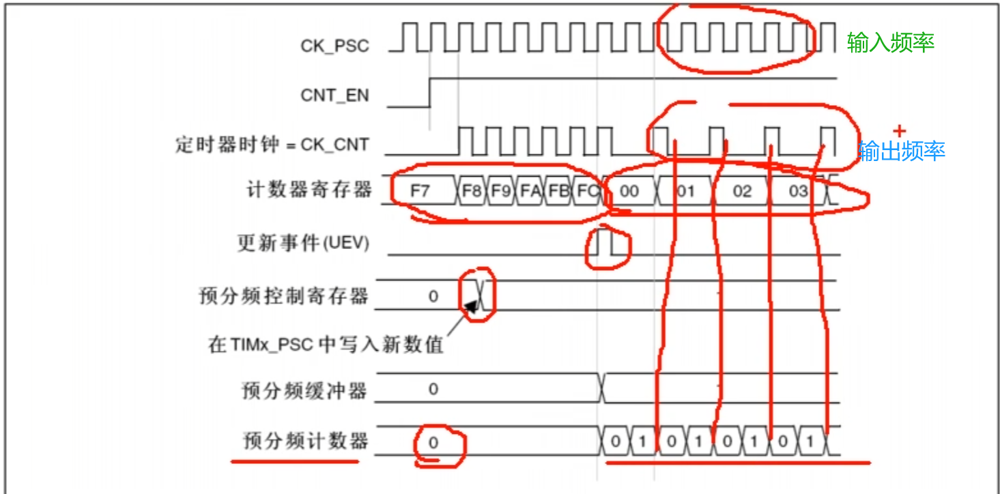

>
>
>注意，预分频器的值和实际的分频系数之间有一个数的偏移


##### 8.3.4.2计数器时序图


>即分配系数为2

>第一行是内部时钟CK_INT 72MHZ
>
>第二行是时钟使能CNT_EN，高电平启动
>
>第三行是计数器时钟，因为分频系数为2，所以这个频率是上面这个CK_INT除以2

然后计数器在这个时钟每个上升沿自增，如图：


当增加到0036的时候，发生溢出。计到36之后，再来一个上升沿，计数器请0

>计数器溢出，产生一个更新时间脉冲，另外还会置一个更新中断标志位UIF
>这个标志位只要置1了，就会去申请中断。然后中断响应后，需要在中断程序中手动清零
>这就是计数器的工作流程


* 计算溢出频率

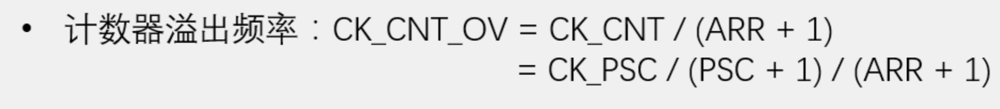

 	


#### 8.3.5定时器定时中断实例

* 接线图如下：


* 初始化定时器

>1、第一步，RCC开启时钟，这个基本上每个代码都是第一步，不用多想
>
>2、第二步，选择时基单元的时钟源，对于定时中断，我们就选择内部时钟源
>
>3、第三步，配置时基单元，包括这里的预分频器、自动重装器、计数模式等等
>
>4、第四步，配置输出中断控制，允许更新中断输出到NVIC
>
>5、第五步，配置NVIC，在NVIC中打开定时器中断的通道，并分配一个优先级
>
>整个模块配置完成后，我们还需要使能一下计数器
>
>当定时器使能后，计数器就会开始计数了，当计数器更新时，触发中断
>
>写一个定时器的中断函数，这样这个中断函数每隔一段时间就能自动执行一次了


* 关于TIM的函数，有如下介绍：

```c
void TIM_TimeBaseInit(TIM_TypeDef* TIMx, TIM_TimeBaseInitTypeDef* TIM_TimeBaseInitStruct);
//时基单元初始化，用来配置时基单元

void TIM_TimeBaseStructInit(TIM_TimeBaseInitTypeDef* TIM_TimeBaseInitStruct);
//这个函数可以把结构体变量赋一个默认值

void TIM_Cmd(TIM_TypeDef* TIMx, FunctionalState NewState);
//用来使能计数器，也就是上图的运行控制位置

void TIM_ITConfig(TIM_TypeDef* TIMx, uint16_t TIM_IT, FunctionalState NewState);
//用来使能中断输出信号的，对应的是上图的中断输出控制的位置

```


* 时钟源选择，用以下的函数：

```c
void TIM_InternalClockConfig(TIM_TypeDef* TIMx);
//这是选择内部时钟

void TIM_ITRxExternalClockConfig(TIM_TypeDef* TIMx, uint16_t TIM_InputTriggerSource);
//这是选着ITRX其他定时器的时钟

void TIM_TIxExternalClockConfig(TIM_TypeDef* TIMx, uint16_t TIM_TIxExternalCLKSource,
                                uint16_t TIM_ICPolarity, uint16_t ICFilter);
//这是选着TIX捕获通道的


void TIM_ETRClockMode1Config(TIM_TypeDef* TIMx, uint16_t TIM_ExtTRGPrescaler, uint16_t TIM_ExtTRGPolarity,
                             uint16_t ExtTRGFilter);
//选择ETR通过外部时钟模式1输入的时钟

void TIM_ETRClockMode2Config(TIM_TypeDef* TIMx, uint16_t TIM_ExtTRGPrescaler, 
                             uint16_t TIM_ExtTRGPolarity, uint16_t ExtTRGFilter);
//选择ETR通过外部时钟模式2输入的时钟

void TIM_ETRConfig(TIM_TypeDef* TIMx, uint16_t TIM_ExtTRGPrescaler, uint16_t TIM_ExtTRGPolarity,
                   uint16_t ExtTRGFilter);
//就是单独用来配置ETR引 脚的预分频器、极性、滤波器这些参数的
```


* 时基单元：

```c
void TIM_TimeBaseInit(TIM_TypeDef* TIMx, TIM_TimeBaseInitTypeDef* TIM_TimeBaseInitStruct);
//时基单元初始化函数
```

* 中断输出控制：

```c
void TIM_ITConfig(TIM_TypeDef* TIMx, uint16_t TIM_IT, FunctionalState NewState);

```

* NVIC

```c
//使用NVIC_Init函数
NVIC_PriorityGroupConfig(NVIC_PriorityGroup_2);
	NVIC_InitTypeDef NVIC_InitStructure;
	NVIC_InitStructure.NVIC_IRQChannel = TIM2_IRQn;
	NVIC_InitStructure.NVIC_IRQChannelCmd=ENABLE;
	NVIC_InitStructure.NVIC_IRQChannelPreemptionPriority=2;
	NVIC_InitStructure.NVIC_IRQChannelSubPriority =1;
	NVIC_Init(&NVIC_InitStructure);
```

* 运行控制：

```c
void TIM_Cmd(TIM_TypeDef* TIMx, FunctionalState NewState);
```

 


* 配置时基单元的代码：

```c
//配置时基单元
	TIM_TimeBaseInitTypeDef Tim_TimeBaseInitStructure;
	Tim_TimeBaseInitStructure.TIM_ClockDivision = TIM_CKD_DIV1;
	Tim_TimeBaseInitStructure.TIM_CounterMode = TIM_CounterMode_Up;
	Tim_TimeBaseInitStructure.TIM_Period = 10000-1;
	Tim_TimeBaseInitStructure.TIM_Prescaler = 7200-1;
	Tim_TimeBaseInitStructure.TIM_RepetitionCounter = 0;
	TIM_TimeBaseInit(TIM2,&Tim_TimeBaseInitStructure);
```

* ​	其中：

```c
Tim_TimeBaseInitStructure.TIM_ClockDivision =TIM_CKD_DIV1;
```

>这是时钟分频的参数，这个是给滤波器提供的，和时基单元关系并不大
>
>TIM_CKD_DIV1 这是一分频，也就是不分频

```c
Tim_TimeBaseInitStructure.TIM_CounterMode = TIM_CounterMode_Up;
```

>此函数包括 向上计数，向下计数，三中中央对齐模式

```c
Tim_TimeBaseInitStructure.TIM_Period = 
```

>Period周期，就是ARR自动重装器的参数

```c
Tim_TimeBaseInitStructure.TIM_Prescaler = 
```

>Prescaler,这就是PSC预分频器的值

```
Tim_TimeBaseInitStructure.TIM_RepetitionCounter
```

>RepetitionCounter就是重复计数器的值

这些参数就是时某单元里面每个关键寄存器的参数了


##### 8.3.5.1定时1秒公式

* 决定定时时间的参数是period 和 prescaler

>如果想定一个1秒的时间，根据计数器定时频率公式：


* 定时1秒，即定时频率为1HZ
* 可以给PSC给一个7200 - 1，ARR给一个10000 - 1

>因为预分频器和计数器都有1个数的偏差，所以这里要再减个1
>
>然后注意这个PSC和ARR的取值都要在0~65535之间，不要超范围了

* 如果预分频PSC给少点，自动重装ARR给多点，这样就是以一个比较高的频率计比较多的数
* 在这里，我们的预分频是对72M进行7200分频, 这样得到的就是 72M/7200 = 10 k 的计数频率
* 在10K的频率下，计10000个数，就是1s的时间

* 到这里时基单元就配置好了


* 定时器计数完全代码：

Timer.C:

```c
#include "stm32f10x.h"                  // Device header

extern uint16_t Num;
//不同文件中使用同一个变量NUM

void Timer_Init(void)
{
	//初始化TIM2，即通用定时器
	//开启时钟,这里选用APB1的时钟外设，因为TIM2是APB1的时钟外设
	RCC_APB1PeriphClockCmd(RCC_APB1Periph_TIM2, ENABLE);
	
	//选择时基单元的时钟
	//TIM_InternalClockConfig(TIM2);
	//这样TIM2的时基单元就由内部时钟来驱动了
	 
	//配置时基单元
	TIM_TimeBaseInitTypeDef Tim_TimeBaseInitStructure;
	Tim_TimeBaseInitStructure.TIM_ClockDivision = TIM_CKD_DIV1;
	Tim_TimeBaseInitStructure.TIM_CounterMode = TIM_CounterMode_Up;
	Tim_TimeBaseInitStructure.TIM_Period = 10000-1;
	Tim_TimeBaseInitStructure.TIM_Prescaler = 7200-1;
	Tim_TimeBaseInitStructure.TIM_RepetitionCounter = 0;
	TIM_TimeBaseInit(TIM2,&Tim_TimeBaseInitStructure);
	
	//使能中断，这里使能的是更新中断
	TIM_ITConfig(TIM2,TIM_IT_Update,ENABLE);
	//这样就开启了更新中断到NVIC的通路
	
	NVIC_PriorityGroupConfig(NVIC_PriorityGroup_2);
	NVIC_InitTypeDef NVIC_InitStructure;
	NVIC_InitStructure.NVIC_IRQChannel = TIM2_IRQn;
	NVIC_InitStructure.NVIC_IRQChannelCmd=ENABLE;
	NVIC_InitStructure.NVIC_IRQChannelPreemptionPriority=2;
	NVIC_InitStructure.NVIC_IRQChannelSubPriority =1;
	NVIC_Init(&NVIC_InitStructure);
	
	//启动定时器
	TIM_Cmd(TIM2,ENABLE);
	
}


//定时器2的中断函数
void TIM2_IRQHandler(void)
{
	//首先照常检查一下中断标志位：
	if(TIM_GetITStatus(TIM2,TIM_IT_Update) == SET)
	{
		
		Num++;
		TIM_ClearITPendingBit(TIM2,TIM_IT_Update);
	}
	
	
}
```

Timer.h:

```c
#ifndef __TIMER_H
#define __TIMER_H

void Timer_Init(void);


#endif

```

main.c:

```c
#include "stm32f10x.h"                  // Device header
#include "Delay.h"
#include "OLED.h"
#include "Timer.h"


uint16_t Num;


int main(void)	
{
	OLED_Init();
	Timer_Init(); //初始化定时器
	OLED_ShowString(1,1,"NUM:");
	
	while (1)
	{	
		OLED_ShowNum(1,5,Num,5);
	}	
	
}

```

* 程序现象如图：


定时器每过1秒，NUM的数值就++


#### 8.3.6定时器外部时钟

* 接线图：


>这个PAO引脚就是TIM2的ETR引脚,我们就在这个引脚输入一个外部时钟

* 首先是Timer.C:

```c
#include "stm32f10x.h"                  // Device header

extern uint16_t Num;
//不同文件中使用同一个变量NUM

void Timer_Init(void)
{
	//初始化TIM2，即通用定时器
	//开启时钟,这里选用APB1的时钟外设，因为TIM2是APB1的时钟外设
	RCC_APB1PeriphClockCmd(RCC_APB1Periph_TIM2, ENABLE);
	
	//引脚需要配置GPIO：注意这是是APB2时钟外设
	RCC_APB2PeriphClockCmd(RCC_APB2Periph_GPIOA,ENABLE);
	GPIO_InitTypeDef GPIO_InitStructure;
	GPIO_InitStructure.GPIO_Mode = GPIO_Mode_IPU;
	GPIO_InitStructure.GPIO_Pin = GPIO_Pin_0;
	GPIO_InitStructure.GPIO_Speed = GPIO_Speed_50MHz;
	GPIO_Init(GPIOA,&GPIO_InitStructure);
	
	
	
	//配置通过ETR的外部时钟模式2
TIM_ETRClockMode2Config(TIM2,TIM_ExtTRGPSC_OFF,TIM_ExtTRGPolarity_NonInverted,0x03);
	 
	//配置时基单元
	TIM_TimeBaseInitTypeDef Tim_TimeBaseInitStructure;
	Tim_TimeBaseInitStructure.TIM_ClockDivision = TIM_CKD_DIV1;
	Tim_TimeBaseInitStructure.TIM_CounterMode = TIM_CounterMode_Up;
	Tim_TimeBaseInitStructure.TIM_Period = 10-1;
	Tim_TimeBaseInitStructure.TIM_Prescaler = 1-1;
	Tim_TimeBaseInitStructure.TIM_RepetitionCounter = 0;
	TIM_TimeBaseInit(TIM2,&Tim_TimeBaseInitStructure); 
	
	//使能中断，这里使能的是更新中断
	TIM_ITConfig(TIM2,TIM_IT_Update,ENABLE);
	//这样就开启了更新中断到NVIC的通路
	
	NVIC_PriorityGroupConfig(NVIC_PriorityGroup_2);
	NVIC_InitTypeDef NVIC_InitStructure;
	NVIC_InitStructure.NVIC_IRQChannel = TIM2_IRQn;
	NVIC_InitStructure.NVIC_IRQChannelCmd=ENABLE;
	NVIC_InitStructure.NVIC_IRQChannelPreemptionPriority=2;
	NVIC_InitStructure.NVIC_IRQChannelSubPriority =1;
	NVIC_Init(&NVIC_InitStructure);
	
	//启动定时器
	TIM_Cmd(TIM2,ENABLE);
	
}

uint16_t Timer_GetCount(void)
{
	return TIM_GetCounter(TIM2);
}

//定时器2的中断函数
void TIM2_IRQHandler(void)
{
	//首先照常检查一下中断标志位：
	if(TIM_GetITStatus(TIM2,TIM_IT_Update) == SET)
	{
		
		Num++;
		TIM_ClearITPendingBit(TIM2,TIM_IT_Update);
	}
	
	
}
```

* 配置通过ETR的外部时钟模式2解释：

```c
TIM_ETRClockMode2Config(TIM2,TIM_ExtTRGPSC_OFF,TIM_ExtTRGPolarity_NonInverted,0x03);

//第二个参数是外部触发预分频器，TIM_ExtTRGPSC_OFF是不需要分频
//第三个是外部触发的极性，反向 = 低电平或下降沿有效 不反向，就死高电平或者上升沿有效
//第四个参数是外部触发滤波器，值在0X00到0X0F之间，
```

>配置滤波器，可以让次实验中的对射红外传感器，OLED上显示的数字有序，不会忽然跳变几个，比较有用

* main.c:

```c
#include "stm32f10x.h"                  // Device header
#include "Delay.h"
#include "OLED.h"
#include "Timer.h"


uint16_t Num;


int main(void)	
{
	OLED_Init();
	Timer_Init(); //初始化定时器
	OLED_ShowString(1,1,"NUM:");
	OLED_ShowString(2,1,"CNT:");

	while (1)
	{	
		OLED_ShowNum(1,5,Num,5);
		OLED_ShowNum(2,5,Timer_GetCount(),5); 
	}	
	
}

```

* 程序现象如下：


>用卡片挡住对射红外传感器，CNT++,当CNT到10之后，NUM++
>
>我们用挡光片挡一下，CNT加1，因为现在时基单元没有预分频，所以每次遮挡CNT都会加1，如果有预分频了，就是遮挡几次，才能加一次，然后加到9后，自动清零，同时申请中断，Num++


## 9、TIM输出比较OC


> 都有四个输出能较的通道，可以同时输出四路PWM波形,这四个通道有各自的CCR寄存器，但是它们是共用一个CNT计数器的


* **CNT就是时基单元里面的计数器，CCR就是捕获/比较寄存器**

>那在输出比较这里，这块电路会比较CNT和CCR的值,CNT试数自增，CCR是我们给定的一个值,当CNT大于CCR、小于CCR或者等于CCR时
>
>这里输出就会对应的置1、置0、置1、置0,这样就可以输出一个电平不断跳变的PWM波形了

### 9.1PWM


>PWM波形是一个数字输出信号，也是由高低电平组成的,是一个连续变化电平信号
>
>使用这个PWM波形，是用来等效地实现一个模拟信号的输出
>
>例如：
>
>控制LED亮度大小，可以通过PWM波形来实现
>
>我们让LED不断点亮、熄灭、点亮、熄灭，当这个点亮、熄灭的频率足够大时，LED就不会闪烁了，而是呈现出一个中等亮度
>
>当我们调控这个点亮和熄灭的时间比例时，就能让LED呈现出不同的亮度级别
>
>当然对于电机调速也是一样


>这样具有惯性的系统，才能使用PWM,这种高低电平跳变的数字信号,它是可以等效为中间这个虚线所表示的模拟量的，如图：


当下面电平时间长一点，上面电平时间短一点的时候，等效的模拟量就偏向于下面


### 9.2PWM参数

* **频率**=1/T~S~

**T~S~就是代表一个高低电平变换周期的时间**，周期的倒数就是频率

PWM的频率越快，那它等效模拟的信号就越平稳，不过同时性能开销就越大

一般来说PWM的频率都在几K到几KHZ

* **占空比**=T~ON~/T~S~

**T~ON~是高电平的时间**，那T~ON~/T~S~就是高电平时间相对于整个周期时间的比例

>比如占空比为50%，那就是高低电平时间相等的方波
>
>占空比为20%，那就是高电平占20%，低电平占80%
>
>古空比为100%，那就直接是高电平不带变的

**占空比决定了PWM等效出来的模拟电压的大小,**占空比越大，那等效的模拟电压就越趋近于高电平

* * **比如高电平是5v，低电平是0v，占空比50%，就等效于中间电压2.5v**


* **分辨率**=占空比变化步距 = 1/(ARR+1)

>比如有的占空比只能是1%、2%、3%等等这样以1%的步距跳变,那分辨率就是1%
>
>**所以这个分辨率就是占空比变化的精细程度**


分析：TIM输出比较模块如何输出PWM波形

>通用定时器的输出比较通道：


对应的是如下的部位:


* 左边是CNT和CCR输出比较的结果，右边就是输出比较电路，最后通过TIM_CH1输出到GPIO引脚上

>然后下面还有三个同样的单元，分别输出到CH2、CH3、CH4


进行比较，当CNT>CCR1，或者CNT=CCR1时,就会给这个输出模式控制器传一个信号,然后输出模式控制器就会改变它输出OC1REF的高低电平

>接着这个REF信号可以前往主模式控制器,也可以把这个REF映射到主模式的TRGO输出上去

* REF的主要去向还是下面这一路，到达**极性选择**


给这个寄存器写0，信号就会往上走，就是信号电平不翻转，就是信号不变

写1的话，信号就会往下走，就是信号通过一个非门取反，那输出的信号就是输入信号高低电平**反转**的信号

* 那接着就是输出使能电路了，选择要不要输出
* 最后就是OC1引脚，这个引脚就是CH1通道的引脚


* 关于上图的**输出模式控制器**

>什么时候给REF高电平，什么时候给REF低电平

* 输出模式控制器里面的执行逻辑：


* PWM模式1和PWM模式2

>它们可以用于输出频率和占空比都可调的PWM波形，也是我们主要使用的模式


### 9.3PWM的基本结构


* 首先左上角这里，是时基元和运行控制部分，PSC前方是时钟源选择
* 下面这里，就是输出比较单元了，总共有4路
  * 输出比较单元的最开始，**是CCR捕获/较寄存器**：CNT与CCR在不断进行比较
  * 第二个是**输出模式控制器**

如图：


>这里蓝色线是CNT的值，黄色线是ARR的值
>
>蓝色线从0开始自增，一直增到ARR，也就是99，之后清0继续自增
>
>在这个过程中，我们再设置一条红色线
>
>这条红色线就是CCR，比如我们设置CCR为30
>
>之后再执行这里的**输出模式控制器**逻辑，下面这里绿色线就是输出

例如：


**这里CNT＜CCR，所以置高电平**,然后CNT大于CCR，变低电平......

这样一直持续下去，REF的电平就会不断变化

并且，它的占空比是受CCR值的调控,如果CCR设置高一些，输出的占空比就变大


### 9.4PWM参数计算


* 如下图，PWM的一个周期，始终对应着数器的一个溢出更新周期


* **所以PWM的频率就等于计数器的更新频率**

看下图：CNT是从0一直加到ARR，比如ARR是99，那CNT总共就是计了100个数

>计时器等于arr时溢出，一共计数arr+1次。因为单片机中0也会计数一次，这里0到99，加上0的计数，就是计数100次
>
>


高电平的时间，CNT是从0一直加到CCR，比如CCR是30

这里在等于30的瞬间，就已经跳变为低电平了

所以CNT从0到29是高电平，总共是30个数的时间

* **所以这里占空比就是30/100=30%**


从上面这个图可以看出，CCR的值应该设置在0到ARR+1这个范围里，CCR=ARR+1时，占空比就正好是100%

所以CCR的变化范围取决于ARR的值，ARR越大，CCR的范围就越大，对应的分辨率就越大


### 9.5舵机


* 硬件电路：


* 直流电机


>这里有两个引脚，当我们一边接正，一边接负，电机就朝一个方向转
>
>如果把正负极对调，那电机就会朝另一个方向转

* 电机驱动模块


>这里左下角VM，就是电机电源的正极了,要接一个可以输出大电流的电源
>
>然后下一个引脚是VCC，这个是逻辑电平输入端，范围是2.7到5.5V，这个要和我们控制器的电源保持一致。比如你使用STM32，是3.3V的器件，那就接3.3V
>
>在板子内部都是连通的，随便选一个GND用就可以
>
>这里AO1、AO2、BO1、B02就是两路电机的输出了
>
>AO1和AO2就是A路的两个输出，它的控制端就是上面的这三个，PWMA、AIN2和AIN1，这三个引脚控制下面A路的一个电机


>在这里，如果IN1和IN2全都接高电平,两个输出就都为低电平，这样两个输出没有电压差，电机是不会转的
>
>如果IN1和IN2全都接低电平,输出直接关闭，这样电机也是不会转的
>
>


#### 9.5.1PWM驱动LED呼吸灯


>我们准备在这个PA0引脚输出一个PWM波,用于驱动这个LED，并且呈现出不同的亮度


>第一步，RCC开启时钟，把我们要用的TIM外设和GPIO外设的时钟打开
>第二步，配置时基单元，包括这前面的时钟源选择
>
>第三步，配置输出比较单元
>
>里面包括这个CCR的值、输出比较模式、极性选择、输出使能这些参数
>
>第四步，配置GPIO
>
>把PWM对应的GPIO口，初始化为复用推挽输出的配置

```c
void TIM_OC1Init(TIM_TypeDef* TIMx, TIM_OCInitTypeDef* TIM_OCInitStruct);
void TIM_OC2Init(TIM_TypeDef* TIMx, TIM_OCInitTypeDef* TIM_OCInitStruct);
void TIM_OC3Init(TIM_TypeDef* TIMx, TIM_OCInitTypeDef* TIM_OCInitStruct);
void TIM_OC4Init(TIM_TypeDef* TIMx, TIM_OCInitTypeDef* TIM_OCInitStruct);
```

这4个函数就是用来配置输出比较模块的

OC就是output compare输出比较模块，

```c
TIM_OCStructInit(TIM_OCInitTypeDef* TIM_OCInitStruct);
```

这个是用来给OC结构体初始化用的

```c
void TIM_ForcedOC1Config(TIM_TypeDef* TIMx, uint16_t TIM_ForcedAction);
void TIM_ForcedOC2Config(TIM_TypeDef* TIMx, uint16_t TIM_ForcedAction);
void TIM_ForcedOC3Config(TIM_TypeDef* TIMx, uint16_t TIM_ForcedAction);
void TIM_ForcedOC4Config(TIM_TypeDef* TIMx, uint16_t TIM_ForcedAction);
```

* 这个用来配置强制输出模式

>"如果你在运行中想要暂停输出波形并目强制输出高或低电平,可以使用。
>
>但是强制输出高电平 == 使得占空比等于100%，所以这个用的不多

```c
void TIM_OC1PreloadConfig(TIM_TypeDef* TIMx, uint16_t TIM_OCPreload);
void TIM_OC2PreloadConfig(TIM_TypeDef* TIMx, uint16_t TIM_OCPreload);
void TIM_OC3PreloadConfig(TIM_TypeDef* TIMx, uint16_t TIM_OCPreload);
void TIM_OC4PreloadConfig(TIM_TypeDef* TIMx, uint16_t TIM_OCPreload);
```

* 这是用来配置CCR寄存器的预装功能的

>这个预装功能，就是影子寄存器,就是你写入的值不会立即生效，而是在更新事件才会生效

```c
void TIM_OC1FastConfig(TIM_TypeDef* TIMx, uint16_t TIM_OCFast);
void TIM_OC2FastConfig(TIM_TypeDef* TIMx, uint16_t TIM_OCFast);
void TIM_OC3FastConfig(TIM_TypeDef* TIMx, uint16_t TIM_OCFast);
void TIM_OC4FastConfig(TIM_TypeDef* TIMx, uint16_t TIM_OCFast);
```

>这四个函数是用来配置快速使能的

```c
void TIM_OC1PolarityConfig(TIM_TypeDef* TIMx, uint16_t TIM_OCPolarity);
void TIM_OC1NPolarityConfig(TIM_TypeDef* TIMx, uint16_t TIM_OCNPolarity);
void TIM_OC2PolarityConfig(TIM_TypeDef* TIMx, uint16_t TIM_OCPolarity);
void TIM_OC2NPolarityConfig(TIM_TypeDef* TIMx, uint16_t TIM_OCNPolarity);
void TIM_OC3PolarityConfig(TIM_TypeDef* TIMx, uint16_t TIM_OCPolarity);
void TIM_OC3NPolarityConfig(TIM_TypeDef* TIMx, uint16_t TIM_OCNPolarity);
void TIM_OC4PolarityConfig(TIM_TypeDef* TIMx, uint16_t TIM_OCPolarity);
```

* **这些就是用来单独设置输出比较的极性的**

>这里带个N的就是高级定时器里互补通道的配置
>OC4没有互补通道，所以就没有OC4N的的函数
>
>那这里有函数可以设置极性，在结构体初始化的那个函数里也可以设置极性

```c
void TIM_SetCompare1(TIM_TypeDef* TIMx, uint16_t Compare1);
void TIM_SetCompare2(TIM_TypeDef* TIMx, uint16_t Compare2);
void TIM_SetCompare3(TIM_TypeDef* TIMx, uint16_t Compare3);
void TIM_SetCompare4(TIM_TypeDef* TIMx, uint16_t Compare4);
```

这四个是用来单独更改CCR寄存器值的函数:这四个国数比较重要，我们在运行的时候，更改占空比,用这4个函数

```c
void TIM_CtrlPWMOutputs(TIM_TypeDef* TIMx, FunctionalState NewState);
```

>仅高级定时器使用
>
>在使用高级定时器输出PWM时需要调用这个函数使能主输出否则PWM将不能正常输出


* 初始完整代码如下：

PWM.C:

```c
#include "stm32f10x.h"                  // Device header


void PWM_Init(void)
{
	

	//初始化TIM2，即通用定时器
	//开启时钟,这里选用APB1的时钟外设，因为TIM2是APB1的时钟外设
	RCC_APB1PeriphClockCmd(RCC_APB1Periph_TIM2, ENABLE);
    //开启GPIO口的时钟
    //现在，在T1M2的OC1通道上就可以输出PWM波形了(这里放在前面符合习惯)
	//现在需要借用GPIO口输出波形
	RCC_APB2PeriphClockCmd(RCC_APB2Periph_GPIOA,ENABLE);
	
	GPIO_InitTypeDef GPIO_InitStructure;
	GPIO_InitStructure.GPIO_Mode = GPIO_Mode_AF_PP; //复用推挽输出
	//对于普通的开漏/推挽输出,引脚的控制权是来自于输出数据寄存器的
	//那如果想让定时器来控制引脚,那就需要使用复用开漏/推挽输出的模式
	GPIO_InitStructure.GPIO_Pin = GPIO_Pin_0;
	GPIO_InitStructure.GPIO_Speed = GPIO_Speed_50MHz;
	GPIO_Init(GPIOA,&GPIO_InitStructure);
		
	//选择时基单元的时钟
	TIM_InternalClockConfig(TIM2);
	//这样TIM2的时基单元就由内部时钟来驱动了
	 
	//配置时基单元
	TIM_TimeBaseInitTypeDef Tim_TimeBaseInitStructure;
	Tim_TimeBaseInitStructure.TIM_ClockDivision = TIM_CKD_DIV1;
	Tim_TimeBaseInitStructure.TIM_CounterMode = TIM_CounterMode_Up;
	Tim_TimeBaseInitStructure.TIM_Period = 100-1; //ARR
	Tim_TimeBaseInitStructure.TIM_Prescaler = 720-1; //PSC
	Tim_TimeBaseInitStructure.TIM_RepetitionCounter = 0;
	TIM_TimeBaseInit(TIM2,&Tim_TimeBaseInitStructure);
	
	
	TIM_OCInitTypeDef TIM_OCInitStructure;
	//给结构体先默认赋值
	TIM_OCStructInit(&TIM_OCInitStructure);
	
	TIM_OCInitStructure.TIM_OCMode = TIM_OCMode_PWM1;
	TIM_OCInitStructure.TIM_OCPolarity = TIM_OCPolarity_High;
	TIM_OCInitStructure.TIM_OutputState = TIM_OutputState_Enable;
	TIM_OCInitStructure.TIM_Pulse = 50 ;
	//这个pluse就是CCR的值
	TIM_OC1Init(TIM2,&TIM_OCInitStructure);
	
	
	
	
	//启动定时器
	TIM_Cmd(TIM2,ENABLE);
	

}
```

main.c:

```c
#include "stm32f10x.h"                  // Device header
#include "Delay.h"
#include "OLED.h"
#include "PWM.h"

int main(void)	
{
	OLED_Init();
	PWM_Init();
	while (1)
	{	
		
	}	
	
}
```

程序现象：


LED已经点亮，此时是已1KZ的频率闪烁，示波器图如下：


* CCR的计算

>TIM_OCInitStructure.TIM_Pulse = ?

根据公式：


>如果我现在要产生一个频率为1KHz，占空比为50%，分辨率为1%的PWM波形
>
>代入公式就是：
>
>72M/(PSC+1)/(ARR+1) = 1000
>
>CCR/(ARR+1) = 50%
>
>1/(ARR+1) = 1%
>
>解出：ARR+1 == 100
>
>CCR = 50
>
>PSC+1=720 


* 要让LED呈现呼吸灯的效果，就需要让程序不断修改CCR的值
* 代码如下：

```c
#include "stm32f10x.h"                  // Device header


void PWM_Init(void)
{
	

	//初始化TIM2，即通用定时器
	//开启时钟,这里选用APB1的时钟外设，因为TIM2是APB1的时钟外设
	RCC_APB1PeriphClockCmd(RCC_APB1Periph_TIM2, ENABLE);
	RCC_APB2PeriphClockCmd(RCC_APB2Periph_GPIOA,ENABLE);
	
	GPIO_InitTypeDef GPIO_InitStructure;
	GPIO_InitStructure.GPIO_Mode = GPIO_Mode_AF_PP; //复用推挽输出
	//对于普通的开漏/推挽输出,引脚的控制权是来自于输出数据寄存器的
	//那如果想让定时器来控制引脚,那就需要使用复用开漏/推挽输出的模式
	GPIO_InitStructure.GPIO_Pin = GPIO_Pin_0;
	GPIO_InitStructure.GPIO_Speed = GPIO_Speed_50MHz;
	GPIO_Init(GPIOA,&GPIO_InitStructure);
		
	//选择时基单元的时钟
	TIM_InternalClockConfig(TIM2);
	//这样TIM2的时基单元就由内部时钟来驱动了
	 
	//配置时基单元
	TIM_TimeBaseInitTypeDef Tim_TimeBaseInitStructure;
	Tim_TimeBaseInitStructure.TIM_ClockDivision = TIM_CKD_DIV1;
	Tim_TimeBaseInitStructure.TIM_CounterMode = TIM_CounterMode_Up;
	Tim_TimeBaseInitStructure.TIM_Period = 100-1; //ARR
	Tim_TimeBaseInitStructure.TIM_Prescaler = 720-1; //PSC
	Tim_TimeBaseInitStructure.TIM_RepetitionCounter = 0;
	TIM_TimeBaseInit(TIM2,&Tim_TimeBaseInitStructure);
	
	
	TIM_OCInitTypeDef TIM_OCInitStructure;
	//给结构体先默认赋值
	TIM_OCStructInit(&TIM_OCInitStructure);
	
	TIM_OCInitStructure.TIM_OCMode = TIM_OCMode_PWM1;
	TIM_OCInitStructure.TIM_OCPolarity = TIM_OCPolarity_High;
	TIM_OCInitStructure.TIM_OutputState = TIM_OutputState_Enable;
	TIM_OCInitStructure.TIM_Pulse = 0 ;
	//这个pluse就是CCR的值
	TIM_OC1Init(TIM2,&TIM_OCInitStructure);
	
	//现在，在T1M2的OC1通道上就可以输出PWM波形了
	//现在需要借用GPIO口输出波形
	
	
	//启动定时器
	TIM_Cmd(TIM2,ENABLE);
	

}


void PWM_SetCompare1(uint16_t Compare)
{
	TIM_SetCompare1(TIM2,Compare);
	//这个函数是用来单独更改通道1的CCR值的
	
	
	
}

```

MAIN.C:

```c
#include "stm32f10x.h"                  // Device header
#include "Delay.h"
#include "OLED.h"
#include "PWM.h"


uint8_t i;
int main(void)	
{
	OLED_Init();
	PWM_Init();
	while (1)
	{	
		for(i=0;i<=100;i++)
		{
			 PWM_SetCompare1(i);
			//这里这样占空比就是从0到100，LED逐渐变亮
			Delay_ms(10);
			//延时一段时间，不然太快了
		}
		
		for(i=0;i<=100;i++)
		{
			 PWM_SetCompare1(100-i);
			//这里这样占空比就是从100-0.逐渐变暗
			Delay_ms(10);
			//延时一段时间，不然太快了
		}
		
	}	
	
}

```

现在呈现的就是LED从暗变亮，在从亮变暗，如此往复循环的效果了


#### 9.5.2PWM驱动舵机

* 硬件电路图：


>这里要接5V的电机电源，大家不要把它接在面包板的正极了,这个正极只有3.3V的电压，而且输出功率不太，带不动电机的，所以我们需要把它接在STLNK的5V输出引脚

按照下图的规定：


参数计算：


>72M/PSC+1/ARR+1 ==1/20ms ==50hz
>
>这里PSC和ARR的参数并不是固定的，可以自主选择
>
>这里设置**PSC+1=72,ARR+1=20K**
>
>这样满足第一个等式，最终的频率是50hz
>
>因为一个周期是20ms，我们这里自动重装值ARR+1设置成20K
>
>按比例来：20K的ARR+1对应20ms,则500的CCR对应就是0.5ms
>
>CCR设置2500，就是2.5ms
>
>题目要求高电平为0.5ms~2.5ms宽度之间，因此正好满足
>
>

* ​	代码如下：

Servo.c:

```c
#include "stm32f10x.h"                  // Device header
#include "PWM.h"

void Servo_Init(void)
{
	PWM_Init();
}


// 0度  对应500
// 180  对应2500
void Servo_SetAngle(float Angle)
{
	PWM_SetCompare2(Angle /180 * 2000 +500);
	//通过输入Angle的值，改变CCR的值
}


```

* servo.h

```c
#ifndef __SERVO_H
#define __SERVO_H


void Servo_Init(void);
void Servo_SetAngle(float Angle);


#endif

```

MAIN.C:

```c
#include "stm32f10x.h"                  // Device header
#include "Delay.h"
#include "OLED.h"
#include "SERVO.h"
#include "Key.h"


uint8_t KeyNum;
float Angle;
int main(void)	
{
	OLED_Init();
	Servo_Init(); 
	Key_Init();
	
	
	Servo_SetAngle(90); //设置角度为90度时CCR的值
	
	OLED_ShowString(1,1,"Angle:");
	while (1)
	{	
		KeyNum = Key_GetNum();
		if(KeyNum==1)
		{
			Angle+=30;
			if(Angle>180)
				Angle = 0;
		}
			Servo_SetAngle(Angle);
		OLED_ShowNum(1,7,Angle,3);

	}	
	
}

```

* 程序效果为：按下按键，舵机上的旋钮转动30度，直到转过180度，舵机上的旋钮自动归位

* 示波器效果如图：

>按下按键，舵机转动的角度增加30度


**每次按下按键，高电平时间，也就是占空比，在按照我们设定的要求不断变化**


#### 9.5.3PWM驱动直流电机

* 硬件引脚图：


>它的第一个引脚VM，电机电源，同样的，也是接在STLINK的5V引l脚
>
>第二个VCC，逻辑电源，接在面包板3.3V正极
>
>之后AO1、AO2，电机输出端，接电机的两根线
>
>这个线不分正反，如果你对调这两根线一那电机旋转的方向就会翻转
>
>STBY，待机控制脚，不需要待机，直接接逻辑电源3.3V
>
>最后一个PWMA是速度控制，需要接 PWM的输出脚
>
>AIN1和AIN2是方向控制，任意接两个GPIO就行了
>
>最后一个PWMA是速度控制，需要接PWM的输出脚


* **因为接线图上是PA2链接电机驱动的PWMA，PA2是CH3也就是3通道，所以这里代码用通道3**

代码如下：

* Motor.c:

```c
#include "stm32f10x.h"                  // Device header
#include "PWM.h"
void Motor_Init(void)
{
	//GPIO初始化
	RCC_APB2PeriphClockCmd(RCC_APB2Periph_GPIOA,ENABLE);
	GPIO_InitTypeDef GPIO_InitStructure;
	GPIO_InitStructure.GPIO_Mode = GPIO_Mode_Out_PP;
	GPIO_InitStructure.GPIO_Pin = GPIO_Pin_4 | GPIO_Pin_5;
    //AIN1和AIN2是方向控制,接2个GPIO口引脚
	GPIO_InitStructure.GPIO_Speed = GPIO_Speed_50MHz;
	GPIO_Init(GPIOA,&GPIO_InitStructure);
	
	//先调用底层的PWM,初始化一下PWM
	PWM_Init();
}

//设置速度函数，实质上还是通过改变CCR的值来改变占空比
void Motor_SetSpeed(int8_t speed)
{
	//针对正转和反转，分别用if来处理
	if(speed>=0) //正转
	{
		//在里面我们首先把方问控制脚设置为一个高电平，一个低电平
		GPIO_SetBits(GPIOA,GPIO_Pin_4);
		GPIO_ResetBits(GPIOA,GPIO_Pin_5);
		PWM_SetCompare3(speed);
	}
	else
	{
		GPIO_ResetBits(GPIOA,GPIO_Pin_4);
		GPIO_SetBits(GPIOA,GPIO_Pin_5);
		//因为这时Speed为负数,SetCompare必须传正数，所以Speed前面要加一个负号
		PWM_SetCompare3(-speed);
		
	}
}
```

Motor.h:

```c
#ifndef __MOTOR_H
#define __MOTOR_H


void Motor_Init(void);
void Motor_SetSpeed(int8_t speed);

#endif
```

MAIN.C:

```c
#include "stm32f10x.h"                  // Device header
#include "Delay.h"
#include "OLED.h"
#include "Motor.h"
#include "Key.h"

uint8_t KeyNum;
int8_t Speed;

int main(void)	
{
	OLED_Init();
	Motor_Init();
	Key_Init();
	
	OLED_ShowString(1,1,"Speed:");
	
	
    //我这里ARR设置是100，当CCR到100的时候，就是全部高电平，占空比拉满，自然转速最大
	while (1)
	{	
		KeyNum = Key_GetNum();
		if(KeyNum==1)
		{
			Speed+=20;
			if(Speed>100)
			{
				Speed=-100;
			}
		}
		Motor_SetSpeed(Speed);
		OLED_ShowSignedNum(1,7,Speed,3);
	}	
	
}
```


## 10、TIM输入捕获IC


* 输入捕获，就是下图左边一部分电路


>右边是输出比较通道，4个输入捕获和4个输出比较通道，共用4个CCR寄存器
>
>同时,他们的CH1到CH4,4个引脚的通道，也是共用的

* 所以对于同一个定时器，输入捕获和输出比较，只能使用其中一个，不能同时使用

解释：

* 当前CNT的值被锁存到CCR中：

把当前CNT的值读出来，写入到CCR中去

>就是输入引脚电平跳变的瞬间，把CNT的值锁存到CCR中

* PWMI模式和主从出发模式组合起来，测量频率占空比就是硬件全自动执行

**输入捕获，是接收到输入信号，执行CNT锁存到CCR的动作**

#### 10.1频率测量


* 测频法：


>测频法的实现流程：
>
>例如：用 对射式红外传感器计次，每来一个上升沿计次+1
>
>这时再用一个定时器，定一个1s的定时中断，在中断里，每个1s取一下计次值，同时清0计次，为下一次做准备，这样每次读取的计次值就直接是频率
>
>对应定时器外部时钟的代码，也是如此，每隔1s取一下计次，就能实现测频法测量频率的功能了。

* 测周法：

执行流程是，两个上升沿内，以标准频率fc计次,得到N，则频率fx=fc/N

>原理：周期的倒数就是频率，这里捕获信号的2个上升沿，测量一下这之间持续的时间即可
>
>我们使用1个已知的标准频率**fc**的计次时钟，来驱动计数器
>
>计一个数的时间是1/fc，计N个数，时间就是N/fc .这就是周期，去倒数就是频率：即
>
>f~x~  = f~c~ / N


>首先，测频法适合测量高频信号，测周法适合测量低频信号

* 测周法的电路实现：


>最左边是通道的4个引脚，进来后有一个三输入的异或门
>
>之后通过数据选择器，到达输入捕获通道1，数据选择器如果选择上面一个，那输入捕获通道1的输入，就是3个引脚的异或值
>
>接下来来到了输入滤波器和边沿检测器，输入滤波器可以对信号进行滤波，
>
>边沿检测器和外部中断的是一样的，可选择高电平触发或者低电平触发
>
>这里设计了2套滤波和边沿检测电路，
>
>第一套电路，经过滤波和极性选择，得到**TI1FP1(Tl1 Filter Polarity 1)**，输入给通道1的后续电路
>
>第二套电路，经过另一个滤波和极性选择，得到TI1FP2(Tl1 Filter Polarity 2)，输入给下面通道2的后续电路
>
>同理，TI2也是这样


>在这里，两个信号进来，可以选择各走各的，也可以选择进行一个交又，让CH2引脚输入给通道1，或者CH1引脚输入给通道2
>
>也是它交又的主要目的，就是可以把一个引脚的输入，同时映射到两个捕获单元，这也是PWMI模式的经典结构
>
>接下来，第一个补货通道，使用上升沿触发，用来补货周期。
>
>第二个通道，使用下降沿触发，用来捕获占空比


>两个通道同时对一个引脚进行捕获，就可以同时测量频率和占空比，这就是PWMI模式
>
>接下来来到预分配器，分频之后的触发信号，就可以触发捕获电路进行工作了
>
>每来一个触发信号，CNT的值，就会向CCR转运一次，转运的同时，会发生一个捕获事件
>
>这个事件会在状态寄存器置标志位，同时也可以产生中断

就像测周法一样：


上升沿用于触发输入捕获，CNT用于计数计时，每来一个上升沿，取-CNT的值，自动存在CCR里，CCR捕获到的值，就是计数值N，CNT的驱动时钟，就是fc，fcN，就得到了待测信号的频率


* 中界频率：

>那当有一个频率，测频法和测周法计次的N相同,将测频法的N提出来，将测周法的N也提出来，让他们N相等，将FX解出来
>
>

#### 10.2主从触发模式


* 其中主模式可以将定时器内部的信号，映射到TRGO引脚，用于触发别的外设，所以这部分叫做主模式
* 从模式，就是接收其他外设或者自身外设的一些信号，用于控制自身定时器的运行，也就是被别的信号控制
* 触发源选择，就是选择**从模式**的触发信号源的，
  * 触发源选择，选择指定的一个信号，得到TRGI，TRGI去触发从模式，从模式可以在这个列表里，选择一项操作来自动执行

#### 10.3输入捕获基本结构


>时基单元配置好，启动定时器，CNT在预分频的时钟控制下，不断自增，
>
>经过预分频之后这个位置的时钟频率，就是驱动CNT的标准频率fc
>
>这里不难看出，**标准频率=72M/预分频系数**（输出频率=输入频率/系数）
>
>然后下面输入捕获通道1的GPIO口，输入一个这样的方波信号
>
>经过滤波器和边沿检测
>
>选择TI1FP1为上升沿触发，之后输入选择直连的通道，分频器选择不分频
>
>当T11FP1出现上升沿之后，CNT的当前计数值转运到CCR1里，同时触发源选择，选中I1FP1为触发信号，从模式选择复位操作
>
>这样T11FP1的上升沿，也会通过上面这一路，去触发CNT清零

#### 10.4PWMI基本结构


>下面这里多了一个通道
>
>首先，T1FP1配置上升沿触发，触发捕获和清零CNT,
>
>这时我们再来一个T1FP2，配置为下降沿触发,通过交又通道，去触发通道2的捕获单元
>
>我们看一下左上角的这个图
>
>最开始上升沿，CCR1捕获，同时清零CNT,之后CNT-直++
>然后，在下降沿这个时刻，触发CCR2捕获,所以这时CCR2的值，就是CNT从这里到这里的计数值,就是高电平期间的计数值
>
>CCR2捕获，并不触发CNT清零
>
>CCR1就是一整个周期的计数值,CCR2就是高电平期间的计数值,我们用CCR2/CCR1，是不是就是占空比了.这就是PWMI模式，使用两个通道来捕获频率和占空比的思路
>
>


#### 10.5输入捕获模式测量频率


ic.c：

```c
#include "stm32f10x.h"                  // Device header


//输入捕获的初始化
void IC_Init(void)
{
	//开启TIM2和GPIO的时钟
	//因为我们还需要TIM2输出PWM，所以这里输入捕获定时器换一个，变成TIM3
	RCC_APB1PeriphClockCmd(RCC_APB1Periph_TIM3,ENABLE);
	RCC_APB2PeriphClockCmd(RCC_APB2Periph_GPIOA,ENABLE);
	
	//GPIO初始化
	GPIO_InitTypeDef GPIO_InitStructure;
	GPIO_InitStructure.GPIO_Mode = GPIO_Mode_IPU; //上拉输入
	//计划用PA6的通道1
	GPIO_InitStructure.GPIO_Pin = GPIO_Pin_6;
	GPIO_InitStructure.GPIO_Speed = GPIO_Speed_50MHz;
	GPIO_Init(GPIOA,&GPIO_InitStructure);
	
	//TIM初始化
	TIM_InternalClockConfig(TIM3);
	
	TIM_TimeBaseInitTypeDef TIM_TimeBaseInitStructure;
	TIM_TimeBaseInitStructure.TIM_ClockDivision=TIM_CKD_DIV1;
	TIM_TimeBaseInitStructure.TIM_CounterMode = TIM_CounterMode_Up;
	TIM_TimeBaseInitStructure.TIM_Period = 65536-1;  	//ARR
	TIM_TimeBaseInitStructure.TIM_Prescaler= 72-1;		//PSC
	TIM_TimeBaseInitStructure.TIM_RepetitionCounter = 0;
	TIM_TimeBaseInit(TIM3,&TIM_TimeBaseInitStructure);
	
	
	//初始化输入捕获单元
	TIM_ICInitTypeDef TIM_ICInitStructure;
	TIM_ICInitStructure.TIM_Channel = TIM_Channel_1;
	TIM_ICInitStructure.TIM_ICFilter = 0xF;  //滤波器
	TIM_ICInitStructure.TIM_ICPolarity =TIM_ICPolarity_Rising; 	//边沿检测极性选择
	TIM_ICInitStructure.TIM_ICPrescaler = TIM_ICPSC_DIV1;  //触发信号分频器
	TIM_ICInitStructure.TIM_ICSelection =TIM_ICSelection_DirectTI;  //配置数据选择器
	
	TIM_ICInit(TIM3,&TIM_ICInitStructure);
	
	//触发源选择
	TIM_SelectInputTrigger(TIM3,TIM_TS_TI1FP1);
	//配置从模式为RESET
	TIM_SelectSlaveMode(TIM3,TIM_SlaveMode_Reset);
	
	TIM_Cmd(TIM3,ENABLE);
	
}

//返回最新一个周期频率值
uint32_t IC_getFreq(void)
{
	//根据测周法：fx = fc / N
	
	return 1000000 / TIM_GetCapture1(TIM3);
	//这里fc = 72M / PSC+1 ,因为PSC+1 = 72 ,所以是1M
	
}
```

MAIN.C:

```c
#include "stm32f10x.h"                  // Device header
#include "Delay.h"
#include "OLED.h"
#include "PWM.h"
#include "IC.h"


uint8_t i;
int main(void)	
{
	OLED_Init();
	PWM_Init();
	IC_Init();
	
	OLED_ShowString(1,1,"freq=00000HZ");
	
	
	//这里PWM将待测信号输出到PA0，PA0通过导线输入到PA6 
	PWM_SetPrescaler(720-1);   //freq = 72M/PSC+1/ARR+1
	PWM_SetCompare1(50);	//duty = CCR/ARR+1    这里ARR+1都等于100
	while (1)
	{	
		OLED_ShowNum(1,6,IC_getFreq(),5);
		
	}	
	
}

```

* 程序现象如下：


#### 10.6PWMI模式测频率占空比

IC.C:

```c
#include "stm32f10x.h"                  // Device header

//输入捕获的初始化
void IC_Init(void)
{
	//开启TIM2和GPIO的时钟
	//因为我们还需要TIM2输出PWM，所以这里输入捕获定时器换一个，变成TIM3
	RCC_APB1PeriphClockCmd(RCC_APB1Periph_TIM3,ENABLE);
	RCC_APB2PeriphClockCmd(RCC_APB2Periph_GPIOA,ENABLE);
	
	//GPIO初始化
	GPIO_InitTypeDef GPIO_InitStructure;
	GPIO_InitStructure.GPIO_Mode = GPIO_Mode_IPU; //上拉输入
	//计划用PA6的通道1
	GPIO_InitStructure.GPIO_Pin = GPIO_Pin_6;
	GPIO_InitStructure.GPIO_Speed = GPIO_Speed_50MHz;
	GPIO_Init(GPIOA,&GPIO_InitStructure);
	
	//TIM初始化
	TIM_InternalClockConfig(TIM3);
	
	TIM_TimeBaseInitTypeDef TIM_TimeBaseInitStructure;
	TIM_TimeBaseInitStructure.TIM_ClockDivision=TIM_CKD_DIV1;
	TIM_TimeBaseInitStructure.TIM_CounterMode = TIM_CounterMode_Up;
	TIM_TimeBaseInitStructure.TIM_Period = 65536-1;  	//ARR
	TIM_TimeBaseInitStructure.TIM_Prescaler= 72-1;		//PSC
	TIM_TimeBaseInitStructure.TIM_RepetitionCounter = 0;
	TIM_TimeBaseInit(TIM3,&TIM_TimeBaseInitStructure);
	
	
	//初始化输入捕获单元
	//这里改成 配置成两个通道同时捕获同一个引脚的模式
	TIM_ICInitTypeDef TIM_ICInitStructure;
	TIM_ICInitStructure.TIM_Channel = TIM_Channel_1;
	TIM_ICInitStructure.TIM_ICFilter = 0xF;  //滤波器
	TIM_ICInitStructure.TIM_ICPolarity =TIM_ICPolarity_Rising; 	//边沿检测极性选择
	TIM_ICInitStructure.TIM_ICPrescaler = TIM_ICPSC_DIV1;  //触发信号分频器
	TIM_ICInitStructure.TIM_ICSelection =TIM_ICSelection_DirectTI;  //配置数据选择器
	
	TIM_ICInit(TIM3,&TIM_ICInitStructure);
	//在函数TIM_PWMIConfig里，会自动把剩下的一个通道初始化成相反的配置
	//比如我这里传入通道1，直连，上升沿
	//那函数里面就会顺带配置通道2，交叉，下降沿
	//这个函数只支持通道1,和通道2的配置
	TIM_PWMIConfig(TIM3,&TIM_ICInitStructure);
	
	//触发源选择
	TIM_SelectInputTrigger(TIM3,TIM_TS_TI1FP1);
	//配置从模式为RESET
	TIM_SelectSlaveMode(TIM3,TIM_SlaveMode_Reset);
	
	TIM_Cmd(TIM3,ENABLE);
	
}

//返回最新一个周期频率值
uint32_t IC_getFreq(void)
{
	//根据测周法：fx = fc / N
	
	return 1000000 / TIM_GetCapture1(TIM3);
	//这里fc = 72M / PSC+1 ,因为PSC+1 = 72 ,所以是1M
	
}


uint32_t IC_GetDuty(void)
{
	//高电平的计数值存在CCR2里
	//整个周期的计数值存在CCR1里
	//占空比 = CCR2 / CCR1
	
	return  100 * TIM_GetCapture2(TIM3) / TIM_GetCapture1(TIM3);
	//值域0-1 这里乘以100
}
```

MAIN.C:

```c
#include "stm32f10x.h"                  // Device header
#include "Delay.h"
#include "OLED.h"
#include "PWM.h"
#include "IC.h

int main(void)	
{
	OLED_Init();
	PWM_Init();
	IC_Init();
	
	OLED_ShowString(1,1,"freq=00000HZ");
	OLED_ShowString(2,1,"duty=00%");
	
	
	//这里PWM将待测信号输出到PA0，PA0通过导线输入到PA6 
	PWM_SetPrescaler(720-1);   //freq = 72M/PSC+1/ARR+1
	PWM_SetCompare1(50);	//duty = CCR/ARR+1    这里ARR+1都等于100
	while (1)
	{	
		OLED_ShowNum(1,6,IC_getFreq(),5);
		OLED_ShowNum(2,6,IC_GetDuty(),2);
		
	}	
	
}

```

* 程序现象如下：


#### 10.7TIM编码器接口


* 正交编码器：


>就是像这样，输出的两个方波信号，相位相差90度,
>
>超前90度或者滞后90度，分别代表正转和反转
>
>当编码器的旋转轴转起来时,A相和B相会输出这样的方波信号
>
>转的越快，这个方波的频率就越高,所以方波的频率就代表了速度
>
>我们取出任意一相的信号来测频率,就能知道旋转速度了

当正转时，A相提前B相90度

反转时，A相滞后B相90度

>当出现某个边沿时，我们判断另一相的高低电平,如果对应另一相的状态出现在上面这个表里,那就是正转，计数自增.
>
>反之，另一相的状态出现在下面这个表里,那就是反转，计数自减.这样就能卖现编码器接口的功能了


* 编码器接口基本结构


>输入捕获的前两个通道，通过GPIO口接入编码器的A、B相
>
>然后通过滤波器和边沿检测极性选择
>
>产生I1FP1和I2FP2，通向编码器接口.编码器接口通过预分频器控制CNT计数器的时钟
>
>同时，编码器接口还根据编码器的旋转方向，控制CNT的计数方向
>
>编码器咋转时，CNT自增，
>编码器反转时，CNT自减
>
>一般我们会设置ARR为65535，最大量程,这样的话，利用补码的特性，很容易得到负数
>
>直接把这个16位的无符号数转换为16位的有符号数
>
>例如：反转的时候，CNT--,0的下一个数就是65535，就是对应-1

* 工作模式：


例如：


>这里假设T1接A相，TI2接B相
>
>左表第一个状态，A相上升沿，B相低电平
>
>一般都使用第三种模式：


* 总结：
* 正转的状态都向上计数，反转的状态都向下计数，这就是编码器接口执行的逻辑


* 实例图：


* 例如：

第一个状态，TI1上升沿，TI2低电平


所以这里计数器变高了一级

正交编码器抗噪声：


比如这里，T11上升沿，T12低电平，查表得向上计数，这里自增

然后下一个状态，T11下降沿，T12还是低电平，查表，就是向下计数，所以这里自减

这里一直自增又自减，最终计数值呢，还是原来那个数，并不受毛刺噪声的影响。这就是正交编码器抗噪声的原理


注意：上述例子都是 “均不反向的例子”，**当TI1反向时：**


>比如第一个状态，T1上升沿，T12低电平
>
>查表应该是向上上计数，但这里实际却是向下计数
>
>所以T1反相之后,我们先这样，把训1高低电平取反.
>
>这才是反相后实际给编码器接口的电平


* 反相可以用于：调整极性，把任意一个引脚反相，就能反转计数方向了、
* 当然如果想改变计数方向的话我们还可以直接把A、B相两个引脚换一下


总结：

**编码器接口模式基本上相当手使用了一个带有方向选择的外部时钟!**


#### 10.8编码器测速

* 接线图：  


注意：PA6和PA7是TIM3的通道1和通道2，我们计划用TM3接编码器


Encoder.c:

```c
#include "stm32f10x.h"                  // Device header


void Encoder_Init(void)
{
	
	RCC_APB1PeriphClockCmd(RCC_APB1Periph_TIM3,ENABLE);
	RCC_APB2PeriphClockCmd(RCC_APB2Periph_GPIOA,ENABLE);
	
	//GPIO初始化
	GPIO_InitTypeDef GPIO_InitStructure;
	GPIO_InitStructure.GPIO_Mode = GPIO_Mode_IPU; //上拉输入
	//计划用PA6的通道1
	GPIO_InitStructure.GPIO_Pin = GPIO_Pin_6 | GPIO_Pin_7;
	GPIO_InitStructure.GPIO_Speed = GPIO_Speed_50MHz;
	GPIO_Init(GPIOA,&GPIO_InitStructure);
	
	//编码器接口就是一个带方向控制的外部时钟
	//TIM_InternalClockConfig(TIM3);
	
	TIM_TimeBaseInitTypeDef TIM_TimeBaseInitStructure;
	TIM_TimeBaseInitStructure.TIM_ClockDivision=TIM_CKD_DIV1;
	TIM_TimeBaseInitStructure.TIM_CounterMode = TIM_CounterMode_Up;
	TIM_TimeBaseInitStructure.TIM_Period = 65536-1;  	//ARR
	TIM_TimeBaseInitStructure.TIM_Prescaler= 1-1;		//PSC不分频，编码器的时钟直接驱动计数器
	TIM_TimeBaseInitStructure.TIM_RepetitionCounter = 0;
	TIM_TimeBaseInit(TIM3,&TIM_TimeBaseInitStructure);
	
	
	//初始化输入捕获单元
	TIM_ICInitTypeDef TIM_ICInitStructure;
	TIM_ICStructInit(&TIM_ICInitStructure); //默认初始值
	TIM_ICInitStructure.TIM_Channel = TIM_Channel_1;
	TIM_ICInitStructure.TIM_ICFilter = 0xF;  //滤波器
	//TIM_ICInitStructure.TIM_ICPolarity =TIM_ICPolarity_Rising; 	//边沿检测极性选择
	//这里上升沿并不代表上升沿有效，因为编码器接口始终都是上开沿、下降沿都有效的
	//这里的上升沿参数代表的是高低电平极性不反转
	TIM_ICInit(TIM3,&TIM_ICInitStructure);
	
	//写入通道2
	TIM_ICInitStructure.TIM_Channel = TIM_Channel_2;
	TIM_ICInitStructure.TIM_ICFilter = 0xF;  //滤波器
	//TIM_ICInitStructure.TIM_ICPolarity =TIM_ICPolarity_Rising;
	//这个TIM_ICPolarity_Rising属于重复配置了
	TIM_ICInit(TIM3,&TIM_ICInitStructure);
	
	//注意：这个结构体变量的配置，调用ICnit函数之后，就写入到硬件的寄存器了
	//这个结构体我们可以换个值继续使用,不需要重新定义新的结构体了
	
	//配置编码器接口
	TIM_EncoderInterfaceConfig(TIM3,TIM_EncoderMode_TI12,TIM_ICPolarity_Rising,TIM_ICPolarity_Rising);
	
	TIM_Cmd(TIM3,ENABLE);
}

int16_t Encoder_Get(void)
{
	return TIM_GetCounter(TIM3);
	
}
```

MAIN.C:

```c
#include "stm32f10x.h"                  // Device header
#include "Delay.h"
#include "OLED.h"
#include "Timer.h"
#include "Encoder.h"

uint16_t Num;


int main(void)	
{
	OLED_Init();
	//Timer_Init(); //初始化定时器
	Encoder_Init();
	
	OLED_ShowString(1,1,"CNT:");
	
	while (1)
	{	
		OLED_ShowSignedNum(1,5,Encoder_Get(),5);
	}	
	
}

```

* 程序现象如下：当向左旋时,CNT开始自增，向右旋时，CNT开始自减


* 如果要使用这个编码器来测速的话：

Encoder.c:

```c
#include "stm32f10x.h"                  // Device header


void Encoder_Init(void)
{
	
	RCC_APB1PeriphClockCmd(RCC_APB1Periph_TIM3,ENABLE);
	RCC_APB2PeriphClockCmd(RCC_APB2Periph_GPIOA,ENABLE);
	
	//GPIO初始化
	GPIO_InitTypeDef GPIO_InitStructure;
	GPIO_InitStructure.GPIO_Mode = GPIO_Mode_IPU; //上拉输入
	//计划用PA6的通道1
	GPIO_InitStructure.GPIO_Pin = GPIO_Pin_6 | GPIO_Pin_7;
	GPIO_InitStructure.GPIO_Speed = GPIO_Speed_50MHz;
	GPIO_Init(GPIOA,&GPIO_InitStructure);
	
	//编码器接口就是一个带方向控制的外部时钟
	//TIM_InternalClockConfig(TIM3);
	
	TIM_TimeBaseInitTypeDef TIM_TimeBaseInitStructure;
	TIM_TimeBaseInitStructure.TIM_ClockDivision=TIM_CKD_DIV1;
	TIM_TimeBaseInitStructure.TIM_CounterMode = TIM_CounterMode_Up;
	TIM_TimeBaseInitStructure.TIM_Period = 65536-1;  	//ARR
	TIM_TimeBaseInitStructure.TIM_Prescaler= 1-1;		//PSC不分频，编码器的时钟直接驱动计数器
	TIM_TimeBaseInitStructure.TIM_RepetitionCounter = 0;
	TIM_TimeBaseInit(TIM3,&TIM_TimeBaseInitStructure);
	
	
	//初始化输入捕获单元
	TIM_ICInitTypeDef TIM_ICInitStructure;
	TIM_ICStructInit(&TIM_ICInitStructure); //默认初始值
	TIM_ICInitStructure.TIM_Channel = TIM_Channel_1;
	TIM_ICInitStructure.TIM_ICFilter = 0xF;  //滤波器
	//TIM_ICInitStructure.TIM_ICPolarity =TIM_ICPolarity_Rising; 	//边沿检测极性选择
	//这里上升沿并不代表上升沿有效，因为编码器接口始终都是上开沿、下降沿都有效的
	//这里的上升沿参数代表的是高低电平极性不反转
	TIM_ICInit(TIM3,&TIM_ICInitStructure);
	
	//写入通道2
	TIM_ICInitStructure.TIM_Channel = TIM_Channel_2;
	TIM_ICInitStructure.TIM_ICFilter = 0xF;  //滤波器
	//TIM_ICInitStructure.TIM_ICPolarity =TIM_ICPolarity_Rising;
	//这个TIM_ICPolarity_Rising属于重复配置了
	TIM_ICInit(TIM3,&TIM_ICInitStructure);
	
	//注意：这个结构体变量的配置，调用ICnit函数之后，就写入到硬件的寄存器了
	//这个结构体我们可以换个值继续使用,不需要重新定义新的结构体了
	
	//配置编码器接口
	TIM_EncoderInterfaceConfig(TIM3,TIM_EncoderMode_TI12,TIM_ICPolarity_Rising,TIM_ICPolarity_Rising);
	
	TIM_Cmd(TIM3,ENABLE);
}

int16_t Encoder_Get(void)
{
	//读取CNT，然后吧CNT清零的逻辑
	int16_t Temp;
	Temp = TIM_GetCounter(TIM3);
	TIM_SetCounter(TIM3,0);
	
	return Temp;
	
}
```

MAIN.C:

```c
#include "stm32f10x.h"                  // Device header
#include "Delay.h"
#include "OLED.h"
#include "Timer.h"
#include "Encoder.h"

uint16_t Num;


int main(void)	
{
	OLED_Init();
	//Timer_Init(); //初始化定时器
	Encoder_Init();
	
	OLED_ShowString(1,1,"CNT:");
	
	while (1)
	{	
		OLED_ShowSignedNum(1,5,Encoder_Get(),5);
		Delay_ms(1000);
	}	
	
}

```

* 程序现象为：旋转的速度变快，在OLED屏幕上显示的数值也会增大


>但是这里使用DELAY函数，有可能阻塞主程序的运行，所以这里可以使用中断函数来执行这个操作,同时也要初始化定时器

MAIN.C

```c
#include "stm32f10x.h"                  // Device header
#include "Delay.h"
#include "OLED.h"
#include "Timer.h"
#include "Encoder.h"

int16_t speed;


int main(void)	
{
	OLED_Init();
	Timer_Init(); //初始化定时器
	Encoder_Init();
	
	OLED_ShowString(1,1,"speed:");
	
	while (1)
	{	
		OLED_ShowSignedNum(1,7,speed,5);
		
	}	
	
}

//定时中断
void TIM2_IRQHandler(void)
{
	if(TIM_GetITStatus(TIM2,TIM_IT_Update)==SET)
	{
		speed = Encoder_Get();
		TIM_ClearITPendingBit(TIM2,TIM_IT_Update);	
	}
	
	
	
}

```

* 程序现象如上一样


## 11、ADC模拟-数字转换器

* ADC可以将引脚上**连续变化的模拟电压转换为内存中存储的数字变量**，建立模拟电路到数字电路的桥梁

>ADC其实就是一个电压表，把引脚的电压值测出来，放在一个变量里,这就是ADC的作用


* **STM32主要是数字电路，数字电路只有高低电平，没有几V电压的概念,所以如果想读取电压值，就需要借助ADC模数转换器来实现:**

>ADC 将模拟电压转换为 存储的数字信号
>
>DAC 将数字变量转化为模拟电压

* **1us转换时间**，就是，从AD转换开始，到产生结果，需要花1us的时间。对应AD转换的频率就是1MHZ

* 转换结果：


#### 11.1逐次逼近型ADC


>**在STM32中，有18路输入通道**，上图的例子中，这里只有8路
>
>1、IN0 ~ IN7是8路输入通道，通过通道选择开关，选中一路，就是你想选中哪个通道，就把通道号放在下面这三个脚上
>
>所以说如果你想转换多路信号，那不必设计多个AD转换器，需要一个AD转换器，然后加一个多路选择开关
>
>2、这里的逐次逼近寄存器：那现在，我们有了一个外部通道输入的，未知编码的电压，和一个DAC输出的，已知编码的电压。它俩同时输入到电压比较器，进行大小判断
>
>如果DAC输出的电压比较大，我就调小DAC数据.
>
>直到DAC输出的电压和外部通道输入的电压近似相等,这样DAC输入的数据就是外部电压的编码数据了.
>
>这个电压调节的过程就是这个逐次逼近SAR来完成的.一般使用2分法实现
>
>3、EOC是**End Of Convert**，**转换结束信号**，START是开始转换，给一个输入脉冲，开始转换。CLOCK是ADC时钟，因为ADC内部是一步一步进行判断的


#### 11.2STM32ADC框图


>规则组和注入组：
>
>1、这个**规则组**虽然可以同时转换16个通道,但是数据寄存器只能存一个结果，如果不想之前的结果被覆盖,就要尽快把结果拿走
>
>如果要使用规则组的菜单，那就再配合DMA转运数据，这样就不用担心数据覆盖的问题了
>
>2、这里的注入通道，一次性最多可以有4个通道，并且这里的数据寄存器有4个，是可以同时存4个不同结果的。对手注入组而言，就不用担心数据覆盖的问题了

* 一般使用**规则组**


##### 11.2.1ADC基本结构图

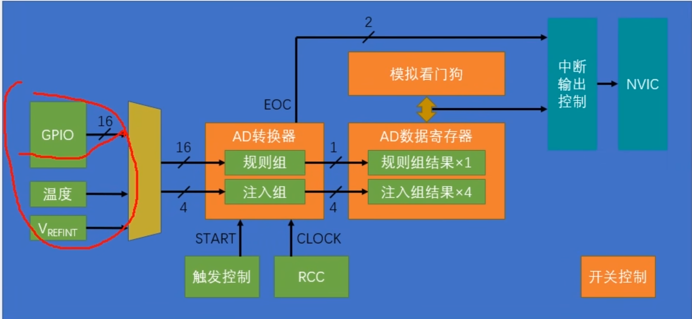

>左边是输入通道，16个GPI0口，外加两个内部的通道,
>
>AD转换器里有两个组，一个是规则组，一个是注入组
>
>规则组最多可以选中16个通道，注入组最多可以选择4个通道
>
>然后转换的结果可以存放在AD数据寄存器里
>
>其中规则组只有1个数据寄存器，注入组有4个
>
>然后下面这里有触发控制，提供了开始转换这个START信号
>
>触发控制可以选择软件触发和硬件触发,硬件触发主要是来自于定时器，当然也可以选择外部中断的引脚
>
>右边这里是来自于RCC的ADC时钟CLOCK,ADC逐次比较的过程就是由这个时钟推动的
>
>然后上面，可以布置一个模拟看门狗用于监测转换结果的范围
>
>**另外，规则组和注入组转换完成后会有个EOC信号,他会置一个标志位，当然也可以通向NVIC**


* 输入通道

>这些就是ADC通道和引脚复用的关系


* 规则组的4种转换模式

>那在我们ADC初始化的结构体里，会有两个参数,一个是选择单次转换还是连续转换的,另一个是选择扫描模式还是非扫描模式的

1、**单次转换，非扫描模式**


>在这里我们可以在序列1的位置指定我们想转换的通道,比如通道2，写到这个位置
>
>然后，我们就可以触发转换，ADC就会对这个通道2进行模数转换
>
>过一小段时间后，转换完成
>
>转换结果放在数据寄存器里，同时给EOC标志位置1,整个转换过程就结束了
>
>如果转换完了，那我们就可以在数据寄存器里读取结果了


>如果我们想再启动一次转换，那就需要再触发一次
>
>转换结束，置EOC标志位，读结果

这里的单次转换非扫描模式，只有序列1有用，没有用到这个菜单列表


2、**连续转换 非扫描模式**


>这样就只需要最开始触发一次，之后就可以一直转换了
>
>


3、单次转换 扫描模式


>比如这里指定通道数目为7，那它就只看前7个位置
>
>然后每次触发之后，它就依次对这前7个位置进行AD转换
>
>转换结果都放在数据寄存器里
>
>这里为了防止数据被覆盖，
>就需要用DMA及时将数据挪走
>
>那7个通道转换完成之后，产生EOC信号，转换结束


4、连续转换 扫描模式


* 触发控制


* 数据对齐


因为数据左对齐实际上就是把数据左移了4次

二进制有个特点，就是数据左移一次，就等效于把这个数据乘2

那这里左移4次，就相当于把结果乘16了

所以直接读的话会比实际值大16倍


* 转换时间


* ADC校准

>ADC内置的校准模式，可以消除每个电容器上出现的误差


* ADC外围电路


>图一：这里电位器的两个固定端，一端接3.3V，另一端接GND
>
>这样中间的滑动端就可以输出一个0~3.3V可调的电压输出了，我们这里可以接ADC的输入通道，比如PA0口。
>
>当滑动端往上滑时，电压增大，往下滑时，电压减小(这里电压指的是PA0~GND之间的，把电阻分隔开，就能看出)


>图二：中间是传感器输出电压的电路，
>
>般来说，像光敏电阻、热敏电阻、红外接收管、麦克风等等，都可以等效为一个可变电阻。
>
>因为电阻阻值没法直接测量，所以这里可以通过和一个固定电阻串联分压，
>
>来得到一个反应电阻值电压的电路。

 在这里，**传感器阻值变小时，下拉作用强，输出端的电压下降**，传感器阻值变大时，下拉作用变弱，输出端受上拉电阻的作用，电压就会升高


>图三：这是一个简单的电压转换电路，使用电阻分压，使得PA2的电压范围就是0~3.3V，就可以进入ADC转换了


#### 11.3 AD单通道和AD多通道

* 引脚图：


* 代码如下：

AD.C:

```c
#include "stm32f10x.h"                  // Device header

void AD_Init(void)
{
	//OPEN ADC1'S CLOCK
	//ALL ADC ARE IN APB2PERIPH
	RCC_APB2PeriphClockCmd(RCC_APB2Periph_ADC1,ENABLE);
	RCC_APB2PeriphClockCmd(RCC_APB2Periph_GPIOA,ENABLE);
	
	//RCC_ADCCLKConfig这个函数是用来配置ADCCLK分频器的,
	//它可以对APB2的72MHz时钟选择2、4、6、8分频，输入到ADCCLK
	RCC_ADCCLKConfig(RCC_PCLK2_Div6);
	//ADCCLK=72MHz/6=12MHZ
	
	GPIO_InitTypeDef GPIO_InitStructure;
	GPIO_InitStructure.GPIO_Mode = GPIO_Mode_AIN; //模拟输入
	GPIO_InitStructure.GPIO_Pin = GPIO_Pin_0;
	GPIO_InitStructure.GPIO_Speed = GPIO_Speed_50MHz ;
	GPIO_Init(GPIOA,&GPIO_InitStructure);
	//在AIN模式下，GPIO口是无效的，断开GPIO，就是为了防止GPIO口的输入输出对模拟电压造成干扰，这也是ADC专用的模式
	
	//选择规则组的输入通道
	ADC_RegularChannelConfig(ADC1,ADC_Channel_0,1,ADC_SampleTime_55Cycles5);
	//上面这个函数就是 在序列1的位置，写入通道0
	
	ADC_InitTypeDef ADC_InitStructure;
	ADC_InitStructure.ADC_Mode= ADC_Mode_Independent; //独立模式
	ADC_InitStructure.ADC_DataAlign = ADC_DataAlign_Right; //数据右对齐
	ADC_InitStructure.ADC_ExternalTrigConv=ADC_ExternalTrigConv_None;  //触发源使用软件触发
	ADC_InitStructure.ADC_ContinuousConvMode =  DISABLE;   //单次转换
	ADC_InitStructure.ADC_ScanConvMode = 	DISABLE;		//非扫描
	ADC_InitStructure.ADC_NbrOfChannel =  1; //指定通道的数目
	ADC_Init(ADC1,&ADC_InitStructure); 
	
	
	//开启adc电源
	ADC_Cmd(ADC1,ENABLE);
    
    //ADC的校准 有4个步骤
	ADC_ResetCalibration(ADC1);	//复位校准
	while(ADC_GetResetCalibrationStatus(ADC1)==SET); //返回复位校准的状态 
	//一旦标志位被硬件清0了，这个空循环就会自动跳出来,这样就实现了等待复位校准完成的效果
	ADC_StartCalibration(ADC1); //开始校准
	while(ADC_GetCalibrationStatus(ADC1)==SET);  //获取校准状态,等待校准完成
	//这样ADC就处于准备就绪的状态了
}


//启动转换，获取结果
uint16_t AD_GetValue(void)
{
	
	//这样就可以触发，ADC就开始转换了
	ADC_SoftwareStartConvCmd(ADC1,ENABLE);
	while(ADC_GetFlagStatus(ADC1,ADC_FLAG_EOC) == RESET);  //看规则组是否转换完成
	//==reset,转换未完成，空循环
	//转换完成后，EOC由硬件自动置1，跳出while循环
	
	//取结果
	 return ADC_GetConversionValue(ADC1);  //返回值是AD转换的结果
}
```

解析：


* 第一步，开启RCC时钟，包括ADC和GPIO的时钟，同时ADCCLK的分频器也要配置
* 第二步，配置GPIO,配置为模拟输入的模式
* 第三步，配置多路开关，把左边的通道接入到右边的规则组列表里
* 第四步，配置ADC转换器，这里通过结构体来配置，包括ADC是单次转换还是连续转换、扫描还是非扫描、有几个通道
* 第五步，开关控制，调用ADC_CMD函数，开启ADC
* 第六步，我们还可以对ADC进行一下校准，这样可以减小误差

如果想要软件触发转换，那会有函数可以触发；如果想读取转换结果，那也会有函数可以读取结果


main.c:

```c
#include "stm32f10x.h"                  // Device header
#include "Delay.h"
#include "OLED.h"
#include "AD.h"

uint16_t AD_Value;

int main(void)	
{
	OLED_Init();
	AD_Init();
	
	OLED_ShowString(1,1,"AD_VALUE:");
	while (1)
	{	
		 AD_Value = AD_GetValue();
		
		OLED_ShowNum(1,10,AD_Value,4);
	}	
	
}

```

* 程序现象如下：


>向左旋AD_VALUE减少，向右增大，其中AD_VALUE的值会不断跳变，这是正常误差范围


* ADC显示电压：

```c
#include "stm32f10x.h"                  // Device header
#include "Delay.h"
#include "OLED.h"
#include "AD.h"


uint16_t AD_Value;
float 	Voltage;

int main(void)	
{
	OLED_Init();
	AD_Init();
	
	OLED_ShowString(1,1,"AD_VALUE:");
	OLED_ShowString(2,1,"Voltage:0.00V");
	while (1)
	{	
		 AD_Value = AD_GetValue();
		//将0~4095的范围，变换为0~3.3的范围了
		 Voltage = (float)AD_Value / 4095 * 3.3;	
		OLED_ShowNum(1,10,AD_Value,4);
		//下面两步是为了显示小数
		OLED_ShowNum(2,9,Voltage,1);
		OLED_ShowNum(2,11,(uint16_t)(Voltage*100) % 100,2);
		
		Delay_ms(100);
	}	
	
}
 
```


以上使用的均是第一种转换方式，也就是：**单次转换非扫描模式**


* 如果是连续转换，非扫描模式：

```c
//将这个参数改成ENABLE
ADC_InitStructure.ADC_ContinuousConvMode =  ENABLE;
```

因为连续转换只需要在最开始一次触发就行了，所以所以这里软件触发转换的函数，就可以挪到初始化的最后

```c
//开启adc电源
	ADC_Cmd(ADC1,ENABLE);
	ADC_ResetCalibration(ADC1);	//复位校准
	while(ADC_GetResetCalibrationStatus(ADC1)==SET); //返回复位校准的状态 
	//一旦标志位被硬件清0了，这个空循环就会自动跳出来,这样就实现了等待复位校准完成的效果
	ADC_StartCalibration(ADC1); //开始校准
	while(ADC_GetCalibrationStatus(ADC1)==SET);  //获取校准状态,等待校准完成
	//这样ADC就处于准备就绪的状态了

ADC_SoftwareStartConvCmd(ADC1,ENABLE);
```

因此在AD_GETVALUE这里，就不需要判断标志位了，因为此时数据寄存器会不断地刷新最新的转换结果

```c
//启动转换，获取结果
uint16_t AD_GetValue(void)
{
	
	 return ADC_GetConversionValue(ADC1);  //返回值是AD转换的结果
}
```


* AD多通道


* 上面接了3个传感器模块，分别是光敏传感器、热敏传感器、反射式红外传感器

>三个模块的AO,就是模拟量输出引脚，3个模块的AO,分别接在PA1,PA2,PA3口，加上电位器的pA0,共计是4个输入通道


* 实现多通道转换的功能

这里可以更用上面的这个单次转换、非扫描的模式，来实现多通道


只需要在每次触发转换之前，手动更改一下列表第一个位置的通道就行了

* 比如第一次转换，先写入通道0，之后触发、等待、读值
* 第二次转换，再先把通道0改成通道1，之后触发、等待、读值

这样，在转换前，先指定一下通道，再启动转换，就可以轻松地实现多通道转换的功能了


* 代码部分：

AD.C:

```c
#include "stm32f10x.h"                  // Device header

void AD_Init(void)
{
	
	//OPEN ADC1'S CLOCK
	//ALL ADC ARE IN APB2PERIPH
	RCC_APB2PeriphClockCmd(RCC_APB2Periph_ADC1,ENABLE);
	RCC_APB2PeriphClockCmd(RCC_APB2Periph_GPIOA,ENABLE);
	
	//RCC_ADCCLKConfig这个函数是用来配置ADCCLK分频器的,
	//它可以对APB2的72MHz时钟选择2、4、6、8分频，输入到ADCCLK
	RCC_ADCCLKConfig(RCC_PCLK2_Div6);
	//ADCCLK=72MHz/6=12MHZ
	
	GPIO_InitTypeDef GPIO_InitStructure;
	GPIO_InitStructure.GPIO_Mode = GPIO_Mode_AIN; //模拟输入
	GPIO_InitStructure.GPIO_Pin = GPIO_Pin_0 | GPIO_Pin_1 | GPIO_Pin_2 | GPIO_Pin_3;
	GPIO_InitStructure.GPIO_Speed = GPIO_Speed_50MHz ;
	GPIO_Init(GPIOA,&GPIO_InitStructure);
	
	//选择规则组的输入通道,这里的通道转换被放在AD_GETVALUE函数中去了，用于每次转换
    //ADC_RegularChannelConfig(ADC1,ADC_Channel,1,ADC_SampleTime_55Cycles5);
	//上面这个函数就是 在序列1的位置，写入通道0
	
	ADC_InitTypeDef ADC_InitStructure;
	ADC_InitStructure.ADC_Mode= ADC_Mode_Independent; //独立模式
	ADC_InitStructure.ADC_DataAlign = ADC_DataAlign_Right; //数据右对齐
	ADC_InitStructure.ADC_ExternalTrigConv=ADC_ExternalTrigConv_None;  //触发源使用软件触发
	ADC_InitStructure.ADC_ContinuousConvMode =  DISABLE;   //单次转换
	ADC_InitStructure.ADC_ScanConvMode = 	DISABLE;		//非扫描
	ADC_InitStructure.ADC_NbrOfChannel =  1; //指定通道的数目
	ADC_Init(ADC1,&ADC_InitStructure); 
	
	
	//开启adc电源
	ADC_Cmd(ADC1,ENABLE);
	ADC_ResetCalibration(ADC1);	//复位校准
	while(ADC_GetResetCalibrationStatus(ADC1)==SET); //返回复位校准的状态 
	//一旦标志位被硬件清0了，这个空循环就会自动跳出来,这样就实现了等待复位校准完成的效果
	ADC_StartCalibration(ADC1); //开始校准
	while(ADC_GetCalibrationStatus(ADC1)==SET);  //获取校准状态,等待校准完成
	//这样ADC就处于准备就绪的状态了
}


//启动转换，获取结果
//这里AD_GetValue的参数就是ADC_RegularChannelConfig中选择通道的参数
uint16_t AD_GetValue(uint8_t ADC_Channel)
{
	//多通道转换，这里通道0改成参数指定的通道
	ADC_RegularChannelConfig(ADC1,ADC_Channel,1,ADC_SampleTime_55Cycles5);
	//这样就可以触发，ADC就开始转换了
	ADC_SoftwareStartConvCmd(ADC1,ENABLE);
	while(ADC_GetFlagStatus(ADC1,ADC_FLAG_EOC) == RESET);  //看规则组是否转换完成
	//==reset,转换未完成，空循环
	//转换完成后，EOC由硬件自动置1，跳出while循环
	
	//取结果
	 return ADC_GetConversionValue(ADC1);  //返回值是AD转换的结果
}
```

* main.c:

```c
#include "stm32f10x.h"                  // Device header
#include "Delay.h"
#include "OLED.h"
#include "AD.h"


uint16_t AD0,AD1,AD2,AD3;


int main(void)	
{
	OLED_Init();
	AD_Init();
	
		OLED_ShowString(1,1,"AD0:");
		OLED_ShowString(2,1,"AD1:");
		OLED_ShowString(3,1,"AD2:");
		OLED_ShowString(4,1,"AD3:");

	//依次启动4次转换，并且在转换之前，指定了转换的通道，
	//每次转换完成后，把结果分别存在4个寄存器数据中，最后显示
	//这就是使用单次转换非扫描的模式，实现AD多通道的方法
	while (1)
	{	
		AD0 = AD_GetValue(ADC_Channel_0);
		AD1 = AD_GetValue(ADC_Channel_1);
		AD2 = AD_GetValue(ADC_Channel_2);
		AD3 = AD_GetValue(ADC_Channel_3);

		OLED_ShowNum(1,5,AD0,4);
		OLED_ShowNum(2,5,AD1,4);
		OLED_ShowNum(3,5,AD2,4);
		OLED_ShowNum(4,5,AD3,4);
		Delay_ms(100);
	}	
	
}
 
```

* 程序现象如下：


在OLED上显示的参数:

* AD0:这是电位器AD值的参数
* AD1:这是光敏电阻AD值的参数，用手盖住光敏传感器，AD1数字变化
* AD2:这是热敏传感器AD值的参数，用手按住相应传感器，AD2数字变化
* AD3:这是反射传感器AD值的参数，移动手掌距传感器的距离，AD3数字变化


## 12、DMA直接存储器存取


>所以存储器到存储器的数据转运，我们一般使用软件触发
>
>外设到存储器的数据转运，我们一般使用硬件触发


#### 12.1STM32存储器映像


* ROM就是只读存储器，是一种非易失性、掉电不丢失的存储器
* RAM就是随机存储器，是一种易失性、掉电丢失的存储器


#### 12.2DMA框图


所以总共就是CPU和存储器两个东西

>Flash是主闪存，SRAM是运行内存	
>
>

* 各个外设，都可以看成是寄存器，也是一种SRAM存储器

>寄存器是一种特殊的存储器,方面，CPU可以对寄存器进行读写，就像读写运行内存一样
>
>另一方面，寄存器的每一位背后，都连接了一根导线,这些导线可以用于控制外设电路的状态

* 寄存器是连接软件和硬件的桥梁

cpu通过如下线路，对DMA进行配置：


>所以DMA，即是总线矩阵的主动单元，可以读写各种存储器,也是AHB总线上的被动单元

* 用于访问各个存储器的DMA总线


* 内部的多个通道，可以进行独立的数据转运

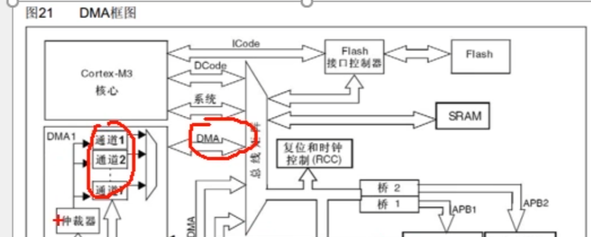

* 仲裁器，用于调度各个通道，防止产生冲突


* AHB从设备，用于配置DMA参数


* DMA请求，用于硬件触发DMA的数据转运


>注意，这里的FLASH,是ROM只读存储器的一种，如果通过总线直接访问的话，无论是CPU，还是DMA，都是只读的，只能读取数据，而不能写入


#### 12.3DMA基本结构图


>左边是外设寄存器站点,右边是存储器站点，包括FLash和SRAM
>
>DMA的数据转运，可以是从外设到存储器，也可以从存储器到外设。
>
>另外，还有一种转运方式，就是存储器到存储器，比如Fash到SRAM或者SRAM到SRAM，这两种方式
>
>由于FLASH是只读的，所以DMA不可以进行SRAM到FLash，或者Flash到Flash的转运操作

>第一个是起始地址，有外设端的起始地址，和存储器端的起始地址
>
>数据宽度：这个参数的作用是，指定一次转运要按多大的数据宽度来进行，它可以选择字节Bvte、半字HalfWord和字Word，字节就是8位，也就是一次转运一个uint8 t，这么大的数据

>传输计数器：这个东西就是用来指定，我总共需要转运几次的，这个传输计数器是一个自滅计数器，比如你给它写一个5，那DMA就只能进行5次数据转运
>
>另外，它减到0之后，之前自增的地址，也会恢复到起始地址的位置，以方便之后DMA开始新一轮的转运

>自动重装器：这个自动重装器的作用就是，传输计数器减到0之后，是否要自动恢复到最初的值 DMA =5 ->0 ->5
>
>

>M2M就是Memory to Memory,当我们给M2M位1时，DMA就会选择软件触发
>
>它这个软件触发的执行逻辑是，以最快的速度，连续不断地触发DMA,争取早目把传输计数器清零，完成这一轮的转换

* DMA进行转运，有几个条件

>第一，就是开关控制，DMA_Cmd必须使能
>
>第二，就是传输计数器必须大于0
>
>第三，就是触发源，必须有触发信号,触发一次，转运一次，传输计数器自减一次


* DMA1的请求映像


EN位是开关控制，**EN=0时不工作，EN=1时工作**

左边的硬件触发源，每个通道的硬件触发源都是不同的，如果需要用ADC1来触发的话，就必须选择通道1，如果需要定时器2的更新事件来触发的话，那就必须选择通道2


* 若数据宽度不一样，转运问题


如果你把小的数据转到大的里面去，高位就会补0。

如果把大的数据转到小的里面，高位就会舍弃掉


#### 12.4数据转运+DMA


转运完DataA[0]和DataB[0]之后,两个站点的地址都应该自增，都移动到下一个数据的位置,继续转运DataA[1]和DataB[1]，这样来进行


#### 12.5ADC扫描模式+DMA


触发一次后，7个通道依次进行AD转换,然后转换结果都放到ADG DR数据寄存器里面

在每个单独的通道转换完成后,进行一个DMA数据转运，并且目的地址进行自增


#### 12.6DMA存储器到存储器的数据转运

* 硬件图：


* 代码：

```c
OLED_ShowHexNum(2,1,(uint32_t)&ADC1->DR,8);

//结果为：4001244c
```


* 完整代码：

MYDMA,C:

```c
#include "stm32f10x.h"                  // Device header

uint16_t MYDMA_Size;

//这里MyDMA_Init的参数就是结构体对应的参数
void MyDMA_Init(uint32_t AddrA,uint32_t AddrB,uint16_t Size)
{
	MYDMA_Size = Size;
	//DMA是AHB总线的设备，所以要用AHB开启时钟的函数
	RCC_AHBPeriphClockCmd(RCC_AHBPeriph_DMA1,ENABLE);
	
	DMA_InitTypeDef DMA_InitStructure;
	
	DMA_InitStructure.DMA_PeripheralBaseAddr=AddrA;
	DMA_InitStructure.DMA_PeripheralDataSize=DMA_PeripheralDataSize_Byte;
	DMA_InitStructure.DMA_PeripheralInc=DMA_PeripheralInc_Enable;
	DMA_InitStructure.DMA_MemoryBaseAddr= AddrB;
	DMA_InitStructure.DMA_MemoryDataSize=DMA_MemoryDataSize_Byte;
	DMA_InitStructure.DMA_MemoryInc=DMA_MemoryInc_Enable;
	
	DMA_InitStructure.DMA_DIR=DMA_DIR_PeripheralSRC;
	DMA_InitStructure.DMA_BufferSize=Size;//指定传输几次
	DMA_InitStructure.DMA_Mode=DMA_Mode_Normal;
	DMA_InitStructure.DMA_M2M=DMA_M2M_Enable; //其实外设也是存储器
	DMA_InitStructure.DMA_Priority=DMA_Priority_Medium;
	
	DMA_Init(DMA1_Channel1,&DMA_InitStructure);
	
	//DMA使能
	DMA_Cmd(DMA1_Channel1,DISABLE);
	//这里采用一开始失能，通过调用TRANSFER函数来使能DMA
}


//brief:调用一次这个函数，就再次启动一次DMA转运
void MYDMA_Transfer(void)
{
	//这里要重新给传输计数器赋值，必须要先给DMA失能
	DMA_Cmd(DMA1_Channel1,DISABLE);
	DMA_SetCurrDataCounter(DMA1_Channel1,MYDMA_Size);
	DMA_Cmd(DMA1_Channel1,ENABLE);
	
	while(DMA_GetFlagStatus(DMA1_FLAG_TC1)==RESET); //转运完成之后，标志位置1
	//手动清楚标志位
	DMA_ClearFlag(DMA1_FLAG_TC1);

}

```

main.c:

```c
#include "stm32f10x.h"                  // Device header
#include "Delay.h"
#include "OLED.h"
#include "mydma.h"

//首先我们定义一下，DMA转运的源端数组和目的数组
uint8_t DataA[] = {0X01,0X02,0X03,0X04};
uint8_t DataB[] = {0,0,0,0};

int main(void)	
{
	OLED_Init();
	
	MyDMA_Init((uint32_t)DataA,(uint32_t)DataB,4);
	
	OLED_ShowString(1,1,"DataA");
	OLED_ShowString(3,1,"DataB");
	//显示DATAA的地址
	OLED_ShowHexNum(1,8,(uint32_t)DataA,8);
	OLED_ShowHexNum(3,8,(uint32_t)DataB,8);

	
	//转运之后，再次显示
//	OLED_ShowHexNum(3,1,DataA[0],2);
//	OLED_ShowHexNum(3,4,DataA[1],2);
//	OLED_ShowHexNum(3,7,DataA[2],2);
//	OLED_ShowHexNum(3,10,DataA[3],2);
//	
//	OLED_ShowHexNum(4,1,DataB[0],2);
//	OLED_ShowHexNum(4,4,DataB[1],2);
//	OLED_ShowHexNum(4,7,DataB[2],2);
//	OLED_ShowHexNum(4,10,DataB[3],2);
	
	
	
	while (1)
	{	
		//让DATAA的数据自增
		DataA[0]++;
		DataA[1]++;
		DataA[2]++;
		DataA[3]++;
		
	//在第一行显示DATAA的数据
	OLED_ShowHexNum(2,1,DataA[0],2);
	OLED_ShowHexNum(2,4,DataA[1],2);
	OLED_ShowHexNum(2,7,DataA[2],2);
	OLED_ShowHexNum(2,10,DataA[3],2);
	//在第二行显示DATAB的数据
	OLED_ShowHexNum(4,1,DataB[0],2);
	OLED_ShowHexNum(4,4,DataB[1],2);
	OLED_ShowHexNum(4,7,DataB[2],2);
	OLED_ShowHexNum(4,10,DataB[3],2);
		
	Delay_ms(1000);
		
	//开始转运，函数完成后转运结束
	MYDMA_Transfer();
		
	//接下来显示转运过后的数值
	OLED_ShowHexNum(2,1,DataA[0],2);
	OLED_ShowHexNum(2,4,DataA[1],2);
	OLED_ShowHexNum(2,7,DataA[2],2);
	OLED_ShowHexNum(2,10,DataA[3],2);
	//在第二行显示DATAB的数据
	OLED_ShowHexNum(4,1,DataB[0],2);
	OLED_ShowHexNum(4,4,DataB[1],2);
	OLED_ShowHexNum(4,7,DataB[2],2);
	OLED_ShowHexNum(4,10,DataB[3],2);
	
	Delay_ms(1000);
	}	
	
}

```

* 程序效果如下：


每过1S,dataA的数据都会传输到DataB中


* 如果是将FLASH的数据转运到SRAM中，则有：

```c
#include "stm32f10x.h"                  // Device header
#include "Delay.h"
#include "OLED.h"
#include "mydma.h"

//首先我们定义一下，DMA转运的源端数组和目的数组
//这里CONST 让DataA变成FLASH中的数据
const uint8_t DataA[] = {0X01,0X02,0X03,0X04};
uint8_t DataB[] = {0,0,0,0};

int main(void)	
{
	OLED_Init();
	
	MyDMA_Init((uint32_t)DataA,(uint32_t)DataB,4);
	
	OLED_ShowString(1,1,"DataA");
	OLED_ShowString(3,1,"DataB");
	//显示DATAA的地址
	OLED_ShowHexNum(1,8,(uint32_t)DataA,8);
	OLED_ShowHexNum(3,8,(uint32_t)DataB,8);

	
	//转运之后，再次显示
//	OLED_ShowHexNum(3,1,DataA[0],2);
//	OLED_ShowHexNum(3,4,DataA[1],2);
//	OLED_ShowHexNum(3,7,DataA[2],2);
//	OLED_ShowHexNum(3,10,DataA[3],2);
//	
//	OLED_ShowHexNum(4,1,DataB[0],2);
//	OLED_ShowHexNum(4,4,DataB[1],2);
//	OLED_ShowHexNum(4,7,DataB[2],2);
//	OLED_ShowHexNum(4,10,DataB[3],2);
	
	
	
	while (1)
	{	
		//让DATAA的数据自增
		
		
	//在第一行显示DATAA的数据
	OLED_ShowHexNum(2,1,DataA[0],2);
	OLED_ShowHexNum(2,4,DataA[1],2);
	OLED_ShowHexNum(2,7,DataA[2],2);
	OLED_ShowHexNum(2,10,DataA[3],2);
	//在第二行显示DATAB的数据
	OLED_ShowHexNum(4,1,DataB[0],2);
	OLED_ShowHexNum(4,4,DataB[1],2);
	OLED_ShowHexNum(4,7,DataB[2],2);
	OLED_ShowHexNum(4,10,DataB[3],2);
		
	Delay_ms(1000);
		
	//开始转运，函数完成后转运结束
	MYDMA_Transfer();
		
	//接下来显示转运过后的数值
	OLED_ShowHexNum(2,1,DataA[0],2);
	OLED_ShowHexNum(2,4,DataA[1],2);
	OLED_ShowHexNum(2,7,DataA[2],2);
	OLED_ShowHexNum(2,10,DataA[3],2);
	//在第二行显示DATAB的数据
	OLED_ShowHexNum(4,1,DataB[0],2);
	OLED_ShowHexNum(4,4,DataB[1],2);
	OLED_ShowHexNum(4,7,DataB[2],2);
	OLED_ShowHexNum(4,10,DataB[3],2);
	
	Delay_ms(1000);
	}	
	
}

```


#### 12.7ADC+DMA应用


* 代码部分：

AD.C:

```c
#include "stm32f10x.h"                  // Device header

uint16_t AD_VALUE[4];

void AD_Init(void)
{
	
	//OPEN ADC1'S CLOCK
	//ALL ADC ARE IN APB2PERIPH
	RCC_APB2PeriphClockCmd(RCC_APB2Periph_ADC1,ENABLE);
	RCC_APB2PeriphClockCmd(RCC_APB2Periph_GPIOA,ENABLE);
	RCC_AHBPeriphClockCmd(RCC_AHBPeriph_DMA1,ENABLE);
	
	//RCC_ADCCLKConfig这个函数是用来配置ADCCLK分频器的,
	//它可以对APB2的72MHz时钟选择2、4、6、8分频，输入到ADCCLK
	RCC_ADCCLKConfig(RCC_PCLK2_Div6);
	//ADCCLK=72MHz/6=12MHZ
	
	GPIO_InitTypeDef GPIO_InitStructure;
	GPIO_InitStructure.GPIO_Mode = GPIO_Mode_AIN; //模拟输入
	GPIO_InitStructure.GPIO_Pin = GPIO_Pin_0 | GPIO_Pin_1 | GPIO_Pin_2 | GPIO_Pin_3;
	GPIO_InitStructure.GPIO_Speed = GPIO_Speed_50MHz ;
	GPIO_Init(GPIOA,&GPIO_InitStructure);
	//因为LED初始化默认低电平，这样可以让LED一开始不亮,让他们都置1
	
	//选择规则组的输入通道
	//通道0放在序列1的位置，通道1放在序列2的位置...
	ADC_RegularChannelConfig(ADC1,ADC_Channel_0,1,ADC_SampleTime_55Cycles5);
	ADC_RegularChannelConfig(ADC1,ADC_Channel_1,2,ADC_SampleTime_55Cycles5);
	ADC_RegularChannelConfig(ADC1,ADC_Channel_2,3,ADC_SampleTime_55Cycles5);
	ADC_RegularChannelConfig(ADC1,ADC_Channel_3,4,ADC_SampleTime_55Cycles5);
	
	//上面这个函数就是 在序列1的位置，写入通道0
	
	ADC_InitTypeDef ADC_InitStructure;
	ADC_InitStructure.ADC_Mode= ADC_Mode_Independent; //独立模式
	ADC_InitStructure.ADC_DataAlign = ADC_DataAlign_Right; //数据右对齐
	ADC_InitStructure.ADC_ExternalTrigConv=ADC_ExternalTrigConv_None;  //触发源使用软件触发
	ADC_InitStructure.ADC_ContinuousConvMode =  DISABLE;   //单次扫描
	ADC_InitStructure.ADC_ScanConvMode = ENABLE;		//扫描，多通道
	ADC_InitStructure.ADC_NbrOfChannel =  4; //指定通道的数目为4
	ADC_Init(ADC1,&ADC_InitStructure); 
	

	//DMA init	
	DMA_InitTypeDef DMA_InitStructure;
	
	DMA_InitStructure.DMA_PeripheralBaseAddr=(uint32_t)&ADC1->DR; //外设基地址
	DMA_InitStructure.DMA_PeripheralDataSize=DMA_PeripheralDataSize_HalfWord;
	DMA_InitStructure.DMA_PeripheralInc=DMA_PeripheralInc_Disable;//不自增，始终转运同一个位置的数据
	DMA_InitStructure.DMA_MemoryBaseAddr=(uint32_t)AD_VALUE;
	DMA_InitStructure.DMA_MemoryDataSize=DMA_MemoryDataSize_HalfWord;
	DMA_InitStructure.DMA_MemoryInc=DMA_MemoryInc_Enable;
	
	DMA_InitStructure.DMA_DIR=DMA_DIR_PeripheralSRC;
	DMA_InitStructure.DMA_BufferSize=4;//指定传输几次
	DMA_InitStructure.DMA_Mode=DMA_Mode_Normal;
	DMA_InitStructure.DMA_M2M=DMA_M2M_Disable; //不使用软件触发，使用硬件触发，触发源为ADC1
	DMA_InitStructure.DMA_Priority=DMA_Priority_Medium;
	
	DMA_Init(DMA1_Channel1,&DMA_InitStructure);
	
	//DMA使能
	DMA_Cmd(DMA1_Channel1,ENABLE);
	
	//开启ADC到DMA的输出
	ADC_DMACmd(ADC1,ENABLE);
	
	//开启adc电源
	ADC_Cmd(ADC1,ENABLE);
	ADC_ResetCalibration(ADC1);	//复位校准
	while(ADC_GetResetCalibrationStatus(ADC1)==SET); //返回复位校准的状态 
	//一旦标志位被硬件清0了，这个空循环就会自动跳出来,这样就实现了等待复位校准完成的效果
	ADC_StartCalibration(ADC1); //开始校准
	while(ADC_GetCalibrationStatus(ADC1)==SET);  //获取校准状态,等待校准完成
	//这样ADC就处于准备就绪的状态了
}


//启动转换，获取结果
void AD_GetValue(void)
{
	//这里要重新给传输计数器赋值，必须要先给DMA失能
	//因为DMA也是正常的单次模式，所以在触发ADC之前，需要重新写入一下传输寄存器
	DMA_Cmd(DMA1_Channel1,DISABLE);
	DMA_SetCurrDataCounter(DMA1_Channel1,4);
	DMA_Cmd(DMA1_Channel1,ENABLE);
	
	
	ADC_SoftwareStartConvCmd(ADC1,ENABLE);
	
	while(DMA_GetFlagStatus(DMA1_FLAG_TC1)==RESET); //转运完成之后，标志位置1
	//手动清楚标志位
	DMA_ClearFlag(DMA1_FLAG_TC1);
	
}
```

main.C:

```c
#include "stm32f10x.h"                  // Device header
#include "Delay.h"
#include "OLED.h"
#include "AD.h"


int main(void)	
{
	OLED_Init();
	AD_Init();
	
		OLED_ShowString(1,1,"AD0:");
		OLED_ShowString(2,1,"AD1:");
		OLED_ShowString(3,1,"AD2:");
		OLED_ShowString(4,1,"AD3:");

	//依次启动4次转换，并且在转换之前，指定了转换的通道，
	//每次转换完成后，把结果分别存在4个寄存器数据中，最后显示
	//这就是使用单次转换非扫描的模式，实现AD多通道的方法
	while (1)
	{	
		AD_GetValue();
//		AD0 = AD_GetValue(ADC_Channel_0);
//		AD1 = AD_GetValue(ADC_Channel_1);
//		AD2 = AD_GetValue(ADC_Channel_2);
//		AD3 = AD_GetValue(ADC_Channel_3);

		OLED_ShowNum(1,5,AD_VALUE[0],4);
		OLED_ShowNum(2,5,AD_VALUE[1],4);
		OLED_ShowNum(3,5,AD_VALUE[2],4);
		OLED_ShowNum(4,5,AD_VALUE[3],4);
		Delay_ms(100);
	}	
	
}
 
```

* 可以看到，此时硬件外设，已经实现了相互配合，实现了高度的自动化
* 各种操作都是硬件自己完成的，极大地减轻了软件负担
* 软件什么都不需要做，也不需要进任何中断
* 各个外设互相连接、互相交织，不再是传统的这样，一个CPU，单独控制多个独立的外设，而是外设之间互相连接，互相合作，形成一个网状结构


## 13、USART串口协议


* **通信的目的:将一个设备的数据传送到另一个设备，扩展硬件系统**

* 因为有些功能是STM32内部没有的，这个就只能通过外挂芯片来完成，这个时候就需要在2个设备之间，连上1根或者多根通信线，通过通信线路发送或者接收数据，完成数据交换，从而实现控制外挂模块和读取外挂模块数据的目的


* USART的引脚

**TX和 RX 也可以叫TXD 和 RXD**

>TX(Transmit Exchange)是数据发送脚
>
>RX(Receive Exchange)是数据接收脚


### 13.1串口


* 硬件电路


* VCC和GND是供电，TX和RX是通信的引脚
* TX和RX是单端信号，它们的高低电平都是相对于GND的，所以严格上来说，GND应该也算是通信线

* 所以，串口通信的TX、RX、GND是必须要接的，上面的VCC，如果两个设备都有独立供电，那VCC可以不接


* 电平标准


>我们在单片机电路中最常见的是TTL电平,也就是5V或者3.3V表示逻辑1，0V表示逻辑0


### 13.2串口参数以及时序


>串口中，每一个字节都装载在一个数据帧里面
>
>每个数据帧都由起始位、数据位和停止位组成,这里数据位有8个，代表一个字节的8位
>
>右边：校验位跟在有效载荷后面，占1位

* 波特率：**串口一般是使用异步通信**，所以需要双方约定一个通信速率

>波特率本来的意思是每秒传输码元的个数,单位是码元/s，或者直接叫波特(Baud)
>
>**比特率**：比特率的意思是每秒传输的比特数，单位是bit/s，或者叫bps
>
>在二进制调制的情况下，一个码元就是一个bit。此时波特率就等于比特率
>
>像我们单片机的串口通信，基本都是二进制调制，也就是高电平表示1，低电平表示0，一位就是1bit

比如我们双方规定波特率为1000bps，那就表示，1s要发1000位，每一位的时间就是1ms


也就是上图这里，这一段时间是1ms

发送方每隔1ms发送一位，接收方每隔1ms接收一位,这就是波特率，它决定了每隔多久发送一位


* 起始位

>首先，串口的空闲状态是高电平，也就是没有数据传输的时候,引脚必须要置高电平，作为空闲状态
>
>然后需要传输的时候，必须要先发送一个起始位,这个起始位必须是低电平.来打破空闲状态的高电平，产生一个下降沿,这个下降沿，就告诉接收设备，这一帧数据要开始了

* 停止位：
* 停止位固定为1，把引脚恢复成高电平

>这个停止位的作用是，用于数据帧间隔，固定为高电平，同时这个停止位，也是为下一个起始位做准备的
>
>如果没有停止位，那当我数据最后一位是0的时候，下次再发送新的一帧，就没法产生下降沿了。

* 数据位：

>这里数据位表示数据帧的有效载荷,1为高电平，0为低电平，低位先行.
>
>比如这里要先发送一个字节：0X0F,那就首先把0F转换为二进制，就是0000 1111
>
>然后低位先行，所以数据要从低位开始发送,也就是从最右边的1开始向左发送：11110000


注意：这里的数据位有2种表达方法：

* 一种是把校验位作为数据位的一部分，其中9位数据，就是8位有效载荷和1位校验位
* 另一种就是把数据位和校验位独立开，数据位就是有效载荷，校验位就是独立的1位


例如上图，这里的S就是起始位，变为低电平，然后就是8位要发送的电平，然后就是停止位P，再次置高电平


### 13.3 USART通用同步/异步收发器


* **UART就是异步收发器**

**其中这里USART1是APB2总线上的设备，USART2\USART3都是APB1总线的设备**


#### 13.3.1USART框图


这部分就是串口的数据寄存器了，发送或接收的字节数据就存在这

一个是**发送数据寄存器TDR(Transmit.DR)**，另一个是接收数据寄存器**RDR(Receive DR)**.

这两个寄存器占用同一个地址

**在程序上，只表现为一个寄存器，就是数据奇存器DR.(Data Register)**

* 注意：**TDR是只写的，RDR是只读的**


**发送移位寄存器**的作用就是，把一个字节的数据一位一位地移出去，正好对应串四协议的波形的数据位--

>当数据从TDR移动到移位寄存器时,会置一个标志位，叫**TXE((TXEmpty)，**发送寄存器空
>
>我们检查这个标志位，如果置1了-我们就可以在TDR写入下一个数据了

* 注意，当TXE标志位置1时，数据还没有被发送出去，只要数据转移到发送寄存器，TXE就会置1，我们就可以写入新的数据了.

>然后发送移位寄存器就会在下面这里的发生器控制的驱动下,**向右移位**，然后一位一位地，把数据输出到TX引脚
>
>**向右移位满足低位先行原则**


然后左边这里，有一个硬件数据流控，也就是硬件流控制，简称流控

>如果发送设备发的太快，接收设备来不及处理,就会出现丢弃或覆盖数据的现象!
>
>那有了流控，就可以避免这个问题了

* nRTS(Request To Send)是请求发送 是输出脚:若是低电平，表明USART准备好接收数据
* nCTS(Clear To Send)是清除发送，是输入脚:若是高电平，在当前数据传输结束时阻断下一次的数据发送

**这里前面加个n意思是低电平有效**

>具体操作方法为：
>
>寻找另一个支持流控的串口，它的TX接到我的RX，然后我的RTS要输出一个能不能接收的反馈信号，接到对方的CTS
>
>当我能接收的时候，RTS就置低电平，请求对方发送，对方的CTS接收到之后，就可以一直发

* TX和CTS是一对的，RX和RTS是一起的
* CTS和RTS也要交叉连接


串口一般是点对点的通信，点对点，只支持两个设备互相通信，而多设备，在一条总线上，可以接多个从设备，我想跟某个设备通信，就先进行寻址，确定通信对象

* 这个唤醒单元就可以用来实现多设备的功能


状态寄存器这里，有两个标志位比较重要

一个是**TXE发送寄存器空**，另一个是**RXNE接收寄存器非空**

**这两个是判断发送状态和接收状态的必要标志位**


#### 13.3.2USART基本框图


* 最左边这里是波特率发生器，用于产生约定的通信速率，时钟来源是PCLK2或1

>经过波特率发生器分频后,产生的时钟通向发送控制器和接收控制器
>
>发送控制器和接收控制器，用来控制发送移位和接收移位
>
>之后，由发送数据寄存器和发送移位寄存器这两个寄存器的配合
>
>将数据一位一位地移出去,通过GPIO的复用输出，输出到TX引脚,产生串口协议规定的波形
>
>那右边这实际上有四个寄存器,但在软件层面，只有一个DR寄存器可以供我们读写


### 13.4数据帧


>空闲高电平，然后起始位0，然后根据写入的数据，置1或0,依次发送位0到位8，加起来就是9位,最后停止位1，数据帧结束
>
>然后下面这个时钟，就是我们之前说的同步时钟输出的功能
>
>可以看到，这里在每个数据位的中间，都有一个时钟上升沿,接收端可以在时钟上升沿进行采样
>
>这个时钟的最后一位，可以通过这个LBCL位控制，要不要输出,另外这个时钟的极性、相位什么的，也可以通过配置寄存器配置
>
>一个是空闲帧，就是从头到尾都是1
>
>还有一个是断开帧，从头到尾都是0,这两个数据帧，是局域网协议用的
>
>

* 配置停止位：

STM32可以配置停止位长度为0.5、1、1.5、2，这四种


>一般选择1位停止位就行了


* 对于输入而言，还要保证每次输入采样的位置，**要正好处于每一位的中间**，只有在每一位的正中间采样，这样高低电平读进来，才是最可靠的


>如果你采样点过于靠前或靠后，那有可能高低电平还正在翻转,电平还不稳定，或者稍有误差，数据就采样错了
>
>


* USART起始位侦测试

**也就是在一位的时间里，可以进行16次采样**


最开始，空闲状态高电平，那采样就一直是1，在某个位置，突然采到一个0，那么就说明，在这两次采样之间，出现了下降沿，那之后就应该是起始位了


* 数据采样


在一个数据位，有16个采样时钟

>由于起始位侦测已经对齐了采样时钟,所以，这里就直接在第8、9、10次采样数据位
>
>为了保证数据的可靠性，这里是连续采样3次

* 波特率发生器

**波特率发生器就是分频器**


### 13.5串口发送

* 接线图:


>这里两个设备之间要把负极接在一起进行共地，一般多个系统之间互连，都要进行共地。这样电平才能有高低的参考
>
>


>最后，两个接口都要连接电脑才有效，这个串口模块和STLINK都要插在电脑上,这样，STM32和串口模块都有独立供电
>
>所以这里通信的电源正极就不需要接了


* Serial.c:

```C
#include "stm32f10x.h"                  // Device header

void Serial_Init(void)
{
	RCC_APB2PeriphClockCmd(RCC_APB2Periph_USART1,ENABLE);
	RCC_APB2PeriphClockCmd(RCC_APB2Periph_GPIOA,ENABLE);
	
	GPIO_InitTypeDef GPIO_InitStructure;
	//TX脚是USART外设控制的输出脚，所以要选复用推挽输出
	//RX脚是USART外设数据输入脚，所以要选择输入模式
	//因为串回波形空闲状态是高电平，所以不使用下拉输入	
	GPIO_InitStructure.GPIO_Mode = GPIO_Mode_AF_PP ;
	GPIO_InitStructure.GPIO_Pin = GPIO_Pin_9;
	GPIO_InitStructure.GPIO_Speed = GPIO_Speed_50MHz ;
	GPIO_Init(GPIOA,&GPIO_InitStructure);
	
	
	USART_InitTypeDef USART_InitStructure;
	USART_InitStructure.USART_BaudRate=9600;
	USART_InitStructure.USART_HardwareFlowControl=USART_HardwareFlowControl_None; 
	USART_InitStructure.USART_Mode=USART_Mode_Tx;
	USART_InitStructure.USART_Parity=USART_Parity_No;
	USART_InitStructure.USART_StopBits=USART_StopBits_1;
	USART_InitStructure.USART_WordLength=USART_WordLength_8b;
	USART_Init(USART1,&USART_InitStructure);
	
	USART_Cmd(USART1,ENABLE);
	
}

//SEND MESSAGE
void Serial_SendBtye(uint8_t Byte)
{
	USART_SendData(USART1,Byte);
	//BYTE WAS WRITTEN INTO TDR
	//waiting for TDR'S Data transfefing to 移位寄存器
	while(USART_GetFlagStatus(USART1,USART_FLAG_TXE)==RESET);
	
	// NO NEED TO CLEARFLAGS
	
}

```

MAIN.C:

```c
#include "stm32f10x.h"                  // Device header
#include "Delay.h"
#include "OLED.h"
#include "Serial.h"

int main(void)	
{
	OLED_Init();
	
	Serial_Init();
	Serial_SendBtye(0x41);
	
	
	while (1)
	{	
		
	}	
	
}

```

>串口配置好了后，打开串口，重复按下STM32的复位按钮，每复位一次，都会发送我们程序中发送的数据：41
>
>


**如果接受模式换成文本模式，则41就解析成了 A**


* 数据模式


```c
Serial_SendBtye('A');
```

它先会对A进行编码，找到数据0x41,最终发送的其实还是0x41


* 发送数组：

```C
void Serial_SendArray(uint8_t *Array,uint16_t Length)
{
	
	uint16_t i;
	for(i=0;i<Length;i++)
	{
		Serial_SendBtye(Array[i]);
	}
	
}

```

MAIN.C:

```c#
#include "stm32f10x.h"                  // Device header
#include "Delay.h"
#include "OLED.h"
#include "Serial.h"

int main(void)	
{
	OLED_Init();
	
	Serial_Init();
//	Serial_SendBtye(0x41);
	
	uint8_t MyArray[] = {0x42,0x43,0x44,0x45};
	Serial_SendArray(MyArray,4);
	while (1)
	{	
		
	}	
	
}

```


* 字符串：

```c
void Serial_SendString(char* String)
{
	uint8_t i;
	for(i=0;String[i]!='\0';i++)
	{
		Serial_SendBtye(String[i]);
	}
	
}
```

MAIN.C:

```c
#include "stm32f10x.h"                  // Device header
#include "Delay.h"
#include "OLED.h"
#include "Serial.h"

int main(void)	
{
	OLED_Init();
	
	Serial_Init();
//	Serial_SendBtye(0x41);
	
//	uint8_t MyArray[] = {0x42,0x43,0x44,0x45};
//	Serial_SendArray(MyArray,4);
	
	Serial_SendString("HELLOWORLD");
	
	while (1)
	{	
		
	}	
	
}

```


* 最终能在电脑显示字符串形式的数字

```c
//次方函数
uint32_t Serial_Pow(uint32_t x,uint32_t y)
{
	uint32_t Result = 1;
	while(y--)
	{
		Result *= x;	
		
	}
	return Result;
}


//最终能在电脑显示字符串形式的数字
void Serial_SendNumber(uint32_t Number,uint8_t Length)
{
	//在函数里面，我们需要把Number的个位、十位、百位等等
	//以十进制拆分开
	//然后转换成字符数字对应的数据，依次发送出去
	uint8_t i;
	for(i=0;i<Length;i++)
	{
		Serial_SendBtye( Number / Serial_Pow(10,Length -i-1) % 10 + '0');
		//这里用逐位取余的操作去数字，但显示的顺序要反过来,从高到低
		//最后加上 '0'，是因为要对应ASCII码表
	}
	
	
}
```

MAIN.C:

```c
#include "stm32f10x.h"                  // Device header
#include "Delay.h"
#include "OLED.h"
#include "Serial.h"

int main(void)	
{
	OLED_Init();
	
	Serial_Init();

//	Serial_SendBtye(0x41);
//	Serial_SendBtye(0x41);
	
//	uint8_t MyArray[] = {0x42,0x43,0x44,0x45};
//	Serial_SendArray(MyArray,4);
	
//	Serial_SendString("HELLOWORLD");
	
	Serial_SendNumber(12345,5);
	while (1)
	{	
		
	}	
	
}

```


* 程序效果如下：


#### 13,5,1 Printf函数移植

>使用prntf之前，我们需要打开工程选项,把这个Use MicroLlB勾上


>MicroLlB是Keil为嵌入式平合优化的一个精简库

* 因为printf函数默认是输出到屏幕，我们单片机没有屏幕,所以要进行重定向

>步骤就是，在串口模块里,最开始加上，#include<stdio.h>,之后，在这后面，重写foutc函数

```c
int fputc(int ch,FILE *f)
{
	//我们要把foutc重定向到串口
	Serial_SendBtye(ch);
	return ch;
	
}
```

>那重定向fputc跟printf有什么关系呢,这个fputc是printf函数的底层,print函数在打即的时候，就是不断调用foutc函数一个个打印的,
>
>我们把fputc函数重定向到了串口，那printf自然就输出到串口了


* 上面的方法，你重定向到串口1了，就不能在串口2使用了
* 这时就可以用sprintf，sprintf可以把格式化字符输出到一个字符串里

```c
char String[100];
	//然后sprintf，第一个参数，是打印输出的位置
	sprintf(String,"Num=%d\r\n",666);
	Serial_SendString(String);//把字符串String通过串口发送出去
```


*  方法3：封装Sprintf
*  先添加头文件，#include <stdarg.h>

```c
// ... 是可变参数的意思
void Serial_Printf(char *format, ...)
{
	char String[100];
	va_list arg; //定义一个参数列表变量
	va_start(arg,format); //从format位置开始接收参数表，放在arg里面
	vsprintf(String,format,arg);
	//打印位置是String
	//格式化字符串是format，参数表是arg
	//对于这种封装格式，要用vsprintf
	va_end(arg); //释放参数表
	Serial_SendString(String);
}
```

MAIN.C:

```c
Serial_Printf("Num=%d\r\n",666); 	
```


* 显示汉字的操作方法:

>这里需要打开工程选项，C/C++，这里杂项控制栏
>写--no-multibyte-chars


```c
Serial_Printf("你好盆友"); 	
```


### 13.6串口发送和接受

**串口接收**：

serial.c:

```c
#include "stm32f10x.h"                  // Device header

void Serial_Init(void)
{
	RCC_APB2PeriphClockCmd(RCC_APB2Periph_USART1,ENABLE);
	RCC_APB2PeriphClockCmd(RCC_APB2Periph_GPIOA,ENABLE);
	
	
	GPIO_InitTypeDef GPIO_InitStructure;
	//TX脚是USART外设控制的输出脚，所以要选复用推挽输出
	//RX脚是USART外设数据输入脚，所以要选择输入模式
	//因为串回波形空闲状态是高电平，所以不使用下拉输入	
	GPIO_InitStructure.GPIO_Mode = GPIO_Mode_AF_PP ;
	GPIO_InitStructure.GPIO_Pin = GPIO_Pin_9;
	GPIO_InitStructure.GPIO_Speed = GPIO_Speed_50MHz ;
	GPIO_Init(GPIOA,&GPIO_InitStructure);
	
    //还是这个说法，对结构体赋值后，其保存的参数直接赋给硬件了，下次再对结构体赋值，并不会覆盖
	GPIO_InitStructure.GPIO_Mode = GPIO_Mode_IPU ;
	GPIO_InitStructure.GPIO_Pin = GPIO_Pin_10;
	GPIO_InitStructure.GPIO_Speed = GPIO_Speed_50MHz ;
	GPIO_Init(GPIOA,&GPIO_InitStructure);
	
	USART_InitTypeDef USART_InitStructure;
	USART_InitStructure.USART_BaudRate=9600;
	USART_InitStructure.USART_HardwareFlowControl=USART_HardwareFlowControl_None; 
	USART_InitStructure.USART_Mode=USART_Mode_Tx |USART_Mode_Rx ;
	USART_InitStructure.USART_Parity=USART_Parity_No;
	USART_InitStructure.USART_StopBits=USART_StopBits_1;
	USART_InitStructure.USART_WordLength=USART_WordLength_8b;
	USART_Init(USART1,&USART_InitStructure);
	
	USART_Cmd(USART1,ENABLE);
	
}

//SEND MESSAGE
void Serial_SendBtye(uint8_t Byte)
{
	USART_SendData(USART1,Byte);
	//BYTE WAS WRITTEN INTO TDR
	//waiting for TDR'S Data transfefing to 移位寄存器
	while(USART_GetFlagStatus(USART1,USART_FLAG_TXE)==RESET);
	
	// NO NEED TO CLEARFLAGS
	
}


void Serial_SendArray(uint8_t *Array,uint16_t Length)
{
	
	uint16_t i;
	for(i=0;i<Length;i++)
	{
		Serial_SendBtye(Array[i]);
	}
	
}

void Serial_SendString(char* String)
{
	uint8_t i;
	for(i=0;String[i]!=0;i++)
	{
		Serial_SendBtye(String[i]);
	}
	
}
//次方函数
uint32_t Serial_Pow(uint32_t x,uint32_t y)
{
	uint32_t Result = 1;
	while(y--)
	{
		Result *= x;	
		
	}
	return Result;
}


//最终能在电脑显示字符串形式的数字
void Serial_SendNumber(uint32_t Number,uint8_t Length)
{
	//在函数里面，我们需要把Number的个位、十位、百位等等
	//以十进制拆分开
	//然后转换成字符数字对应的数据，依次发送出去
	uint8_t i;
	for(i=0;i<Length;i++)
	{
		Serial_SendBtye( Number / Serial_Pow(10,Length -i-1) % 10 + '0');
		//这里用逐位取余的操作去数字，但显示的顺序要反过来,从高到低
		//最后加上 '0'，是因为要对应ASCII码表
	}
	
	
}


int fputc(int ch,FILE *f)
{
	//我们要把foutc重定向到串口
	Serial_SendBtye(ch);
	return ch;
	
}

// ... 是可变参数的意思
void Serial_Printf(char *format, ...)
{
	char String[100];
	va_list arg; //定义一个参数列表变量
	va_start(arg,format); //从format位置开始接收参数表，放在arg里面
	vsprintf(String,format,arg);
	//打印位置是String
	//格式化字符串是format，参数表是arg
	//对于这种封装格式，要用vsprintf
	va_end(arg); //释放参数表
	Serial_SendString(String);
}
```

>查询的流程是，在主函数里不断判断RXNE标志位,如果置1了，就说明收到数据了,那再调用ReceiveData，读取DR寄存器，这样就行了

MAIN.C:

```c
#include "stm32f10x.h"                  // Device header
#include "Delay.h"
#include "OLED.h"
#include "Serial.h"


uint8_t RxData;

int main(void)	
{
	OLED_Init();
	
	
	while (1)
	{	
		if(USART_GetFlagStatus(USART1,USART_FLAG_RXNE==SET)) //收到数据后
		{
			//目前接收到的一个字节就已经在RxData里了
			RxData = USART_ReceiveData(USART1);
            
			OLED_ShowHexNum(1,1,RxData,2);
		}
		
	}	
	
}

```


* 这就是**查询方法的串口接收程序**现象

如果你程序比较简单，查询方法是可以考虑的

* 中断程序方法：

>到这里RXNE标志位一但置1了,就会向NVIC申请中断,之后，我们可以在中断函数里接收数据

serial.c:

```C
#include "stm32f10x.h"                  // Device header


uint8_t Serial_RxData;
uint8_t Serial_RxFlag;

void Serial_Init(void)
{
	RCC_APB2PeriphClockCmd(RCC_APB2Periph_USART1,ENABLE);
	RCC_APB2PeriphClockCmd(RCC_APB2Periph_GPIOA,ENABLE);
	
	
	GPIO_InitTypeDef GPIO_InitStructure;
	//TX脚是USART外设控制的输出脚，所以要选复用推挽输出
	//RX脚是USART外设数据输入脚，所以要选择输入模式
	//因为串回波形空闲状态是高电平，所以不使用下拉输入	
	GPIO_InitStructure.GPIO_Mode = GPIO_Mode_AF_PP ;
	GPIO_InitStructure.GPIO_Pin = GPIO_Pin_9;
	GPIO_InitStructure.GPIO_Speed = GPIO_Speed_50MHz ;
	GPIO_Init(GPIOA,&GPIO_InitStructure);
	
	GPIO_InitStructure.GPIO_Mode = GPIO_Mode_IPU ;
	GPIO_InitStructure.GPIO_Pin = GPIO_Pin_10;
	GPIO_InitStructure.GPIO_Speed = GPIO_Speed_50MHz ;
	GPIO_Init(GPIOA,&GPIO_InitStructure);
	
	USART_InitTypeDef USART_InitStructure;
	USART_InitStructure.USART_BaudRate=9600;
	USART_InitStructure.USART_HardwareFlowControl=USART_HardwareFlowControl_None; 
	USART_InitStructure.USART_Mode=USART_Mode_Tx |USART_Mode_Rx ;
	USART_InitStructure.USART_Parity=USART_Parity_No;
	USART_InitStructure.USART_StopBits=USART_StopBits_1;
	USART_InitStructure.USART_WordLength=USART_WordLength_8b;
	USART_Init(USART1,&USART_InitStructure);
	
	USART_ITConfig(USART1,USART_IT_RXNE,ENABLE);
	NVIC_PriorityGroupConfig(NVIC_PriorityGroup_2);
	NVIC_InitTypeDef NVIC_InitStructure;
	NVIC_InitStructure.NVIC_IRQChannel=USART1_IRQn;
	NVIC_InitStructure.NVIC_IRQChannelCmd=ENABLE;
	NVIC_InitStructure.NVIC_IRQChannelPreemptionPriority=1;
	NVIC_InitStructure.NVIC_IRQChannelSubPriority=1;
	NVIC_Init(&NVIC_InitStructure);
	
	USART_Cmd(USART1,ENABLE);
	
}

//SEND MESSAGE
void Serial_SendBtye(uint8_t Byte)
{
	USART_SendData(USART1,Byte);
	//BYTE WAS WRITTEN INTO TDR
	//waiting for TDR'S Data transfefing to 移位寄存器
	while(USART_GetFlagStatus(USART1,USART_FLAG_TXE)==RESET);
	
	// NO NEED TO CLEARFLAGS
	
}


void Serial_SendArray(uint8_t *Array,uint16_t Length)
{
	
	uint16_t i;
	for(i=0;i<Length;i++)
	{
		Serial_SendBtye(Array[i]);
	}
	
}

void Serial_SendString(char* String)
{
	uint8_t i;
	for(i=0;String[i]!=0;i++)
	{
		Serial_SendBtye(String[i]);
	}
	
}

uint8_t Serial_GetRxFlag(void)
{
	if(Serial_RxFlag==1)
	{
		Serial_RxFlag = 0;
		return 1;
	}
	return 0;
	
}

uint8_t Serial_GetRxData(void)
{
	return Serial_RxData;
	
}


void USART1_IRQHandler(void)
{
	if(USART_GetFlagStatus(USART1,USART_IT_RXNE)==SET)
	{
		Serial_RxData = USART_ReceiveData(USART1);
		Serial_RxFlag = 1; //标志位
		USART_ClearITPendingBit(USART1,USART_IT_RXNE);
	}
	
	
	
}

```

MAIN.C:

```c
#include "stm32f10x.h"                  // Device header
#include "Delay.h"
#include "OLED.h"
#include "Serial.h"

uint8_t RxData;
int main(void)	
{
	OLED_Init();
	OLED_ShowString(1,1,"RxData:");
	
	while (1)
	{	
		if(Serial_GetRxFlag() ==1) 
		{
			
			RxData = Serial_GetRxData();
			//加一个数据回传功能
			Serial_SendBtye(RxData); //把接收到的数据回传到电脑
            
			OLED_ShowHexNum(1,8,RxData,2);
			
		}
		
	}	
	
}

```


OLED屏幕显示41，串口接收回传的数据也是41


#### 13.6.1问题答疑：

* 这个USART是如何进入中断并触发函数的？

>在代码中,中断函数的触发机制是基于STM32的USART接收中断实现的.
>
>### 1. 中断配置部分（Serial_Init函数中）
>
>关键配置步骤：
>
>```c
>USART_ITConfig(USART1, USART_IT_RXNE, ENABLE);  // 使能RXNE中断
>NVIC_InitStructure.NVIC_IRQChannel = USART1_IRQn; // 设置USART1中断通道
>NVIC_Init(&NVIC_InitStructure);  // 初始化NVIC
>```

>### 2. 中断触发条件
>
>中断触发是由硬件自动完成的，具体条件是：
>
>- 当USART1的接收寄存器(RDR)接收到新数据时，硬件会自动设置RXNE(接收寄存器非空)标志
>- 由于使能了USART_IT_RXNE中断，此时会触发USART1全局中断

>### 3. 中断处理流程
>
>1. 当USART1接收到一个字节时，硬件自动触发中断
>2. CPU跳转到中断向量表指定的`USART1_IRQHandler`函数(这是我们自己编写的中断函数)
>3. 在中断处理函数中：
>
>  - 首先检查中断源：`USART_GetFlagStatus(USART1, USART_IT_RXNE)`
>  - 如果是RXNE中断，则读取接收到的数据：`USART_ReceiveData(USART1)`
>  - 实现了一个简单的状态机处理接收协议：
>    - 状态0：等待包头0xFF
>    - 状态1：接收4个字节的有效数据
>    - 状态2：等待包尾0xFE
>  - 最后清除中断标志：`USART_ClearITPendingBit`
>
>### 4. 数据包接收完整过程
>
>1. 当收到0xFF时，进入状态1，开始接收数据
>2. 连续接收4个字节存入Serial_RxPacket数组
>3. 收到0xFE时，设置Serial_RxFlag标志位
>4. 主程序通过`Serial_GetRxFlag()`检测到标志位后处理数据
>
>### 5. 中断触发的完整路径
>
>外部设备发送数据 → USART1接收引脚 → USART外设接收移位寄存器 → 接收数据寄存器(RDR) → 硬件设置RXNE标志 → 触发中断 → 进入USART1_IRQHandler → 软件读取数据 → 清除中断标志
>
>### 


### 13.7串口数据包

* HEX数据包


* 数据包的作用是：单独的数据给打包起来，方便我们进行多字节的数据通信

>比如，在这个XYZXYZXYZ数据流中，数据包的第一个数据，也就是X的数据包，它的最高位置1
>
>其余数据包，最高位都置0
>
>当我接收到数据之后，判断一下最高位，如果是1，那就是X数据

* 常用的是是额外添加包头包尾这种方式
* 1、固定包长，含包头包尾，也就是每个数据包的长度都固定不变。数据包前面是包头，后面是包尾
* 2、第三种是可变包长，含包头包尾，也就是每个数据包的长度可以是不一样的


* 文本数据包


>所以这个文本数据包，通常会以换行作为包尾


* 数据包的收发流程


* 接线图：


* 基本接收测试：

```c
#include "stm32f10x.h"                  // Device header


//这4个数据只存储发送或接收的载荷数据，包头包尾就不存了
uint8_t Serial_TxPacket[4];
uint8_t Serial_RxPacket[4];
uint8_t Serial_RxFlag;

void Serial_Init(void)
{
	RCC_APB2PeriphClockCmd(RCC_APB2Periph_USART1,ENABLE);
	RCC_APB2PeriphClockCmd(RCC_APB2Periph_GPIOA,ENABLE);
	
	
	GPIO_InitTypeDef GPIO_InitStructure;
	//TX脚是USART外设控制的输出脚，所以要选复用推挽输出
	//RX脚是USART外设数据输入脚，所以要选择输入模式
	//因为串回波形空闲状态是高电平，所以不使用下拉输入	
	GPIO_InitStructure.GPIO_Mode = GPIO_Mode_AF_PP ;
	GPIO_InitStructure.GPIO_Pin = GPIO_Pin_9;
	GPIO_InitStructure.GPIO_Speed = GPIO_Speed_50MHz ;
	GPIO_Init(GPIOA,&GPIO_InitStructure);
	
	GPIO_InitStructure.GPIO_Mode = GPIO_Mode_IPU ;
	GPIO_InitStructure.GPIO_Pin = GPIO_Pin_10;
	GPIO_InitStructure.GPIO_Speed = GPIO_Speed_50MHz ;
	GPIO_Init(GPIOA,&GPIO_InitStructure);
	
	USART_InitTypeDef USART_InitStructure;
	USART_InitStructure.USART_BaudRate=9600;
	USART_InitStructure.USART_HardwareFlowControl=USART_HardwareFlowControl_None; 
	USART_InitStructure.USART_Mode=USART_Mode_Tx |USART_Mode_Rx ;
	USART_InitStructure.USART_Parity=USART_Parity_No;
	USART_InitStructure.USART_StopBits=USART_StopBits_1;
	USART_InitStructure.USART_WordLength=USART_WordLength_8b;
	USART_Init(USART1,&USART_InitStructure);
	
	USART_ITConfig(USART1,USART_IT_RXNE,ENABLE);
	NVIC_PriorityGroupConfig(NVIC_PriorityGroup_2);
	NVIC_InitTypeDef NVIC_InitStructure;
	NVIC_InitStructure.NVIC_IRQChannel=USART1_IRQn;
	NVIC_InitStructure.NVIC_IRQChannelCmd=ENABLE;
	NVIC_InitStructure.NVIC_IRQChannelPreemptionPriority=1;
	NVIC_InitStructure.NVIC_IRQChannelSubPriority=1;
	NVIC_Init(&NVIC_InitStructure);
	
	USART_Cmd(USART1,ENABLE);
	
}

//SEND MESSAGE
void Serial_SendBtye(uint8_t Byte)
{
	USART_SendData(USART1,Byte);
	//BYTE现在已经被写入TDR
    
	//现在等待TDR的 Data 转移到中去移位寄存器
	while(USART_GetFlagStatus(USART1,USART_FLAG_TXE)==RESET);//当标志位置1时，跳出
	
	// NO NEED TO CLEARFLAGS
	
}


void Serial_SendArray(uint8_t *Array,uint16_t Length)
{
	
	uint16_t i;
	for(i=0;i<Length;i++)
	{
		Serial_SendBtye(Array[i]);
	}
	
}

void Serial_SendString(char* String)
{
	uint8_t i;
	for(i=0;String[i]!=0;i++)
	{
		Serial_SendBtye(String[i]);
	}
	
}

uint8_t Serial_GetRxFlag(void)
{
	if(Serial_RxFlag==1)
	{
		Serial_RxFlag = 0;
		return 1;
	}
	return 0;
	
}

void Serial_SendPacket(void)
{
	Serial_SendBtye(0XFF);
	Serial_SendArray(Serial_TxPacket,4);
	Serial_SendBtye(0XFE);

}


void USART1_IRQHandler(void)
{
	if(USART_GetFlagStatus(USART1,USART_IT_RXNE)==SET)
	{
		
		USART_ClearITPendingBit(USART1,USART_IT_RXNE);
	}

	
}

```

MAIN.C:

```c
#include "stm32f10x.h"                  // Device header
#include "Delay.h"
#include "OLED.h"
#include "Serial.h"

int main(void)	
{
	OLED_Init();
	
	
	Serial_Init();
	
	Serial_TxPacket[0] = 0X01;
	Serial_TxPacket[1] = 0X02;
	Serial_TxPacket[2] = 0X03;
	Serial_TxPacket[3] = 0X04;
	
	
	Serial_SendPacket();
	while (1)
	{	
	
		
	}	
	
}

```

程序现象如下：


* 在接受中断函数里，我们需要用状态机来执行接受逻辑：

```C
#include "stm32f10x.h"                  // Device header


//这4个数据只存储发送或接收的载荷数据，包头包尾就不存了
uint8_t Serial_TxPacket[4];
uint8_t Serial_RxPacket[4];
uint8_t Serial_RxFlag;

void Serial_Init(void)
{
	RCC_APB2PeriphClockCmd(RCC_APB2Periph_USART1,ENABLE);
	RCC_APB2PeriphClockCmd(RCC_APB2Periph_GPIOA,ENABLE);
	
	
	GPIO_InitTypeDef GPIO_InitStructure;
	//TX脚是USART外设控制的输出脚，所以要选复用推挽输出
	//RX脚是USART外设数据输入脚，所以要选择输入模式
	//因为串回波形空闲状态是高电平，所以不使用下拉输入	
	GPIO_InitStructure.GPIO_Mode = GPIO_Mode_AF_PP ;
	GPIO_InitStructure.GPIO_Pin = GPIO_Pin_9;
	GPIO_InitStructure.GPIO_Speed = GPIO_Speed_50MHz ;
	GPIO_Init(GPIOA,&GPIO_InitStructure);
	
	GPIO_InitStructure.GPIO_Mode = GPIO_Mode_IPU ;
	GPIO_InitStructure.GPIO_Pin = GPIO_Pin_10;
	GPIO_InitStructure.GPIO_Speed = GPIO_Speed_50MHz ;
	GPIO_Init(GPIOA,&GPIO_InitStructure);
	
	USART_InitTypeDef USART_InitStructure;
	USART_InitStructure.USART_BaudRate=9600;
	USART_InitStructure.USART_HardwareFlowControl=USART_HardwareFlowControl_None; 
	USART_InitStructure.USART_Mode=USART_Mode_Tx |USART_Mode_Rx ;
	USART_InitStructure.USART_Parity=USART_Parity_No;
	USART_InitStructure.USART_StopBits=USART_StopBits_1;
	USART_InitStructure.USART_WordLength=USART_WordLength_8b;
	USART_Init(USART1,&USART_InitStructure);
	
	USART_ITConfig(USART1,USART_IT_RXNE,ENABLE);
	NVIC_PriorityGroupConfig(NVIC_PriorityGroup_2);
	NVIC_InitTypeDef NVIC_InitStructure;
	NVIC_InitStructure.NVIC_IRQChannel=USART1_IRQn;
	NVIC_InitStructure.NVIC_IRQChannelCmd=ENABLE;
	NVIC_InitStructure.NVIC_IRQChannelPreemptionPriority=1;
	NVIC_InitStructure.NVIC_IRQChannelSubPriority=1;
	NVIC_Init(&NVIC_InitStructure);
	
	USART_Cmd(USART1,ENABLE);
	
}

//SEND MESSAGE
void Serial_SendBtye(uint8_t Byte)
{
	USART_SendData(USART1,Byte);
	//BYTE WAS WRITTEN INTO TDR
	//waiting for TDR'S Data transfefing to 移位寄存器
	while(USART_GetFlagStatus(USART1,USART_FLAG_TXE)==RESET);
	
	// NO NEED TO CLEARFLAGS
	
}


void Serial_SendArray(uint8_t *Array,uint16_t Length)
{
	
	uint16_t i;
	for(i=0;i<Length;i++)
	{
		Serial_SendBtye(Array[i]);
	}
	
}

void Serial_SendString(char* String)
{
	uint8_t i;
	for(i=0;String[i]!=0;i++)
	{
		Serial_SendBtye(String[i]);
	}
	
}

uint8_t Serial_GetRxFlag(void)
{
	if(Serial_RxFlag==1)
	{
		Serial_RxFlag = 0;
		return 1;
	}
	return 0;
	
}

void Serial_SendPacket(void)
{
	Serial_SendBtye(0XFF);
	Serial_SendArray(Serial_TxPacket,4);
	Serial_SendBtye(0XFE);

}

//中断函数
void USART1_IRQHandler(void)
{

	static uint8_t RxState = 0;
	static uint8_t PRxState = 0;
	if(USART_GetFlagStatus(USART1,USART_IT_RXNE)==SET)
	{
		uint8_t RxData = USART_ReceiveData(USART1); 
		if(RxState ==0) //进入等待包头
		{
			if(RxData ==0XFF)
			{
				RxState = 1;
				PRxState = 0; //这个是为状态2准备的
			}
		}
		else if (RxState ==1)
		{
			Serial_RxPacket[PRxState] = RxData;
			PRxState++;
			if(PRxState>=4)
			{
				RxState = 2;
			}
		}
		else if (RxState ==2)
		{
			if(RxData ==0XFE)
			{
				RxState = 0;
				Serial_RxFlag = 1;
			}
		
		}
		USART_ClearITPendingBit(USART1,USART_IT_RXNE);
	}
	
}

```

.H:

```c
#ifndef __SERIAL_H
#define __SERIAL_H
#include<stdio.h>

extern uint8_t Serial_TxPacket[];
extern uint8_t Serial_RxPacket[];

void Serial_Init(void);
void Serial_SendBtye(uint8_t Byte);
void Serial_SendArray(uint8_t *Array,uint16_t Length);
void Serial_SendString(char* String);
void USART1_IRQHandler(void);
uint8_t Serial_GetRxFlag(void);

void Serial_SendPacket(void);

#endif

```

MAIN.C:

```c
#include "stm32f10x.h"                  // Device header
#include "Delay.h"
#include "OLED.h"
#include "Serial.h"

int main(void)	
{
	OLED_Init();
	
	Serial_Init();
	
	Serial_TxPacket[0] = 0X01;
	Serial_TxPacket[1] = 0X02;
	Serial_TxPacket[2] = 0X03;
	Serial_TxPacket[3] = 0X04;
	
	
	Serial_SendPacket();
	while (1)
	{	
		
		if(Serial_GetRxFlag() ==1)//收到了数据包
		{
			OLED_ShowHexNum(1,1,Serial_RxPacket[0],2);
			OLED_ShowHexNum(1,4,Serial_RxPacket[1],2);
			OLED_ShowHexNum(1,7,Serial_RxPacket[2],2);
			OLED_ShowHexNum(1,10,Serial_RxPacket[3],2);
			
		}

	}	
	
}

```

* 程序现象如下：


* 输入包头包尾以及中间的数据


>注意，为避免一些读取错误的情况，应该就是在每个数据包读取处理完毕后，再接收下一个数据包


* 加入按键的完善代码：

MAIN.C:

```c
#include "stm32f10x.h"                  // Device header
#include "Delay.h"
#include "OLED.h"
#include "Serial.h"
#include "Key.h"


uint8_t KeyNum;

int main(void)	
{
	OLED_Init();
	Key_Init();
	Serial_Init();
	
	OLED_ShowString(1,1,"TXPacket");
	OLED_ShowString(3,1,"RXPacket");
	
	Serial_TxPacket[0] = 0X01;
	Serial_TxPacket[1] = 0X02;
	Serial_TxPacket[2] = 0X03;
	Serial_TxPacket[3] = 0X04;
	
	//发送包括包头包尾中间数据的数据包
	
	
	while (1)
	{	
		KeyNum = Key_GetNum();
		if(KeyNum ==1) //按键按下
		{
		Serial_TxPacket[0] ++;
		Serial_TxPacket[1] ++;
		Serial_TxPacket[2] ++;
		Serial_TxPacket[3] ++;
		Serial_SendPacket();
			
			OLED_ShowHexNum(2,1,Serial_TxPacket[0],2);
			OLED_ShowHexNum(2,4,Serial_TxPacket[1],2);
			OLED_ShowHexNum(2,7,Serial_TxPacket[2],2);
			OLED_ShowHexNum(2,10,Serial_TxPacket[3],2);
			
		}
		if(Serial_GetRxFlag() ==1)//收到了数据包
		{
			OLED_ShowHexNum(4,1,Serial_RxPacket[0],2);
			OLED_ShowHexNum(4,4,Serial_RxPacket[1],2);
			OLED_ShowHexNum(4,7,Serial_RxPacket[2],2);
			OLED_ShowHexNum(4,10,Serial_RxPacket[3],2);
			
		}
			
		
		
	}	
	
}

```


* 按一下按键，变换一次数据，发送一个数据包，OLED显示发送数据，串口助手收到数据


* 然后是接受数据包

>我们发送指定格式的数据包


OLED显示：


* 串口收发文本数据包

SERIAL.C:

```c
#include "stm32f10x.h"                  // Device header


//作为缓存区，这4个数据只存储发送或接收的载荷数据，包头包尾就不存了
//接收的数据类型定必为char，用于接字符
char Serial_RxPacket[100];//只定义接受缓存区
uint8_t Serial_RxFlag;

void Serial_Init(void)
{
	RCC_APB2PeriphClockCmd(RCC_APB2Periph_USART1,ENABLE);
	RCC_APB2PeriphClockCmd(RCC_APB2Periph_GPIOA,ENABLE);
	
	
	GPIO_InitTypeDef GPIO_InitStructure;
	//TX脚是USART外设控制的输出脚，所以要选复用推挽输出
	//RX脚是USART外设数据输入脚，所以要选择输入模式
	//因为串回波形空闲状态是高电平，所以不使用下拉输入	
	GPIO_InitStructure.GPIO_Mode = GPIO_Mode_AF_PP ;
	GPIO_InitStructure.GPIO_Pin = GPIO_Pin_9;
	GPIO_InitStructure.GPIO_Speed = GPIO_Speed_50MHz ;
	GPIO_Init(GPIOA,&GPIO_InitStructure);
	
	GPIO_InitStructure.GPIO_Mode = GPIO_Mode_IPU ;
	GPIO_InitStructure.GPIO_Pin = GPIO_Pin_10;
	GPIO_InitStructure.GPIO_Speed = GPIO_Speed_50MHz ;
	GPIO_Init(GPIOA,&GPIO_InitStructure);
	
	USART_InitTypeDef USART_InitStructure;
	USART_InitStructure.USART_BaudRate=9600;
	USART_InitStructure.USART_HardwareFlowControl=USART_HardwareFlowControl_None; 
	USART_InitStructure.USART_Mode=USART_Mode_Tx |USART_Mode_Rx ;
	USART_InitStructure.USART_Parity=USART_Parity_No;
	USART_InitStructure.USART_StopBits=USART_StopBits_1;
	USART_InitStructure.USART_WordLength=USART_WordLength_8b;
	USART_Init(USART1,&USART_InitStructure);
	
	//开启对应中断
	USART_ITConfig(USART1,USART_IT_RXNE,ENABLE);
	NVIC_PriorityGroupConfig(NVIC_PriorityGroup_2);
	NVIC_InitTypeDef NVIC_InitStructure;
	NVIC_InitStructure.NVIC_IRQChannel=USART1_IRQn;
	NVIC_InitStructure.NVIC_IRQChannelCmd=ENABLE;
	NVIC_InitStructure.NVIC_IRQChannelPreemptionPriority=1;
	NVIC_InitStructure.NVIC_IRQChannelSubPriority=1;
	NVIC_Init(&NVIC_InitStructure);
	
	USART_Cmd(USART1,ENABLE);
	
}

//SEND MESSAGE
void Serial_SendBtye(uint8_t Byte)
{
	USART_SendData(USART1,Byte);
	//BYTE WAS WRITTEN INTO TDR(发送数据寄存器)
	//waiting for TDR'S Data transfefing to 发送移位寄存器
	while(USART_GetFlagStatus(USART1,USART_FLAG_TXE)==RESET);
	
	// NO NEED TO CLEARFLAGS
	
}


void Serial_SendArray(uint8_t *Array,uint16_t Length)
{
	
	uint16_t i;
	for(i=0;i<Length;i++)
	{
		Serial_SendBtye(Array[i]);
	}
	
}

void Serial_SendString(char* String)
{
	uint8_t i;
	for(i=0;String[i]!=0;i++)
	{
		Serial_SendBtye(String[i]);
	}
	
}

uint8_t Serial_GetRxFlag(void)
{
	if(Serial_RxFlag==1)
	{
		Serial_RxFlag = 0;
		return 1;
	}
	return 0;
	
}


void USART1_IRQHandler(void)
{

	static uint8_t RxState = 0;
	static uint8_t PRxState = 0;
	if(USART_GetFlagStatus(USART1,USART_IT_RXNE)==SET)
	{
		uint8_t RxData = USART_ReceiveData(USART1); 
		if(RxState ==0) //进入等待包头
		{
			if(RxData =='@')
			{
				RxState = 1;
				PRxState = 0; //这个是为状态2准备的
			}
		}
		else if (RxState ==1)
		{
			if(RxData =='\r')
			{
				RxState = 2;
			}
			else//如果不是的话，才接受数据
			{
			Serial_RxPacket[PRxState] = RxData;
			PRxState++;	
			}
			
			
		}
		else if (RxState ==2)
		{
			if(RxData =='\n')
			{
				RxState = 0;
				Serial_RxPacket[PRxState] = '\0';
				Serial_RxFlag = 1;//代表一个数据包完整接受了，置一个标志位
			//同时，接收到之后，我们还需要给我这个字符数组的最后,加一个字符电结束标志位、0
			
			
			}
		
		}
		USART_ClearITPendingBit(USART1,USART_IT_RXNE);
	}
	
}

```

MAIN.C:

```c
#include "stm32f10x.h"                  // Device header
#include "Delay.h"
#include "OLED.h"
#include "Serial.h"


int main(void)	
{
	OLED_Init();

	Serial_Init();
	
	OLED_ShowString(1,1,"TXPacket");
	OLED_ShowString(3,1,"RXPacket");
	
	//发送包括包头包尾中间数据的数据包
	while (1)
	{	
		if(Serial_GetRxFlag() ==1)//接受到数据包
		{
			OLED_ShowString(4,1,"                ");
			OLED_ShowString(4,1,Serial_RxPacket);
		}
		
		
	}	
	
}

```

* 程序现象：


* 加上LED闪烁的操作

MAIN.C:

```c
#include "stm32f10x.h"                  // Device header
#include "Delay.h"
#include "OLED.h"
#include "Serial.h"
#include "LED.h"
#include <string.h>

int main(void)	
{
	OLED_Init();
	LED_Init();
	Serial_Init();
	
	OLED_ShowString(1,1,"TXPacket");
	OLED_ShowString(3,1,"RXPacket");
	
	//发送包括包头包尾中间数据的数据包
	
	
	while (1)
	{	
		if(Serial_GetRxFlag() ==1)//接受到数据包
		{
			OLED_ShowString(4,1,"                ");
			OLED_ShowString(4,1,Serial_RxPacket);
			
			if(strcmp(Serial_RxPacket,"LED_ON")==0)
			{
				LED1_ON();
				//同时可以反馈一些信息
				Serial_SendString("LED_ON_OK\r\n");
				OLED_ShowString(2,1,"                ");
				OLED_ShowString(2,1,"LED_ON_OK");
			}
			else if(strcmp(Serial_RxPacket,"LED_OFF")==0)
			{
				LED1_OFF();
				//同时可以反馈一些信息
				Serial_SendString("LED_OFF_OK\r\n");
				OLED_ShowString(2,1,"                ");
				OLED_ShowString(2,1,"LED_OFF_OK");
			}
			else
			{
				Serial_SendString("ERROR_COMMAND\r\n");
				OLED_ShowString(2,1,"                ");
				OLED_ShowString(2,1,"ERROR_COMMAND");
			}
			
		}
		
		
	}	
	
}

```

* 当向串口发送@LED_ON时，LED点亮，同时OLED上显示数据


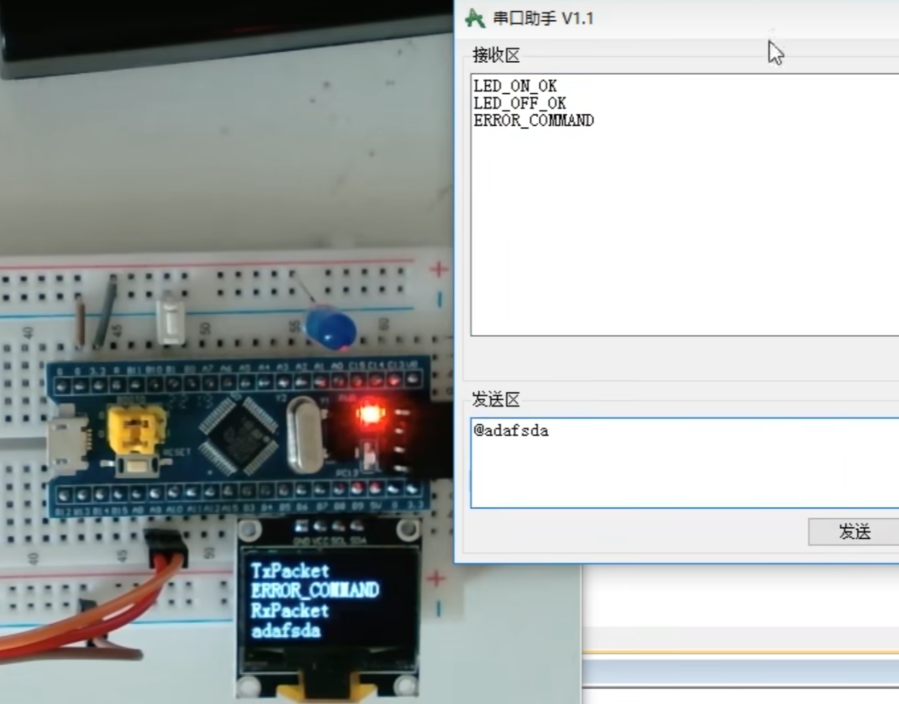


## 14、I2C通信


**SCL:串行时钟线**

**SDA:串行数据线**

* 硬件电路


>任何时候，**都是主机完全掌控SCL线**
>
>另外在空闲状态下，主机可以主动发起对SDA的控制
>
>只有在从机发送数据和从机应答的时候,主机才会转交SDA的控制权给从机
>
>下面的都是，挂载在I2C总线上的从机,这些从机可以是姿态传感器、OLED、存储器、时钟模块等等

>所有主机的SCL可以配置成推挽输出
>
>所有从机的SCL都配置成浮空输入或者上拉输入

**数据流向是，主机发送，所有从机接收**

在SDA线这里，这是半双工协议，所以主机的SDA在发送的时候是输出，在接收的时候是输入

同样，从机的SDA也会在输入和输出之间反复切换

>如果你能协调好输入输出的切换时机,但是这样做，如果总线时序没协调好,极有可能发生两个引脚同时处于输出的状态
>
>如果这时候一个输出高电平，一个输出低电平，那这个状态就是电源短路，这个状态是要极力避免的
>
>因此，I2C的设计是，禁止所有设备输出强上拉的高电平，采用外置弱上拉电阻加开漏输出的电路结构
>
>这样的话，所有的设备都只能输出低电平而不能输出高电平，为了避免高电平造成的引脚浮空，，SCL和SDA各外置一个上拉电阻。所以这是一个弱上拉

* 用弹簧和杆子的例子来解释：

>SCL或SDA就是一根杆子,为了防止有人向上推杆子，有人向下拉杆子，造成冲突,我们就规定，所有的人，不准向上推杆子.只能选择往下拉或者放手
>
>然后，我们再外置一根弹簧向上拉,你要输出低电平，就往下拽,这根弹簧肯定拽不赢你,所以弹簧被拉伸，杆子处于低电平状态
>
>你要输出高电平，就放手,杆子在单簧的拉力下，回弹到高电平
>
>这就是一个弱上拉的高电平，但是完全不影响数据传输

* 好处在于：
* 第一，完全杜绝了电源短路现象，保证电路的安全

* 第二，避免了引脚模式的频繁切换

>开漏加弱上拉的模式，同时兼具了输入和输出的功能,你要是想输出，就去拉杆子或放手，操作杆子变化就行了
>你要是想输入，
>就直接放手，然后观察杆子高低就行了
>
>因为开漏模式下，输出高电平就相当于断开引脚,
>
>所以在输入之前，可以直接输出高电平,不需要再切换成输入模式了

* 第三，就是这个模式会有一个“线与”的现象,就是**只要有任意一个或多个设备输出了低电平,总线就处于低电平**,**只有所有设备都输出高电平,总线才处于高电平**


### 14.1 I2C时序基本单元


>起始条件：在12C总线处于空闲状态时，SCL和SDA都处于高电平状态，他就是没有任何一个设备去碰SCL和SDA，SCL和SDA由外挂的上拉电阻拉高至高电平
>
>起始条件为：SCL不动，然后把SDA拽下来，产生一个下降沿
>
>当从机捕获到这个SCL高电平，SDA下降沿信号时，**就会进行自身的复位，等待主机的召唤**
>
>然后在SDA下降沿之后，主机要再把SCL拽下来，拽下SCL，一方面是占用这个总线
>
>另一方面也是为了方便我们这些基本单元的拼接
>
>就是之后我们会保证，除了起始和终止条件，每个时序单元的SCL都是以低电平开始，低电平结束

### 14.1.0发送一个字节

这时就可以紧跟着一个**发送一个字节**的时序单元


>就是最开始，SCL低电平,主机如果想发送0，就拉低**SDA**到低电平.如果想发送1，就放手，**SDA**回弹到高电平
>
>在SCL低电平期间，允许改变SDA的电平.当这一位放好之后,主机就松手时钟线，SCL回弹到高电平
>
>生高电平期间，是从机读取SDA的时候,所以高电平期间，SDA不允许变化
>
>SCL处于高电平之后,从机需要尽快地读取SDA,一般都是在上升沿这个时刻，从机就已经读取完成了
>
>那主机在放手SCL一段时间后,就可以继续拉低SCL，传输下一位了
>
>主机也需要在SCL下降沿之后尽快把数据放在SDA上
>
>数据放完之后，主机再松手SCL，SCL高电平,从机读取这一位
>
>总的来说：主机拉低SCL，把数据放在SDA上
>
>主机松开SCL，从机读取SDA的数据
>
>在SCL的同步下，依次进行主机发送和从机接收
>
>循环8次，就发送了8位数据，也就是一个字节
>
>另外注意，这里是**高位先行**，所以第一位是一个字节的最高位B7

* 另外，由于这里有时钟线进行同步，所以如果主机一个字节发送一半，突然进中断了，不操作SCL和SDA了，SQL和SDA电平都暂停变化，等中断结束后，主机回来继续操作，传输仍然不会出问题，这就是**同步时序的好处**


### 14.1.1接收一个字节：


* 释放SDA其实就相当于切换成输入模式

>所有设备包括主机都始终处于输入模式,当主机需要发送的时候，就可以主动去拉低SDA,而主机在被动接收的时候，就必须先释放SDA,不要去动它，以免影响别人发送
>
>**因为线与的缘故，任何一个设备拉低了，总线就是低电平，如果你接收的时候，还拽着SDA不放手，那别人无论发什么数据，总线都始终是低电平**
>
>**所以主机在接收之前，需要释放SDA**

>主机在接收之前要释放SDA,然后这时从机就取得了SDA的控制权,从机需要发送0，就把SDA拉低
>
>从机需要发送1，就放手，SDA回弹高电平
>
>然后同样的，低电平变换数据，高电平读取数据
>
>这里实线部分表示主机控制的电平,虚线部分表示从机控制的电平


### 14.1.2应答机制


>这个意思就是：
>
>例如：发送一个字节，接受应答的过程：
>
>当我们在调用发送一个字节之后,就要紧跟着调用接收应答的时序.用来判断从机有没有收到刚才给它的数据.
>
>如果从机收到了,那在应答位这里，主机释放SDA的时候,从机就应该立刻把SDA拉下来.然后在SCL高电平期间，主机读取应答位,如果应答位为0，就说明从机确实收到了
>
>这个场景就是，主机刚发送一个字节
>
>然后说，有没有人收到啊，我现在把SDA放手了哈
>
>如果有人收到的话，你就把SDA拽下来，然后主机高电平读取数据，发现，唉，确实有人给它拽下来了，那就说明有人收到了


* 从机设备地址

**从机设备地址，在I2C协议标准里分为7位地址和10位地址**

比如我们MPU6050这个芯片的7位地址，是1101 000

>比如MPU6050地址的最后一位,就可以由这个板子上的AD0引l脚确定
>
>这个引脚接低电平，那它的地址就是1101000
>
>这个引脚接高电平，那它的地址就是1101001

### 14,1,3 I2C时序


>空闲状态，它俩都是高电平

* 主机需要给从机写入数据的时候:

首先，SCL高电平期间，拉低SDA ,产生起始条件(Start，S)


在起始条件之后，紧跟着的时序,必须是发送一个字节的时序 

* 字节的内容，必须是**从机地址+读写位**(正好从机地址是7位，读写位是1位,加起来是一个字节，8位)

>具体操作为：
>
>低电平期间，SDA变换数据


>高电平期间，从机读取SDA
>
>这里我用绿色的线，来标明了从机读到的数据
>
>比如这样得波形，从机收到得第一位数据，就是高电平1


>然后SCL低电平，主机继续变换数据
>
>因为第二位还是要发送1，所以这里SDA电平没有变换
>
>然后SCL高电平，从机读到第二位是1

>然后继续，低电平变换数据


>来到SCL高电平，此时读取数据，读的SDA得数据为0 
>
>这样持续8次，就发送了一个字节数据

>比如这个波形下，主机寻找的从机地址就是1101000
>
>第八个字节：
>
>然后最低位，表示读写位
>
>0表示，之后的时序主机要进行写入操作
>
>1表示，之后的时序主机要进行读出操作

* 根据协议规定，现在紧跟着得单元就是 接受从机的应答位：

在这个时刻，主机要释放SDA：

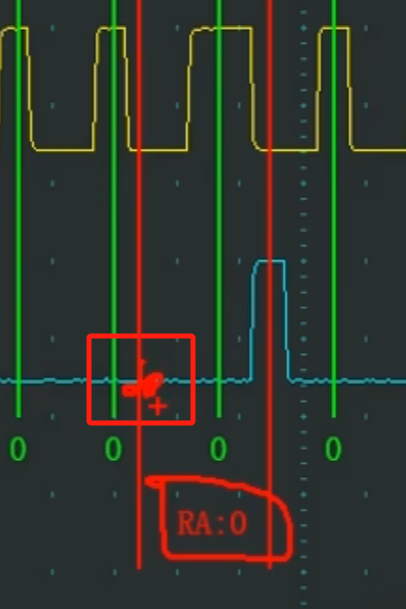

单开主机波形的话，是这样的：

>释放SDA后，引脚电平回弹到高电平
>
>
>
>但是根据协议规定，从机要在这个位拉低SDA

所以是：**该应答的时候，从机立刻拽佳SDA,然后应答结束之后，从机再放开SDA**

* 在这里综合来看，在主机释放SDA之后，由于SDA也被从机拽住了，呈现出没有回弹高电平的状态，恰好是这个状态，**表示了从机产生了应答**

>最终高电平期间，主机读取SDA，发现是0
>就说明，我进行寻址，有人给我应答了,传输没问题


* 在应答位结束后：


* 这里的这个上升沿，就是应答位结束后，从机释放SDA产生的，从机交出了SDA的控制权


由于之前我们读写位给了0，所以应答结束后，我们要继续发送一个字节，第二个字节，就可以送到指定设备的内部了。

从机设备可以自己定义第二个字节和后续字节的用途

>一般第二个字节可以是寄存器地址或者是指令控制字等


即，主机向从机发送了0x19这个数据，这里表示：我要操作你0x19地址下的寄存器了

* 接着同样，是从机应答：

主机释放SDA，从机拽住SDA，SDA表现为低电平，主机收到应答位为0，表示收到了从机的应答


* 然后继续，发送**第三个字节**，同样的流程再来一遍

**这个字节就是主机想要写入到0x19地址下寄存器的内容了**

在这个字节的最后，是接收应答位，如果主机不需要继续传输了，就可以产生停止条件(Stop，P)


>在停止条件之前，先拉低SDA，为后续SDA的上升沿做准备
>
>然后释放SCL，再释放SDA
>
>这样就产生了SCL高电平期间，SDA的上升沿
>
>
>
>这样一个完整的数据帧就拼接完成了


这个指定地址，就是某个设备内部的Reg Address，寄存器地址

### 14.1.4当前地址读


* 如果主机想要读取从机的数据，就可以执行这个时序
* 最开始，还是SCL高电平期间，拉低SDA,产生起始条件，
* 起始条件开始后，主机必须首先调用发送一个字节来进行从机的寻址和指定读写标志位，比如图示的波形，表示本次寻址的目标是1101000的设备，同时，最后一位读写标志为1，表示主机接下来想要读取数据
* 紧跟着，发送一个字节之后，接收一下从机应答位，从机应答0，代表从机收到了第一个字节
* 在从机应答之后，


数据的传输方向就要反过来了，因为刚才主机发出了读的指令，所以这之后，主机就不能继续发送了。

要把SDA的控制权交给从机，主机调用接收一个字节的时序，**进行接收操作**

**从机**可以在SCL低电平期间写入SDA，然后**主机**在SCL高电平期间读取SDA，最终得到**寄存器0x0F**

* 关于这个0X0F的寄存器：

>在从机中，所有的寄存器被分配到了一个线性区域中,并且，会有一个单独的指针变量,指示着其中一个寄存器
>
>这个指针上电默认，一般指向0地址,并且，每写入一个字节和读出一个字节后,这个指针就会自动自增一次
>
>那么在调用当前地址读的时序时,主机没有指定要读哪个地址
>
>从机就会返回当前指针指向的寄存器的值


### 14.1.5指定地址读：


* 前面的部分是**指定地址**写，后面的部分是**当前地址**读，两者结合->**指定地址读**


* 这里在到第二个字节后，要再次重复起始，（用一个字节），因为读 | 写 的操作要再次定义，然后后面照常

* 即：先起始、再重复起始、再停止


### 14.2MPU6050


*  参数


* 从机地址：如果在程序中，用十六进制表示的话

第1 种，就是单纯地把这7位一进制数转换为十六进制，这里1101000，低4位和高3位切开，转换十六进制，就是0x68

第二种：例如在I2C时序中：

这里第一个字节的高7位是从机地址，最低位是读写位。

所以如果你认为0x68是从机地址的话，在发第一个字节时，要先把0x68左移1位

再按位 或上 读写位，

方式2: 就是把0x68左移1位后的数据，当做从机地址,0x68左移1位之后，是0xD0,那这样，MPU6050的从机地址就是0xD0

这时，在实际发送第一个字节时,如果你要写，就直接把0xD0当作第一个字节.如果你要读，就把0xD0或上0x01，即0xD1当作第一个字节

或者说这种表示方式，是把读写位也融入到从机地址里了


* 硬件电路：


### 14.3 软件I2C读写MPU6050


>目前这里STM32是主机，MPU6050是从机
>
>软件l2C，只需要用gpio的读写函数就行了

* 第一个任务，把SCL和SDA都初始化为开漏输出模式
* 第二个任务，把SCL和SDA置高电平

>开漏输出模式仍然可以输入
>输入时，先输出1，再直接读取输入数据奇存器就行了

* 起始条件函数：


//这里我们首先把SCL和SDA都确保释放
//然后先拉低SDA，再拉低SCL这样就能产生起始条件了


* 为了简便，可以给端口号换一个名字，这里有如下几种方法：

1、宏定义

```c
#define SCL_PORT GPIOB 
#define SCL_PIN GPlO_Pin_10


//如果想释放SCL，就：
GPIO_SetBits(SCL_PORT,SCL_PIN);
```

2、将整个函数用宏定义替换

```c
#define OLED_W_SCL(X)  GPIO_WriteBit(GPIOB,GPIO_Pin_8,(BitAction)(x))
#define OLED_W_SDA(X)  GPIO_WriteBit(GPIOB,GPIO_Pin_9,(BitAction)(x))


//BitAction是枚举类型，将X变成0或者1
OLED_W_SCL(1);
```

3、

```c
//这里参数给1或者0，就可以释放|拉低SCL了
void myi2c_w_SCL(uint8_t BitValue)
{
	GPIO_WriteBit(GPIOB,GPIO_Pin_10,(BitAction)BitValue);
	
}

```


* 发送字节的函数：

```c
//发送字节
void MyI2c_SendByte(uint8_t Byte)
{
	//首先趁SCL低电平，先把Bvte的最高位放在SDA线上
	myi2c_w_SDA(Byte & 0x80);//取出最高位
	myi2c_w_SCL(1); //释放SCL
	myi2c_w_SCL(0);	//拉低SCL(为了保证每一个字节以SCL低电平来链接过去)
}
```


* 接受一个字节：

```c
//接受一个字节
uint8_t myi2c_Receive(void)
{
	uint8_t Byte = 0X00;
	myi2c_w_SDA(1); //主机释放SDA
	myi2c_w_SCL(1);//主机释放SCL,读取数据
	if(Myi2c_R_SDA() == 1) {Byte |= 0x80;} //如果SDA为1,就让BYTE最高位置1
	//那这里，读取一位之后，我们再把SCL拉低,这时从机就会把下下一位据放到SDA
	myi2c_w_SCL(0);
}

//执行相同的流程8次，就可以接收一个字节了
```


* 注解：I2C时序的起始和终止与数据传输有本质区别

1、在数据传输中


SCL低电平，这是就是SDA上的数据进行操作（例如从机这时修改想要给主机是发送0还是1，当SCL转到高电平，这时主机开始读取从机发送的数据，以此循环往复，就是一个读写分离的过程）

2、而起始条件


当SCL高电平时，SDA此刻出现了下降沿（这在数据传输中是不允许的），这就代表是起始条件

3、终止条件


同理，在SCL高电平时，SDA出现了上升沿，这就代表时终止条件


* 这里在主函数中测试一下：

```c
int main(void)	
{
	OLED_Init();
	
	myi2c_Init();
	
	myi2c_Start();
	MyI2c_SendByte(0xD0);//1101 000 0 这里是发送一个字节
	uint8_t Ack = myi2c_ReceiveACK(); //接收应答
	//继续发送字节：
	myi2c_Stop();
	
	OLED_ShowNum(1,1,Ack,3);
	while (1)
	{	
		
	}	
	
}
```


点名0XD0的设备，得到了应答

**显示应答位为0**


* 指定地址写寄存器：

```c
//指定地址写寄存器
void mpu6050_WriteReg(uint8_t RegAddress,uint8_t Data)
{
	myi2c_Start();
	MyI2c_SendByte(MPU6050_ADDRESS); //发送的是从机地址+读写位
	myi2c_ReceiveACK();
	//第二个字节的内容，就是指定寄存器地址了
	//这个字节，会存在MPU6050的当前地址指针里
	MyI2c_SendByte(RegAddress);
	myi2c_ReceiveACK();
	//发送第三个字节
	MyI2c_SendByte(Data);
	myi2c_ReceiveACK();
	
	myi2c_Stop();
	
}
```


* 指定地址读：

```c
//指定地址读
uint8_t mpu6050_ReadReg(uint8_t RegAddress)
{
	uint8_t Data;
	myi2c_Start();
	MyI2c_SendByte(MPU6050_ADDRESS); 
	myi2c_ReceiveACK();
	MyI2c_SendByte(RegAddress);
	myi2c_ReceiveACK();
	
	//上面的步骤是设置完地址，现在要转入读的时序
	//重新指定读写位
	myi2c_Start();
	MyI2c_SendByte(MPU6050_ADDRESS | 0X01); //让他变成读写位
	myi2c_ReceiveACK(); //接收应答后，总线控制权就正式交给从机了
	//从机开始发送一个字节,主机接收
	Data = myi2c_Receive();
	//因为主机接收一个字节后，要给从机发送一个应答
	MyI2c_SendAck(1); //1表示不给应答
	myi2c_Stop();
	
	return Data;
}

```

例子：MAIN.C

```c
#include "stm32f10x.h"                  // Device header
#include "Delay.h"
#include "OLED.h"
#include "mpu6050.h"

int main(void)	
{
	OLED_Init();
	mpu6050_Init(); //在这个上层模块的INIT中，已经包含了底层的MYI2C_INIT()
	
	uint8_t ID = mpu6050_ReadReg(0X75); //0X75是要读的寄存器地址
	OLED_ShowHexNum(1,1,ID,2);
	
	while (1)
	{	
		
	}	
	
}

```


* I2C的实现，因为是同步时序，所以软件模拟的清况较多
* 串口因为是异步时序，对时间的控制很严格，所以一般都是硬件自己操作


### 14.4硬件I2C的实现


I2C外设，让硬件自动实现时序，就可以，减轻CPU的负担，节省软件资源


* 多主机模型


当2个主机同时想说话时，发生冲突，这时就要进行总线仲裁了，仲裁失败的一方让出总线控制权


#### 14.4.1I2C外设框图


>左边是这个外设的通信引脚SDA和**SCL**
>
>一般这种引脚，一般都是借用GPIO口的复用模式与外部世界相连的


>上面这一块SDA的数据控制部分，
>
>

核心为是这里的**数据寄存器**和**数据移位寄存器**


当数据寄存器转到移位寄存器时，就会置状态寄存器TXE位为1，表示发送奇存器为空，这就是发送的流程

接收时，输入的数据，一位一位的，从引脚移入到移位寄存器里，当一个字节集齐后，数据就整体从移位寄存器转到数据寄存器，同时置标志位RXNE，表示接收寄存器非空，这就可以读数据了

* I2C这里是半双工，所以数据收发，是同一组数据寄存器和移位寄存器


**接下来的比较器 和地址寄存器，这是从机模式使用的**


>对于可变多主机来说，STM32不进行通信的时候，就是从机
>当STM32作为从机，在被寻址时，如果收到的寻址通过比较器判断，和自身地址相同，那STM32就作为从机，响应外部主机的召唤
>
>


#### 14.4.2I2C基本结构图


移位寄存器，在发送的时候，最高位先移出去，一个SCL时钟，移位一次，移位8次，这样就能把一个字节，由高位到低位，依次放到SDA线上了

在接收的时候，数据通过GPIO口从右边依次移进来，最终移8次，一个字节就接收完成了

同时，这两个GPIO口，都要配置成复用开漏输出的模式

>复用，
>就是GPIO的状态是交由片上外设来控制的
>
>开漏输出，这是12C协议要求的端口配置

上图SDA的部分，输出数据，通过GPIO，输出到端口

输入数据，也是通过GPIO，输入到移位寄存器


那这两个箭头连接在GPIO的哪个位置呢？如下：

>移位寄存器输出的数据,通向GPIO，就接在了这个位置:
>
>
>之后控制这个N-MOS的通断,进而控制这个IO引脚
>
>对于输入部分，虽然这是复用开漏输出，但是输入这一路仍然有效
>
>
>
>IO引脚的高低电平，进入片上外设，来进行复用功能输入


#### 14.4.3硬件I2C的操作流程

* 主机发送


>7位地址，起始条件后的一个字节是寻址
>
>10位地址，起始条件后的2个字节都是寻址，其中第一个字节帧头，内容是5位的标志位11110  + 2位地址 + 1位读写位，后一个字节就是纯粹的地址


* 主机接收


* 代码部分

>有了硬件，底层的东西就不需要我们实现了，之前建立的模块MYI2C可以删除了
>
>


## 15、SPI通信


* SCK：串行时钟线
* MOSI:主机输出从机输入
* MISO：主机输入从机输出
* SS：从机选择

>mosi + msio  = 那这两根通信线，加在一起，就相当于12C总线的SDA,但这里这里SPI是一根发送，一根接收，是全双工
>

* SPI仅支持一主多从，不支持多主机，这一点没有I2C强大

>I2C的第一个字节要涉及分配地址和寻址的问题，spi自己开辟一条通信线，专门用来指定我要跟哪个从机进行通信，**也就是SS：从机选择**
>
>SPl的主机表示，我有几个从机，我就开几条SS


### 15.1SPI硬件电路


>主机，一般都是控制器来作，比如STM32
>
>因为有3个从机，所以SS线需要3根,再加SCK、MOSI、MISO，
>就是6根通信线
>
>因为这些电压都是相对GND的单端信号，所有的设备还需要共地，再来一根
>
>主机还需要再额外引出电源正极VCC，给从机供电

* SCK时钟线：对于主机来说，时钟线为输出，对于所有从机来说，时钟线都为输入，这样主机的同步时钟，就能送到各个从机了
* MOSI主机输出从机输入: 这里左边是主机，所以就对应MO，主机输出,个都是从机，所以就对应S1，从机输入
* MISO:同理，反过来就死

* SS:我们需要在主机另外引出3根SS选择线,分别接到每个从机的SS输入端,主机的SS线都是输出，从机的SS线都是输入

>SS线是低电平有效的
>
>主机想指定谁，
>就把对应的SS输出线置低电平就行了

* SPI引脚配置：输出引脚配置为推挽输出，输入引脚配置为浮空或上拉输入


>推挽输出，高低电平均有很强的驱动能力:
>
>这将使得SPI脚信号的下降沿，非常迅速,上升沿，也非常迅速
>
>不像12C那样，下降沿非常迅速,但是上升沿，就比较缓慢了
>
>SPI信号变化的快，那自然它就能达到更高的传输速度

>当从机的SS引脚为高电平,也就是从机未被选中时,它的MISO引脚，必须切换为高阻态,高阻态就相当于引脚断开，不输出任何电平
>
>这样就可以以防止一条线有多个输出，而导致的电平冲突的问题了
>
>当然这个切换过程都是在从机里，所以我们主机的程序中，并不需要关注这个问题


### 15.2移位示意图

* SPl的基本收发电路，就是使用了这样一个移位的模型


>SPI是高位先行的，所以每来一个时钟信号，移位寄存器就会向左移位一次
>
>移位寄存器的时钟源，是由主机提供的，这里叫作波特率发生器，它产生的时钟驱动主机的移位寄存器进行移位
>
>同时，这个时钟也通过SCK引脚进行输出，接到从机的移位寄存器里


首先规定，波特率发生器时钟的上升沿，所有移位寄存器向左移动一位，移出去的位放到引脚上


波特率发生器时钟的下降沿，引脚上的位，采样输入到移位寄存器的最低位

这时，驱动时钟，产生一个上升沿，这时，所有的位都会向左移动一次，


从最高位移出去的数据，会放在通信线上（实际上是输出数据寄存器）

此时，MOSI数据是1，所以MOSl的电平就是高电平

MISO数据是0，所以MISO的电平就是低电平

接下来，来一个下降沿，在下降沿时，主机和从机肉，都会进行数据采样输入


接下来同理，知道发送完一个字节后：


* 这就完成了，主机和从机一个字节的数据交换

>SPl的数据收发，都是某于字节交换，这个基本单元来进行的
>

这就完成了发送同时接收的目的

>如果只想发送，不想接受：方法一样，只是接收到的数据我们不去看他
>
>如果只想接收，不想发送：方法一样，只不过随便发送一个数据，让从机不理会这个数据就是，我们读取置换过来的数据。一般在接收的时候，我们会统一发送0x00或OxFF


### 15.3SPI时序


**SS低电平有效**，SS从高到低，代表选中的某个从机，这就是通信开始


这里SPI有两个可以配置的位：

* CPOL(Clock Polarity):时钟极性
* CPHA(Clock Phase)时钟相位

>每一位都可配置为1 | 0 。就有模式0、模式1、模式2、模式3这4种模式


SS高电平时，MISO用一条中间的线，表示高阻态，SS下降沿之后，从机的MISO被允许开启输出


SS上升沿之后，从机的MISO必须置回高阻态


移位传输的操作：**这里用模式1举例**


此时CPHA = 1,SCK第一个边沿移出数据

这里上升沿，主机和从机同时移出数据

主机通过MOSI移出最高位，**此时MOSI的电平就表示了主机要发送数据的B7**

从机通过MISO移出最高位，**此时MISO表示从机要发送数据的B7**


然后时钟运行，产生下降沿，**此时主机和从机同时移入数据，也就是进行数据采样**


这里主机移出的B7,进入从机移位寄存器的最低位

从机移出的B7，进入主机移位寄存器的最低位

这样，一个时钟脉冲产生完毕，一个数据位传输完毕

之后时钟继续运行，数据依次移出、移入、移出、移入，完成了一个字节后（如果想结束），就可以置SS为高电平，结束通信


最后，在SS的上升沿，MOSI还可以再变化一次，将MOSI置一个默认的高电平，或者也可以不用去管他，

但是此时MISO从机必须置为高阻态


上述展示的是模式1

接下来是模式0：

>在模式0中，CPHA = 0.
>

不同于模式1，这里CPHA = 0, 是SCK第一个边沿移入数据

但是要先移入数据，必须要有先移出的数据

所以这里在SCK第一个边沿前，MOSI和MISO就要先移出数据，这里也叫做第0个边沿

如图，SS开始下降沿，SCK还是低电平时，MOSI和MISO已经开始移出数据

最终在第八个上升沿时，B0位移入完成，

之后，SCK还有一个下降沿，如果这里主机想要结束通信，那么此时MOSI可以置回默认电平，或者不去管他，MISO也会变化一次，

这一位，实际上是下一个字节的B7，因为这个相位提前了，所以下一个字节的B7回露个头


* **SPI一般都使用模式0**，**也就是有提前相位的模式**


>模式2和模式0的区别在于，模式2的CPOL = 1
>
>
>
>模式1和模式3的区别在于，模式3的CPOL = 1
>
>


* I2C的规定为：有效数据流的第一个字节是寄存器地址，之后依次是读写的数据，这里使用的是读写寄存器的模型
* SPI中，通常采用的是指令码+读写数据的类型


* 发送指令


>这里使用SPI模式0
>
>

>在空闲装填时，SS为高电平，SCK为低电平
>
>SS产生下降沿，时序开始
>
>在这个下降沿时刻，MOSI和MISO就要开始变换数据了
>
>MOSI，由于指令码最高位仍然是0，所以这里保持低电平不变，MISO，从机没有数据发送，所以引脚电平不变
>
>SCK第一个上升沿，进行数据采样
>
>
>
>这里从机采样输入，得到0，主机采样输入，得到1 
>
>接着第二个时钟，主机的数据位仍然是0，因此波形没有变化
>
>如此一位一位发送接收，直到如下这一位发生变化：
>
>

这里主机要发送数据1，下降沿，数据移出，主机将1移出到MOSI，MOSI变为高电平（因为这里是软件模拟，有点误差，不会再SCK下降沿时刻瞬间变化）


* 指定地址写：


* 指定地址读


### 15.4W25Q64


* 这里时钟频率有80,160（双重SPI）,320（4重spi）

* SPI为了不浪费资源（全双工），在只发或只收时有资源浪费，W25Q64允许在发送的时候，可以同时用MOSI和MISO发送，接收的时候也可以同时2个接收MOSI和MISO同时兼具发送和接收的功能

一个SCK时钟，同时发送或者接收2位数据，这就是双重SPI模式，数据传输率为2倍


* 硬件电路：


* 左边黄色图就是W25Q64原理图
* DI对应MOSI,是SPI主机输出从机输入
* DO对应MISO,是SPI主机输入从机输出


* Flash注意事项


* 每个数据位只能由1改写为0，不能由0改写为1

>Flash并没有像RAM那样的直接完全覆盖改写的能力，例如原来存储单元内是0XAA，我要写入0X55，这里并不会直接覆盖 然后变成0X55，根据2进制，且每个数据位只能由1改写为0，不能由0改写为1
>
>比如原来最高位是1，新输入的最高位为0，这一位就可以改为0
>
>

* 写入数据前必须擦除，全部变成1，这样就可以解除第二个条件的限制了

* 最小擦除单元：最小擦除是一个 **扇区**， 一个扇区是4KB,就是4096个字节

>只想擦除某一个字节：
>
>只能把那个字节所在扇区的4096个字节全都擦掉，
>
>要想不丢失数据，你只能先把4096个字节都读出来，再把4096个字节的扇区擦掉，改写完之后，再把数据写回去
>
>流程可以优化为：上电后，先把FLASH的数据都出来，放到RAM里，当有数据变动，在统一吧数据备份到FLASH里

* 在进行任何写入操作时，都要进行一次写使能，一个写使能只能保证后续的一条指令可以执行


15.5软件SPI读写W25Q64

* 接线图


* 代码部分

这里先建立一个MYSPI的模块，主要包含通信引脚封装、初始化,以及SPI通信的3个拼图，起始。终止和交换一个字节

在建一个W25Q64的模块，调用底层SPI，来拼接各种指令和功能的完整时序，比如写使能、擦除、页编程、读数据等等

最后在主函数里，调用这个驱动程的功能


**在软件中：**


* 在实际程序上，这里是先SS下降沿，或SCK下降沿，在数据移出，这不是同时发生的

这个下降沿是触发数据移出这个动作的条件，是触发的条件

>对于硬件SPI来说，由于使用了硬件的移位寄存器电路,所以这两个动作几乎是同时发生的
>
>而软件无法办到

  

* MPSPI.C:

```c
#include "stm32f10x.h"                  // Device header

//从机选择，这里表示写SS的引脚
void MYSPI_W_SS(uint8_t BitValue)
{
    //将写GPIO的操作换一个名字
    GPIO_WriteBit(GPIOA,GPIO_Pin_4,(BitAction)BitValue);
}

//写SCK
void MYSPI_W_SCK(uint8_t BitValue)
{
    //将写GPIO的操作换一个名字
    GPIO_WriteBit(GPIOA,GPIO_Pin_5,(BitAction)BitValue);
}

//写MOSI
void MYSPI_W_MOSI(uint8_t BitValue)
{
    //将写GPIO的操作换一个名字
    GPIO_WriteBit(GPIOA,GPIO_Pin_7,(BitAction)BitValue);
}


//输入引脚MISO
uint8_t MYSPI_R_MISO(void)
{
    return GPIO_ReadInputDataBit(GPIOA,GPIO_Pin_6);
}


void MYSPI_Init(void)
{
    RCC_APB2PeriphClockCmd(RCC_APB2Periph_GPIOA,ENABLE); 
	
	GPIO_InitTypeDef GPIO_InitStructure;
	GPIO_InitStructure.GPIO_Mode = GPIO_Mode_Out_PP ;
    //三个输出口配置为推挽输出
	GPIO_InitStructure.GPIO_Pin = GPIO_Pin_4 | GPIO_Pin_5 | GPIO_Pin_7;
	GPIO_InitStructure.GPIO_Speed = GPIO_Speed_50MHz ;
	GPIO_Init(GPIOA,&GPIO_InitStructure);
	
    //对PIN_6口进行配置,上拉输入
    GPIO_InitStructure.GPIO_Mode = GPIO_Mode_IPU ;
    //三个输出口配置为推挽输出
	GPIO_InitStructure.GPIO_Pin = GPIO_Pin_6;
	GPIO_InitStructure.GPIO_Speed = GPIO_Speed_50MHz ;
	GPIO_Init(GPIOA,&GPIO_InitStructure);
	
    //初始化之后，SS默认高电平，不选择从机
    MYSPI_W_SS(1);
    //SPI选择模式0
    MYSPI_W_SCK(0);
}


//SPI的起始信号
void MYSPI_Start(void)
{
    MYSPI_W_SS(0);   

}

//SPI的终止信号
void MYSPI_Stop(void)
{
    MYSPI_W_SS(1);   

}

uint8_t MYSPI_SwapByte(uint8_t ByteSend)
{
    uint8_t ByteReceive = 0x00;
    //主机移出我的数据最高位放在MOSI上，从机移出放到MISO上（不用管）
    MYSPI_W_MOSI(ByteSend & 0x80); //最高位
    //SCK上升沿，要移入数据
    //上升沿时，从机会自动把MOSI的数据读走,所以不用管从机
    MYSPI_W_SCK(1);
    if(MYSPI_R_MISO() == 1) {ByteReceive |= 0x80;} //这样就把最高位存在BYTERECEIVE里了

    //SCK产生在下降沿，主机和从机移出下一位
    MYSPI_W_SCK(0);
    MYSPI_W_MOSI(ByteSend & 0x40); 
    
    //显然后续使用FOR循环即可
    
    
    
    return ByteReceive;
}
```

```c
uint8_t MYSPI_SwapByte(uint8_t ByteSend)
{
    uint8_t ByteReceive = 0x00;
    uint8_t i;

    for(i=0;i<8;i++)
    {
    MYSPI_W_MOSI(ByteSend & (0x80 >> i)) ; 
    MYSPI_W_SCK(1);
    if(MYSPI_R_MISO() == 1) {ByteReceive |= (0x80 >> i);} 
    //SCK产生在下降沿，主机和从机移出下一位
    MYSPI_W_SCK(0);
   
    }
```

* 这种使用0X80挑出每一位的方法，叫做**掩码的方式**

* 然后还有移位模型：

```c
//移位模型
uint8_t MYSPI_SwapByte(uint8_t ByteSend)
{
    
    uint8_t i;

    for(i=0;i<8;i++)
    {
    MYSPI_W_MOSI(ByteSend & 0x80 ) ; //输出最高位
    ByteSend <<=1; //将BYTESEND最高位移出，最低位补0
    MYSPI_W_SCK(1);
    if(MYSPI_R_MISO() == 1) {ByteSend |= 0x01;} //把收到的数据放在BYTEsend最低位
    //SCK产生在下降沿，主机和从机移出下一位
    MYSPI_W_SCK(0);
   
    }
    return ByteSend;
}
```

>通过对自身的移位，来完成数据的传输


* 接下来对W25Q64J模块进行编写：

```c
#include "stm32f10x.h"                  // Device header
#include "MYSPI.h"


void W25Q64_Init(void)
{

    MYSPI_Init();

}

void W25Q64_ReadID(uint8_t* Mid,uint16_t* Did)
{
    //ss引脚置低
    MYSPI_Start();
    MYSPI_SwapByte(0x9f);   //发送，表示读ID号的指令

    //返回值是交换的数据，这里用MID接收：厂商ID
    *Mid = MYSPI_SwapByte(0XFF);    //此时我的目的是接收，給0xFF,将对面的数据置换过来
    //根据手册（时序）这里交换回来设备ID高8位
    *Did = MYSPI_SwapByte(0XFF);
    *Did <<= 8; //移到高八位
     //这里交换回来设备ID低8位
    *Did |= MYSPI_SwapByte(0XFF);

    MYSPI_Stop();
}
```

MAIN.C:

```c
#include "stm32f10x.h"                  // Device header
#include "Delay.h"
#include "OLED.h"
#include "W25Q64.h"

uint8_t MId;
uint16_t DId;

int main(void)	
{
	OLED_Init();
	W25Q64_Init();
	W25Q64_ReadID(&MId,&DId);

	OLED_ShowHexNum(1,1,MId,2);
	OLED_ShowHexNum(1,1,DId,4);
	
	
	while (1)
	{	
		
	}	
	
}

```

* OLED屏幕上显示对于的产品ID号：


* 这里还可以通过宏定义的方式，来让代码更简洁易懂

```c
#ifndef __W25Q64_h
#define __W25Q64_h

//指令集的宏定义
#define W25Q64_WRITE_ENABLE							0x06
#define W25Q64_WRITE_DISABLE						0x04
#define W25Q64_READ_STATUS_REGISTER_1				0x05
#define W25Q64_READ_STATUS_REGISTER_2				0x35
#define W25Q64_WRITE_STATUS_REGISTER				0x01
#define W25Q64_PAGE_PROGRAM							0x02
#define W25Q64_QUAD_PAGE_PROGRAM					0x32
#define W25Q64_BLOCK_ERASE_64KB						0xD8
#define W25Q64_BLOCK_ERASE_32KB						0x52
#define W25Q64_SECTOR_ERASE_4KB						0x20
#define W25Q64_CHIP_ERASE							0xC7
#define W25Q64_ERASE_SUSPEND						0x75
#define W25Q64_ERASE_RESUME							0x7A
#define W25Q64_POWER_DOWN							0xB9
#define W25Q64_HIGH_PERFORMANCE_MODE				0xA3
#define W25Q64_CONTINUOUS_READ_MODE_RESET			0xFF
#define W25Q64_RELEASE_POWER_DOWN_HPM_DEVICE_ID		0xAB
#define W25Q64_MANUFACTURER_DEVICE_ID				0x90
#define W25Q64_READ_UNIQUE_ID						0x4B
#define W25Q64_JEDEC_ID								0x9F
#define W25Q64_READ_DATA							0x03
#define W25Q64_FAST_READ							0x0B
#define W25Q64_FAST_READ_DUAL_OUTPUT				0x3B
#define W25Q64_FAST_READ_DUAL_IO					0xBB
#define W25Q64_FAST_READ_QUAD_OUTPUT				0x6B
#define W25Q64_FAST_READ_QUAD_IO					0xEB
#define W25Q64_OCTAL_WORD_READ_QUAD_IO				0xE3

#define W25Q64_DUMMY_BYTE							0xFF


#endif
```

w25q64.c:

```c
#include "stm32f10x.h"                  // Device header
#include "MYSPI.h"
#include "W25Q64_INS.h"

void W25Q64_Init(void)
{
    MYSPI_Init();
}

void W25Q64_ReadID(uint8_t* Mid,uint16_t* Did)
{
    //ss引脚置低
    MYSPI_Start();
    MYSPI_SwapByte(W25Q64_JEDEC_ID);   //发送，表示读ID号的指令
    //返回值是交换的数据，这里用MID接收：厂商ID
    *Mid = MYSPI_SwapByte(W25Q64_DUMMY_BYTE);    //此时我的目的是接收，給0xFF,将对面的数据置换过来
    //根据手册（时序）这里交换回来设备ID高8位
    *Did = MYSPI_SwapByte(W25Q64_DUMMY_BYTE);
    *Did <<= 8; //移到高八位
     //这里交换回来设备ID低8位
    *Did |= MYSPI_SwapByte(W25Q64_DUMMY_BYTE);

    MYSPI_Stop();
}
```


* 状态寄存器：


* 等待BUSY：

```c
void W25Q64_WaitBusy(void)
{
    MYSPI_Start();
    MYSPI_SwapByte(W25Q64_READ_STATUS_REGISTER_1);
    //W25Q64_DUMMY_BYTE 接收数据
    //如果BUSY这一位（最低位）为1，就会进入循环，知道BUSY为0，跳出循环
    while((MYSPI_SwapByte(W25Q64_DUMMY_BYTE) & 0x01) == 0x01); 

    MYSPI_Stop();
}

```


指令表


>例如这里的扇区擦除：
>
>先发送指令20，再发送3个字节的地址就可以了

* 写入PAGE的操作

```c
//写入数据
void W25Q64_PageProgram(uint32_t Address,uint8_t* DataArray,uint16_t Count)
{
    uint16_t i;
    MYSPI_Start();
    //指令码
    MYSPI_SwapByte(W25Q64_PAGE_PROGRAM);

    //如上图，先发高位，再一次发低位，将完整的地址拆分出去
    MYSPI_SwapByte(Address >> 16); //最高位的2个字节
    MYSPI_SwapByte(Address >> 8); //这里左移动8位，同时SWAPBYTE()只能接收8位，所以这里返回的是中间的8位数据
    MYSPI_SwapByte(Address); //最低位的字节,这样就实现了连续发送24位字节

    //根据手册，地址发送完，就可以依次发送写入的数据
    for(i=0;i<Count;i++)
    {
        MYSPI_SwapByte(DataArray[i]);
    }
   MYSPI_Stop();

}
```


* 擦除扇区

```c
void W25Q64_WaitBusy(void)
{
    MYSPI_Start();
    MYSPI_SwapByte(W25Q64_READ_STATUS_REGISTER_1);
    //W25Q64_DUMMY_BYTE 接收数据
    //如果BUSY这一位（最低位）为1，就会进入循环，知道BUSY为0，跳出循环
    while((MYSPI_SwapByte(W25Q64_DUMMY_BYTE) & 0x01) == 0x01); 

    MYSPI_Stop();
}
```


* 读取：

```
//读取数据
void W25Q64_ReadData (uint32_t Address,uint8_t* DataArray,uint32_t Count)
{
    uint32_t i;
    MYSPI_Start();
    //指令码
    MYSPI_SwapByte(W25Q64_READ_DATA);

    MYSPI_SwapByte(Address >> 16); //最高位的2个字节
    MYSPI_SwapByte(Address >> 8); //这里左移动8位，同时SWAPBYTE()只能接收8位，所以这里返回的是中间的8位数据
    MYSPI_SwapByte(Address); //最低位的字节,这样就实现了连续发送24位字节

    for(i=0;i<Count;i++)
    {
    DataArray[i]  = MYSPI_SwapByte(W25Q64_DUMMY_BYTE);
    }
    MYSPI_Stop();
}
```

调用这个函数，给一个指定的起始地址，再给接收读取数据的数组和数量，就可以读取数据了


main.c:

```c
#include "stm32f10x.h"                  // Device header
#include "Delay.h"
#include "OLED.h"
#include "W25Q64.h"

uint8_t MId;
uint16_t DId;
uint8_t ArrayWrite[] = {0x01,0x02,0x03,0x04};
uint8_t ArrayRead[4];

int main(void)	
{
	OLED_Init();
	W25Q64_Init();
	OLED_ShowString(1,1,"MID:   DID:");
	OLED_ShowString(2,1,"W:");
	OLED_ShowString(3,1,"R:");
	

	W25Q64_ReadID(&MId,&DId);

	OLED_ShowHexNum(1,5,MId,2);
	OLED_ShowHexNum(1,12,DId,4);


	//在00位置开始写，写内容之前要擦除扇区,这里指定扇区起始地址来删除
	W25Q64_SectorErase(0x000000);
	W25Q64_PageProgram(0x000000,ArrayWrite,4);
    //前面4位是页地址，后面2位是页内地址

	//读出来
	W25Q64_ReadData(0x000000,ArrayRead,4);

	OLED_ShowHexNum(2,3,ArrayWrite[0],2);
	OLED_ShowHexNum(2,6,ArrayWrite[1],2);
	OLED_ShowHexNum(2,9,ArrayWrite[2],2);
	OLED_ShowHexNum(2,12,ArrayWrite[3],2);

	OLED_ShowHexNum(3,3,ArrayRead[0],2);
	OLED_ShowHexNum(3,6,ArrayRead[1],2);
	OLED_ShowHexNum(3,9,ArrayRead[2],2);
	OLED_ShowHexNum(3,12,ArrayRead[3],2);
	
	
	while (1)
	{	
		
	}	
	
}

```

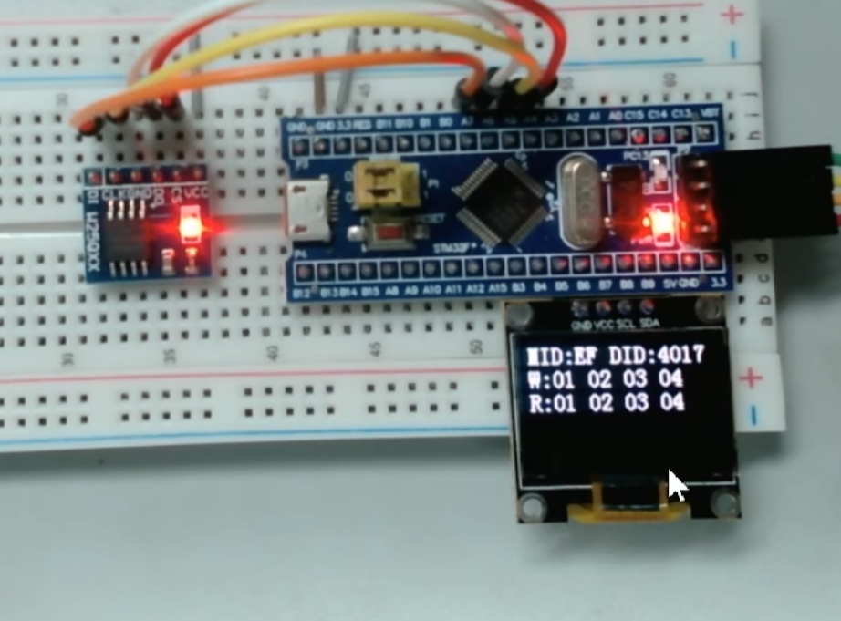

* 如上图，写入01 02 03 04,下方接收到的也是01 02 03 04


### 15.5硬件SPI

>软件SPI就是我们用代码手动翻转电平，来实现时序
>
>硬件SP!，就是使用STM32内部的SPI外设，来实现时序


>其中SP11是APB2的外设，SPI2是APB1的外设
>

* SPI框图


>SPI是全双工，发送和接收同步进行，所以他的数据寄存器，发送和接收是**分离**的，而移位寄存器，发送和接收可以共用
>
>因为12C是半双工，发送和接收不会同时进行，所以它的数据寄存器和移位寄存器，发送和接收都可以是共用的
>
>
>
>串口是全双工，并且发送和接收可以异步进行，所以这就要求，它的数据寄存器，发送和接收是分离的，移位寄存器，发送和接收也得是分离的
>
>


* SPI基本框图


>移位寄存器左移，通过GPIO，到MOSI，从MOSI输出，显然这是SPI的主机
>
>移入的数据，从MISO进来，通过GPIO， 通过移位寄存器的低位，就能实现主机和从机交换一个字节
>这样循环8次，
>
>然后TDR和RDR的配合，可以实现连续的数据流
>
>TDR数据整体转入移位寄存器的时刻，置TXE标志位
>
>移位寄存器数据，整体转入RDR的时刻，置RXNE标志位


* 运行控制
* 主模式全双工连续传输

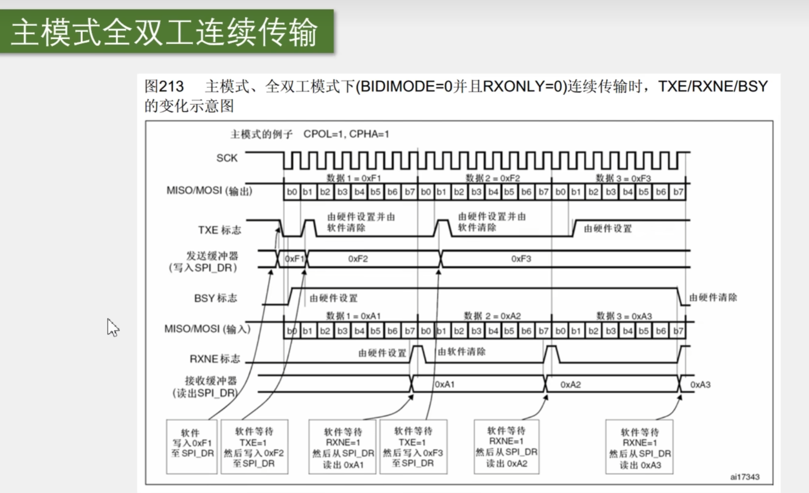

非连续传输


例如：这里配置为spi模式3，我们想发送数据时，如果检测到TXE = 1，TDR为空。此时就软件写入0XF1到SPI_DR,这时TDR的值变为F1,TXE变为0

目前移位寄存器也是空，所以这个F1会立刻转入移位寄存器开始发送，并且TXE置回1，表示可以把下一个数据放在TDR里等候了


* TXE:发送缓冲器空闲标志：
  此标志为1时表明**发送缓冲器**为空，可以写下一个待发送的数据进入缓冲器中。当写入SPI_DR时，TXE标志被清除。

* RXNE:接收缓冲器非空：
  此标志为"1时表明在**接收缓冲器**中包含有效的接收数据。读SPI数据寄存器可以清除此标志。

>非连续传输区别在于：
>
>在连续传输这里，一旦TXE = 1，我们就会把下一个数据写到TDR里等候，数据衔接紧密，而非连续传输这里，TXE = 1,我们不着急把下一个数据写进去，而是一直等待，等第一个字节时序结束，也就是接收第一个字节完成，这时接收的RXNE =1 ,先把第一个接收到的数据读出来,之后再写入下一个字节的数据
>
>第1步，等待TXE为1（TDR为空），此时发送缓冲器空，
>
>第2步，写入发送的数据至TDR(发送缓存器)
>
>第3步，等待RXNE为1(完整收到一个字节)
>
>第4步，读取RDR接收的数据
>
>之后交换第二个字节，重复这4步
>
>等于说，非连续传输，是先将一整个字节全部放入移位寄存器中，并且读出发送的数据，再开始传输下一个字节
>
>而主模式全双工连续传输则是要及时把下一个数据写入TRD等候，紧密排队


* 代码部分:

* 接线图


>线路的连接和之前软件SPI是一样的,因为之前软件SPI的接线是按照硬件SPI的引脚接线图连接的
>


 

* 硬件操作流程:


* 第一部,开启SPI和GPIO的时钟

* ###### 第二步,初始化GPIO口.其中SCK，和MOSI，,配置为复用推挽输出,MISO，是硬件外设的输入信号,我们可以配置为上拉输入,SS，是软件控制的输出信号,配置为通用推挽输出

* 然后第三步，配置SPI外设,使用一个结构体选参数即可

* 之后，第四步，开关控制,调用SPICmd，给SPI使能即可


**注意:SCK的时钟频率 = PCLK的频率 / 分频系数**


* 这里不用像软件SPI那样,手动给手动给SCK，MOSl置高低电平,也不用关心怎么把数据位一个个取出来.这些工作，硬件电路会自动帮我们完成

* 这里不需要清除标志位


## 16、RTC实时时钟


* Unix时间戳


* 时间戳转换


* UTC/GMT


 

* time.h官方库：


>


### 16.1RTC硬件电路图


左边这一块是核心的、分频和计数计时部分


右边这一块是中断输出使能和NVIC部分


下面这一块是和PWR美联的部分

意思就是RTC的闹钟可以唤醒设备，退出待机模式

* 图中有灰色填充的部分，都处于后备区域

上面的APB1总线和APB1接口，就是我们程序读写寄存器的地方了

读写寄存器，可以通过APB1总线来完成，另外也可以看出，RTC是APB1总线上的设备

### 16.2BKP备份寄存器

>而BKP的数据，是需要VBAT引脚接上备用电池来维持的,只要VBAT有电池供电，即使STM32主电源断电,BKP的值也可以维持原状


如果要使用STM32内部的BKP和RTC，这个VBAT引脚就必须接备用电池，用来维持BKP和RTC,在VDD主电源掉电后的供电

>这里备用电池只有一根正极的供电引脚
>
>接电池时，电池正极接到VBAT
>
>电池负极、和主电源的负极接在一起共地，就行了


* BKP基本结构


>STM32后备区域的特性为：当VDD主电源掉电时，后备区域仍然可以由VBAT的备用电池供电，
>当VDD主电源上电时，
>后备区域供电会由VBAT切换至VDD
>
>也就是主电源有电时，VBAT不会用到，这样可以节省电池电量

TAMPER侵入检测：

>当TAMPER产生上升沿或者下降沿时,清除BKP所有的内容，以保证安全
>
>


### 16.3RTC实时时钟


>保证分频频器输出给计数器的频率为1HZ
>


* RTC基本结构


* 外部硬件电路


* 注意事项


### 16.4读写BKP程序


>这个VB引l脚，或者叫VBAT引l脚,是备用电池的供电脚

* BKP的初始化步骤


>第一步，开启BKP的时钟
>
>第二步，使用PWR的一个函数，使能对BKP和RTC的访问

* 测试环节：

```c
#include "stm32f10x.h"                  // Device header
#include "Delay.h"
#include "OLED.h"

int main(void)	
{
	OLED_Init();
	
	RCC_APB1PeriphClockCmd(RCC_APB1Periph_PWR,ENABLE);
	RCC_APB1PeriphClockCmd(RCC_APB1Periph_BKP,ENABLE);

	//设置PWR_CR的DBP，使能对BKP和RTC的访问
	PWR_BackupAccessCmd(ENABLE);
	BKP_WriteBackupRegister(BKP_DR1,0x1234);
	OLED_ShowHexNum(1,1,BKP_ReadBackupRegister(BKP_DR1),4);

	
	while (1)
	{	
		
	}	
	
}

```

>对BKP写入1234，看在OLED显示屏上是否也会显示
>
>

* 此时，就算按在复位键，或者拔掉主电源，BKP的数据都不会丢失，依旧是1234，但备用电源拔掉，BKP的数据就清0了


* 通过按键，接下来对两个数组变量进行测试

```c
#include "stm32f10x.h"                  // Device header
#include "Delay.h"
#include "OLED.h"
#include "key.h"

uint8_t keyNum;
uint16_t ArrayWrite[] = {0x1234,0x5678};
uint16_t ArrayRead[2];

int main(void)	
{
	OLED_Init();
	Key_Init();
	OLED_ShowString(1,1,"w:");
	OLED_ShowString(2,1,"r:");


	RCC_APB1PeriphClockCmd(RCC_APB1Periph_PWR,ENABLE);
	RCC_APB1PeriphClockCmd(RCC_APB1Periph_BKP,ENABLE);

	//设置PWR_CR的DBP，使能对BKP和RTC的访问
	PWR_BackupAccessCmd(ENABLE);

	while (1)
	{	
		keyNum = Key_GetNum();
		if(keyNum == 1) //按键按下
		{
			ArrayWrite[0] ++;
			ArrayWrite[1] ++;

			//把ArrayWrite[0] 写入到 BKP_DR1里
			BKP_WriteBackupRegister(BKP_DR1,ArrayWrite[0]);
			BKP_WriteBackupRegister(BKP_DR2,ArrayWrite[1]);

			OLED_ShowHexNum(1,3,ArrayWrite[0],4);
			OLED_ShowHexNum(1,8,ArrayWrite[1],4);
		}

		//BKP读取DR1,放到ArrayRead[0]
		ArrayRead[0] = BKP_ReadBackupRegister(BKP_DR1);
		ArrayRead[1] = BKP_ReadBackupRegister(BKP_DR2);

		OLED_ShowHexNum(2,3,ArrayRead[0],4);
		OLED_ShowHexNum(2,8,ArrayRead[1],4);
	}	
	
}

```


* 可以看到，每按下一次按键，读取的值都会自增一次，W显示的是我们写入的值，R显示的是我们读取DR1,DR2中的值


### 16.5RTC实时时钟代码


>1.开启BKP的时钟，使用PWR的一个函数，使能对BKP和RTC的访问
>
>2、开启时钟LSE
>
>3、配置RTCCLK数据选择器
>
>4、调用等待同步函数
>
>
>
>5、配置预分频器，给PRL重装寄存器一个合适的分频值，以确保输出给计数器的频率是1HZ
>
>6、配置CNT的值，给这个RTC一个初始时间
>
>7、配置RTC


* MYRTC.C:


```c
#include "stm32f10x.h"                  // Device header


void myRTC_Init(void)
{
    RCC_APB1PeriphClockCmd(RCC_APB1Periph_PWR,ENABLE);
    RCC_APB1PeriphClockCmd(RCC_APB1Periph_BKP,ENABLE);

    PWR_BackupAccessCmd(ENABLE);
  
    //开始LSE时钟
    RCC_LSEConfig(RCC_LSE_ON);
    //等待LSE启动完成
    while(RCC_GetFlagStatus(RCC_FLAG_LSERDY) == RESET);
    //选择RTCCLK时钟源
    RCC_RTCCLKConfig(RCC_RTCCLKSource_LSE);
    RCC_RTCCLKCmd(ENABLE);

    //等待同步
    RTC_WaitForSynchro();
    //等待上一次操作完成
    RTC_WaitForLastTask();

    //配置预分频器
    //这个等待函数，我们可以在每次写入操作之后调用一次
    //进入和退出配置模式的代码，不用我们再额外调用了,这个预分频函数包含了
    RTC_SetPrescaler(32768-1);
    RTC_WaitForLastTask();

    RTC_SetCounter(1672588795); //设定初始时间
    RTC_WaitForLastTask();
    
    //到这里，CNT的值，就会从这个秒数开始，以一秒的速度开始自增
}
```

* 程序现象：


* 显示伦敦时间
* MYRTC.C:

```c
#include "stm32f10x.h"                  // Device header
#include <time.h>
void MyRtc_SetTime(void);


//我们调用设置时间的函数,就把这个数组的时间，刷新到RTC外设里
//调用读取时间的函数,就把RTC外设的时间，刷新到这个数组里
uint16_t Myrtc_time[] = {2023,1,1,23,59,55};


void myRTC_Init(void)
{
    RCC_APB1PeriphClockCmd(RCC_APB1Periph_PWR,ENABLE);
    RCC_APB1PeriphClockCmd(RCC_APB1Periph_BKP,ENABLE);

    PWR_BackupAccessCmd(ENABLE);
  
    //开始LSE时钟
    RCC_LSEConfig(RCC_LSE_ON);
    //等待LSE启动完成
    while(RCC_GetFlagStatus(RCC_FLAG_LSERDY) == RESET);
    //选择RTCCLK时钟源
    RCC_RTCCLKConfig(RCC_RTCCLKSource_LSE);
    RCC_RTCCLKCmd(ENABLE);

    //等待同步
    RTC_WaitForSynchro();
    //等待上一次操作完成
    RTC_WaitForLastTask();

    //配置预分频器
    //这个等待函数，我们可以在每次写入操作之后调用一次
    //进入和退出配置模式的代码，不用我们再额外调用了,这个预分频函数包含了
    RTC_SetPrescaler(32768-1);
    RTC_WaitForLastTask();

    // RTC_SetCounter(1672588795); //设定初始时间
    // RTC_WaitForLastTask();
    MyRtc_SetTime();
    
    //到这里，CNT的值，就会从这个秒数开始，以一秒的速度开始自增
}

void MyRtc_SetTime(void)
{
    time_t time_cnt;
    struct tm time_date;

    time_date.tm_year = Myrtc_time[0] - 1900;
    time_date.tm_mon = Myrtc_time[1] - 1;
    time_date.tm_mday = Myrtc_time[2];
    time_date.tm_hour = Myrtc_time[3];
    time_date.tm_min = Myrtc_time[4];
    time_date.tm_sec = Myrtc_time[5];
    //日期时间到秒数的转换
    time_cnt = mktime(&time_date);

    //把指定的秒数写到CNT里
    RTC_SetCounter(time_cnt);
    RTC_WaitForLastTask();

}


//读取时间的函数
void MyRTC_ReadTime(void)
{
    time_t time_cnt;
    struct tm time_date;

    //读取CNT里的秒数
    time_cnt = RTC_GetCounter();
    //使用LOCALTIME转换秒数成日期
    time_date =  *localtime(&time_cnt);

    //转移到数组里
    Myrtc_time[0] =  time_date.tm_year + 1900 ;
    Myrtc_time[1] = time_date.tm_mon + 1 ;
    Myrtc_time[2] = time_date.tm_mday ;
    Myrtc_time[3] = time_date.tm_hour ;
    Myrtc_time[4] = time_date.tm_min ;
    Myrtc_time[5] = time_date.tm_sec ;
}
```

MAIN.C:

```c
#include "stm32f10x.h"                  // Device header
#include "Delay.h"
#include "OLED.h"
#include "MyRtc.h"

int main(void)	
{
	OLED_Init();
	myRTC_Init();
	
	OLED_ShowString(1,1,"DATE:XXXX-XX-XX");	
	OLED_ShowString(2,1,"TIME:XX-XX-XX");
	OLED_ShowString(3,1,"CNT:");
	
	while (1)
	{	
		MyRTC_ReadTime();

		OLED_ShowNum(1,6,Myrtc_time[0],4);
		OLED_ShowNum(1,11,Myrtc_time[1],2);
		OLED_ShowNum(1,14,Myrtc_time[2],2);
		OLED_ShowNum(2,6,Myrtc_time[3],2);
		OLED_ShowNum(2,9,Myrtc_time[4],2);
		OLED_ShowNum(2,12,Myrtc_time[5],2);


		OLED_ShowNum(3,6,RTC_GetCounter(),10);
	}	
	
}

```


* 当复位时，这个时间会重置，原因是每次复位后都调用了初始化函数，我们这里自己手动重置了
* 当系统完全断电，备用电池也断电了，我们就执行这个初始化
* 当备用电池没断电，我们就不执行这个初始化

解决方法为：**使用BKP，如果上电检测，这个数据没清0，这就表示备用电池是存在且没断电**

```c
void myRTC_Init(void)
{
    RCC_APB1PeriphClockCmd(RCC_APB1Periph_PWR,ENABLE);
    RCC_APB1PeriphClockCmd(RCC_APB1Periph_BKP,ENABLE);

    PWR_BackupAccessCmd(ENABLE);
  
    //第一次上电时，或者系统完全断电之后，BKP_DR1默认为0
    if(BKP_ReadBackupRegister(BKP_DR1)!=0XA5A5)
    {
         //开始LSE时钟
    RCC_LSEConfig(RCC_LSE_ON);
    //等待LSE启动完成
    while(RCC_GetFlagStatus(RCC_FLAG_LSERDY) == RESET);
    //选择RTCCLK时钟源
    RCC_RTCCLKConfig(RCC_RTCCLKSource_LSE);
    RCC_RTCCLKCmd(ENABLE);

    //等待同步
    RTC_WaitForSynchro();
    //等待上一次操作完成
    RTC_WaitForLastTask();

    //配置预分频器
    //这个等待函数，我们可以在每次写入操作之后调用一次
    //进入和退出配置模式的代码，不用我们再额外调用了,这个预分频函数包含了
    RTC_SetPrescaler(32768-1);
    RTC_WaitForLastTask();

    // RTC_SetCounter(1672588795); //设定初始时间
    // RTC_WaitForLastTask();
    MyRtc_SetTime();
    
    //到这里，CNT的值，就会从这个秒数开始，以一秒的速度开始自增

    BKP_WriteBackupRegister(BKP_DR1,0xA5A5);
    }
    //如果已经初始化过了
    else
    {
    //调用等待，防止意外
    //等待同步
    RTC_WaitForSynchro();
    //等待上一次操作完成
    RTC_WaitForLastTask();
    } 
}
```

* 现在按下复位键，时间就不会重置了，当然主电源和备用电源同时断开，时间依然会重置

* DIV线性变换


## 17PWR电源控制

* **PWR -- POWER  CONTROL 电源控制**


