#  1.git概述

## 1.1 Git 工作机制

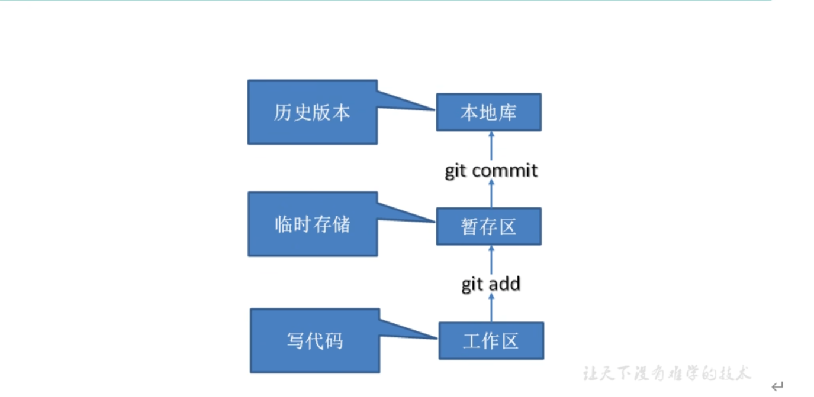

## 1.2 Git 和代码托管中心

> 代码托管中心是基于网络服务器的远程代码仓库，一般我们简单称为**远程库**。

* 从本地库->远程库
* 局域网托管中心：GitLab
* 互联网托管中心：GitHub、Gitee


# 2.Git常用命令

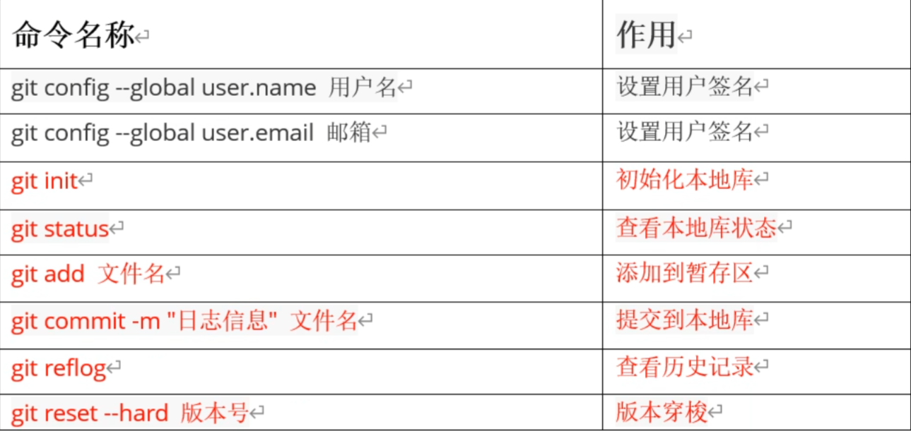

## 2.1设置用户签名

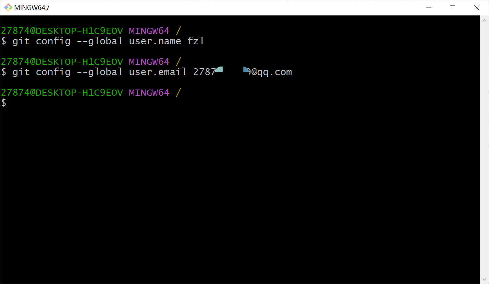

> 在C盘下的user中可以找到：里面包含了用户签名


* 签名的作用是区分不同操作者身份。用户的签名信息在每一个版本的提交信息中能够看到,以此确认本次提交是谁做的。Git 首次安装必须设置一下用户签名,否则无法提交代码。
* ※注意:这里设置用户签名和将来登录GitHub(或其他代码托管中心)的账号没有任何关系。


## 2.2初始化本地库

* 首先移动到当前的文件位置
* 初始化git仓库

```shell
git init
```


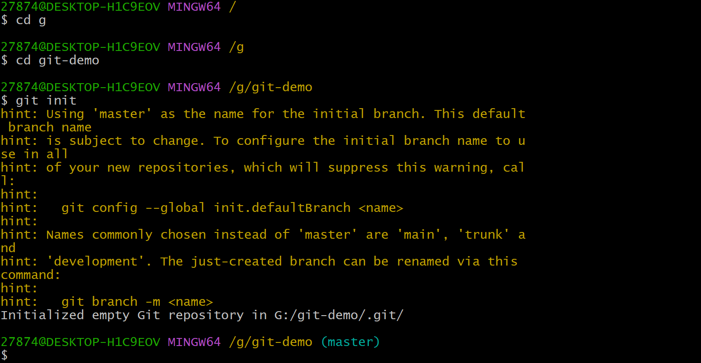

* 在当前文件夹可看到.git文件夹:


## 2.3查看本地库状态

```shell
git status
```


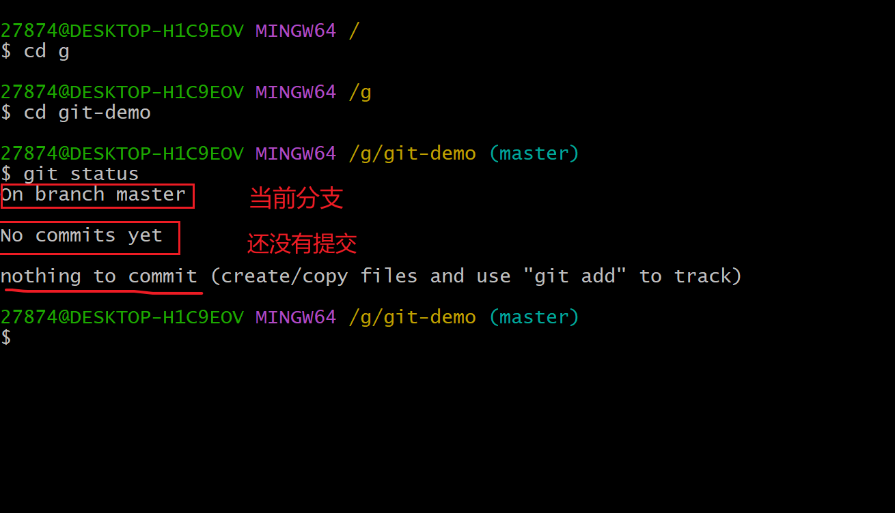

* 新增文件：

```shell
vim hello.txt
```

```shell'
HELLO world
```

* 退出插入模式

* ll命令查看当前文件夹下的文件

```shell
ll
```

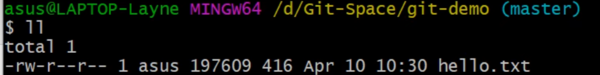

```
cat hello.txt
```

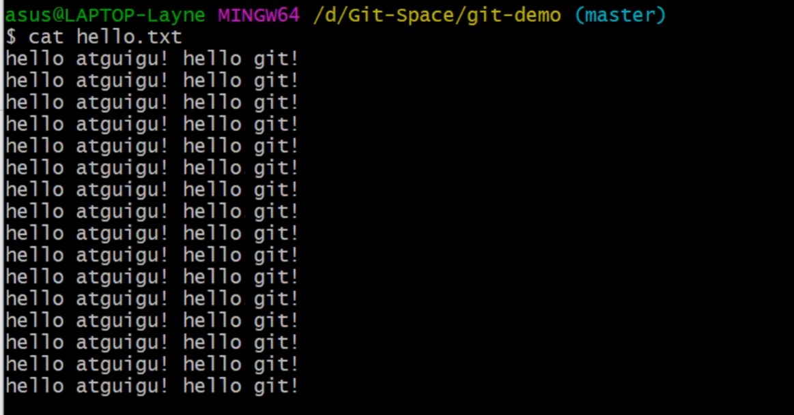


* #### 将文件添加暂存区

```shell
git add hello.txt
```

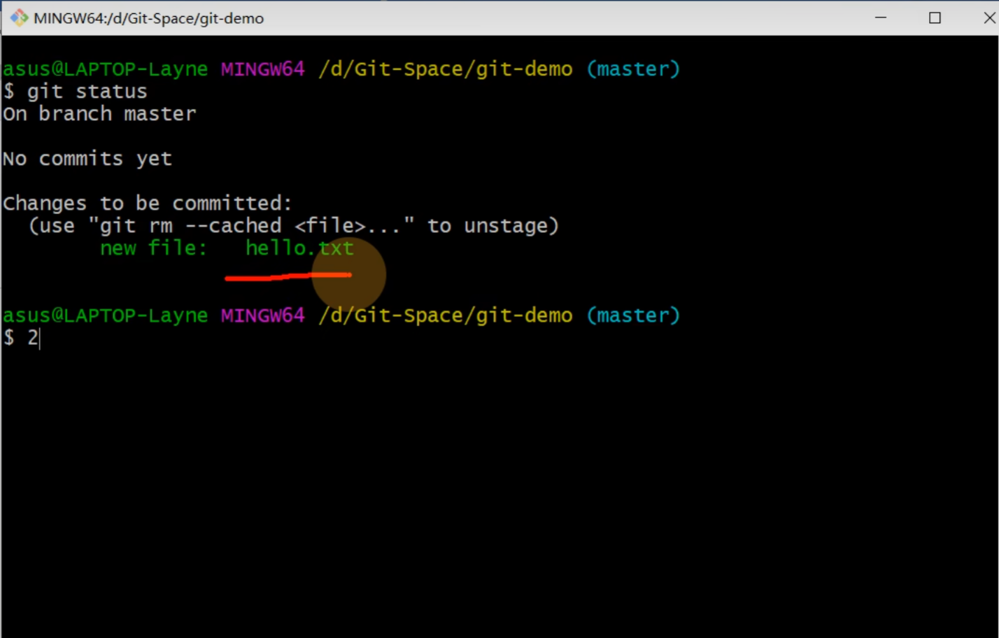

此时文件已经在暂存区内了。

* 如果要删除**暂存区内的文件**

```
git rm --cached hello.txt
```

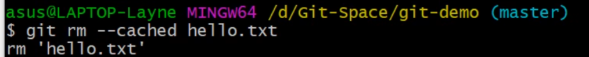

>注意，这里只是删除了暂存区内的文件，工作区依然存在


## 2.4提交本地库

```shell
git commit -m "日志信息" 文件名
```

* 例如：

```shell
git commit -m "first commit" hello.txt
```

* 查看日志信息：

```
git reflog
```

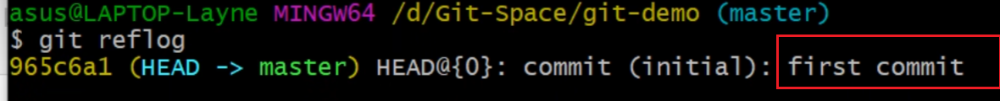

* 或者使用：

```shell
git log
```

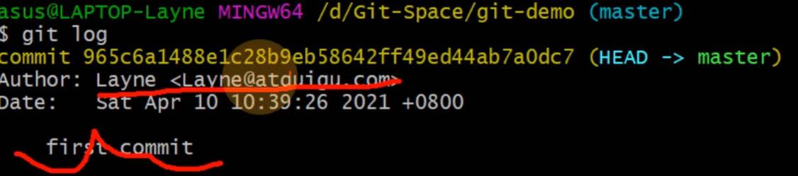


## 2.5修改文件

```shell
vim hello.txt
```

* 修改后查看本地库状态：

```shell
git status
```

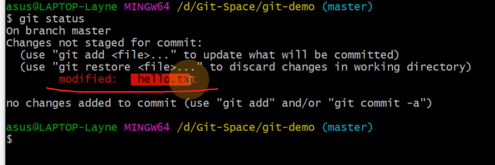

>
>
>红色的说明：修改过后的文件 还没有被添加到暂存区

* 再次添加到暂存区：

```shell
git add hello.txt
```

* 再次提交本地库：

```shell
git commit -m "second commit" hello.txt
```

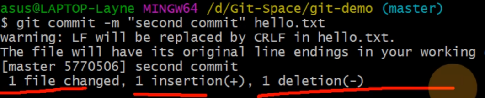

* 此时再查看版本信息：

```shell
git reflog
```

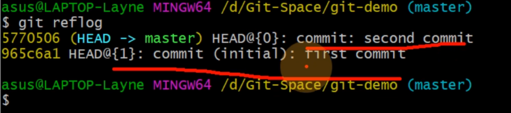

>
>可以看到两个版本信息，且指针Head 指向第二个版本，所以cat查找的是第二个版本


## 2.6历史版本

* 精简版：

```shell
git reflog
```

* 详细版：

```shell
git log
```


* 版本穿越

>
>
>将代码回到第二次修改中去：

```shell
git reflog
```


>查看到二号版本的版本号，将其复制下来

* 版本穿越

```shell
git reset --hard 5770506
```

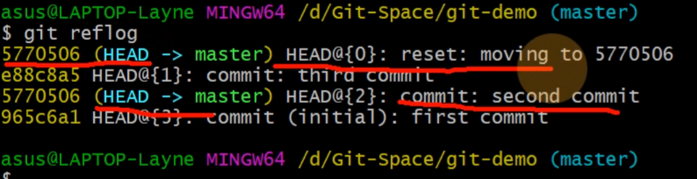

可以看到，指针已经移动到了二号版本的位置上了。

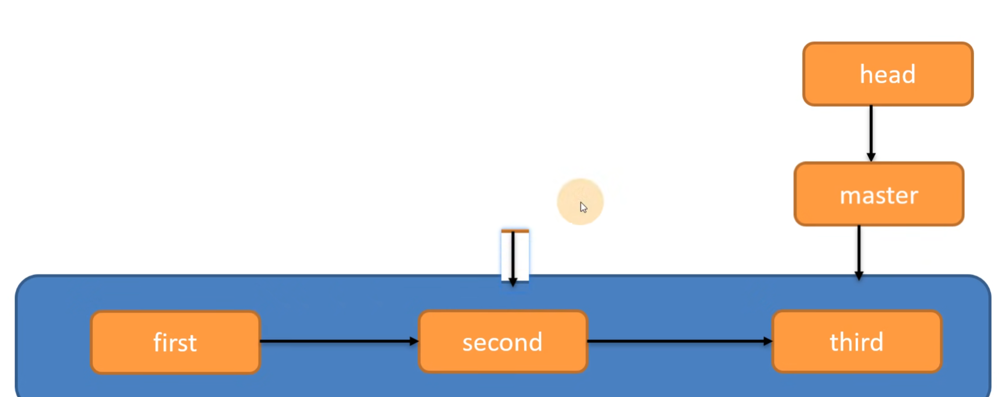


# 3.git分支操作

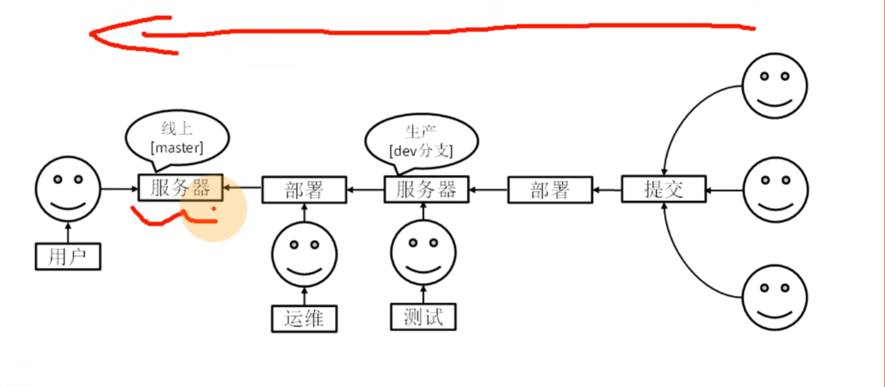

## 3.1分支定义：

>
>
>在版本控制过程中，同时推进多个任务，为每个任务，我们就可以创建每个任务的单独分支。使用分支意味着程序员可以把自己的工作从开发主线上分离开来，开发自己分支的时候，不会影响主线分支的运行。对于初学者而言，分支可以简单理解为副本，一个分支就是一个单独的副本。(分支底层其实也是指针的引用)

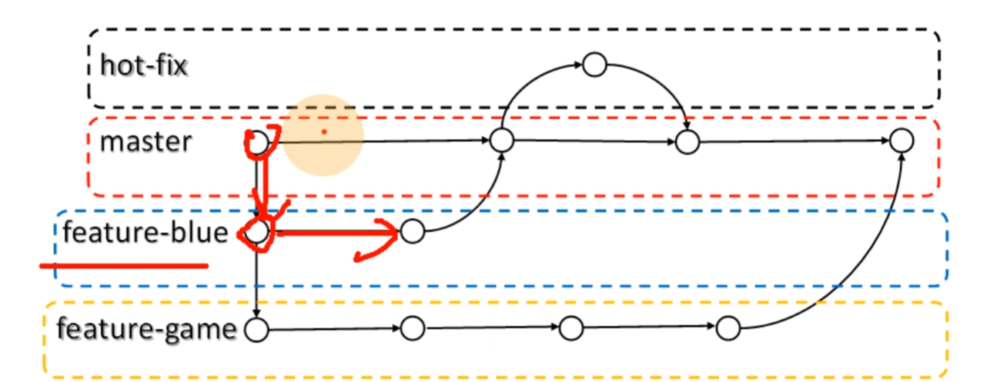


## 3.2分支操作

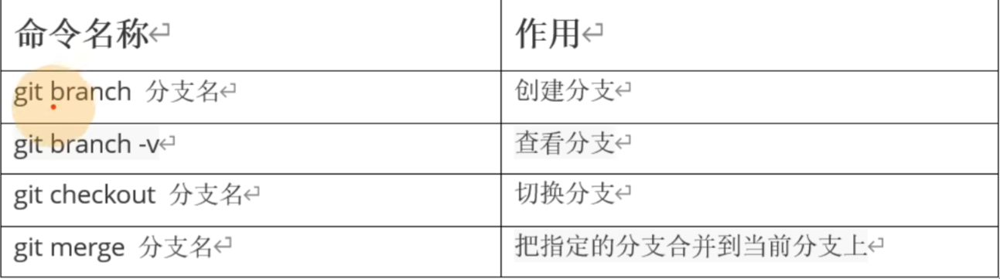

* 查看分支：

```shell
git branch -v
```

* 创建分支

```shell
git branch hot-fix
```

* 切换分支后，修改文件依然要保存暂存区以及commit

```
......
```

* 将当前分支合并回原来分支

```shell
git merge hot-fix
```

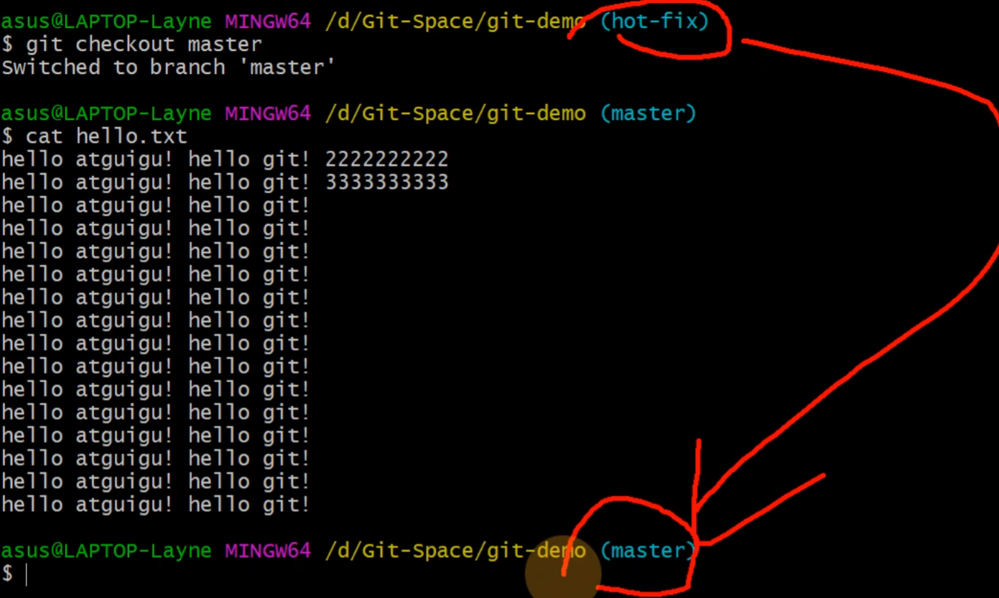

>
>
>这个是在master分支上执行的命令，即将hot-fix分支合并到master分支上


## 3.3合并冲突

>
>
>冲突产生的原因:
>合并分支时，两个分支在同一个文件的同一个位置有两套完全不同的修改。Git 无法替我们决定使用哪一个。必须人为决定新代码内容。

* 手动合并：

```
vim hello.txt
```

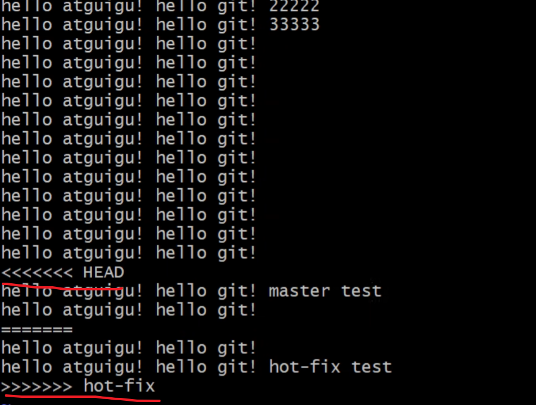

* 修改如下：

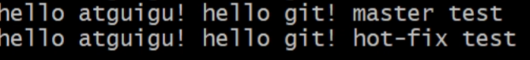

>
>
>删去不需要的部分即可(包括符号和HEAD),保存退出

* 接着git add hello.txt
* **然后再提交本地库时，不可以加文件名！**必须如下操作：

```
git commit -m "merge test"
```

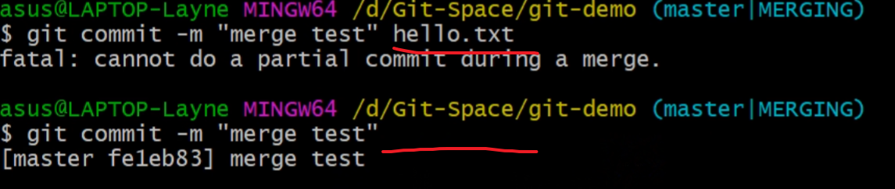


* 注意，合并后只会修改master分支的内容，在hot-fix下的内容并没有改变


## 3.4团队协作

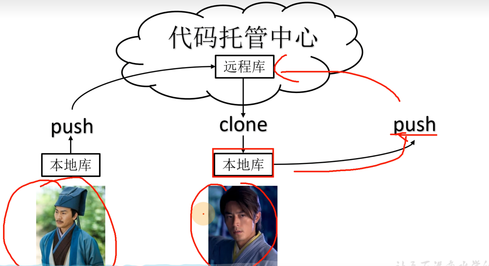


* 跨团队协作

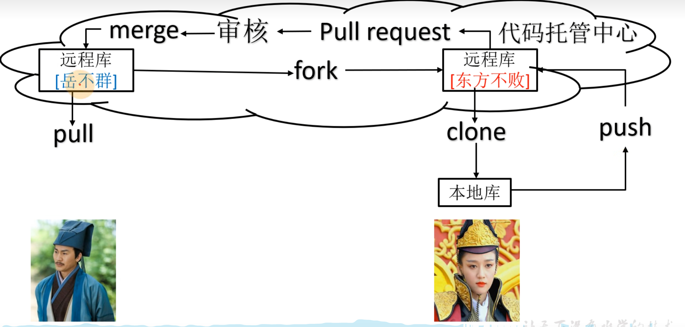


# 4.GitHub操作

## 4.1创建远程库以及别名

> 
>
> 自主创建完一个新仓库之后：

* 为仓库地址起一个别名git-demo，方便记忆：

```
git remote add git-demo https:.......git
```

* 查看别名

```shell
git remote -v
```

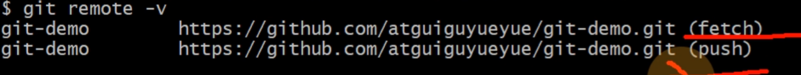

>别名既可以推送也可以拉取，所以这里有显示两个


## 4.2推送本地库到远程库(push)

```
git push git-demo master
```

>
>
>可能会因为网络原因失败


* 点击进入浏览器即可
* 查看状态：


可以看到，已经显示推送成功了

再进入GIThub中，本地库的代码就已经更新了：

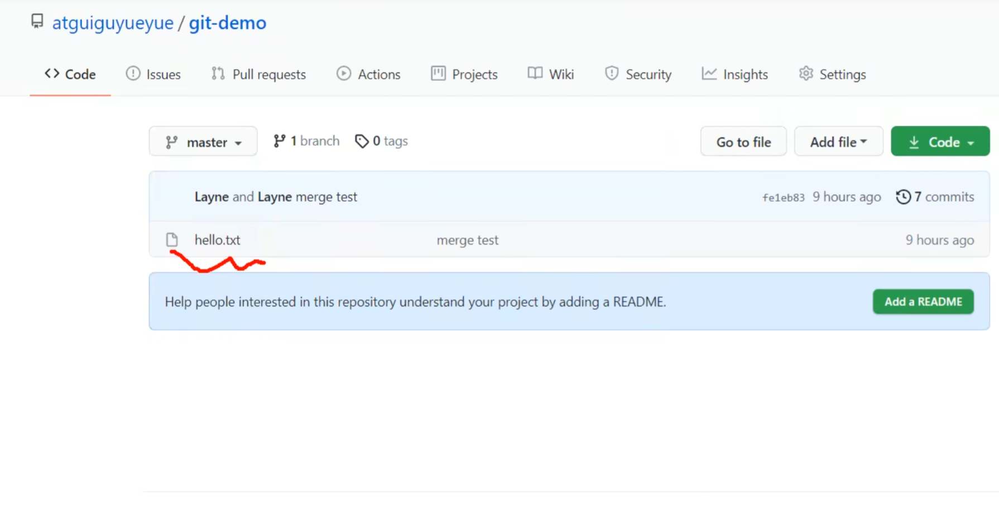

## 4.3拉取远程库到本地库（pull）

> 在github上修改代码后，发现远程库与本地库的代码内容没有同步，需要进行拉取操作

```shell
git pull git-demo master
```

* 将远程端的Master分支拉取回本地

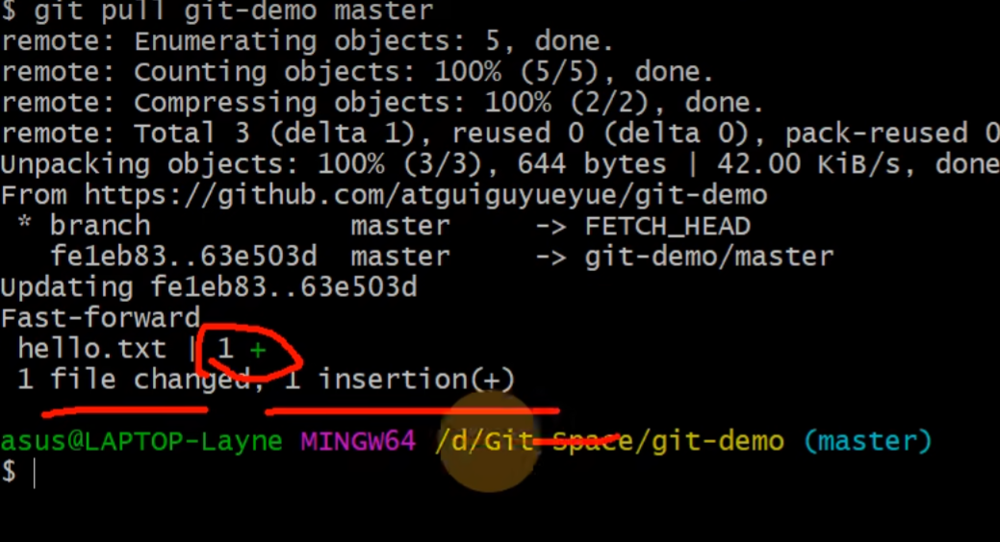


## 4.4克隆远程库到本地

```shell
git clone https://GITHUB代码地址
```

* 克隆代码是不需要登录账号的

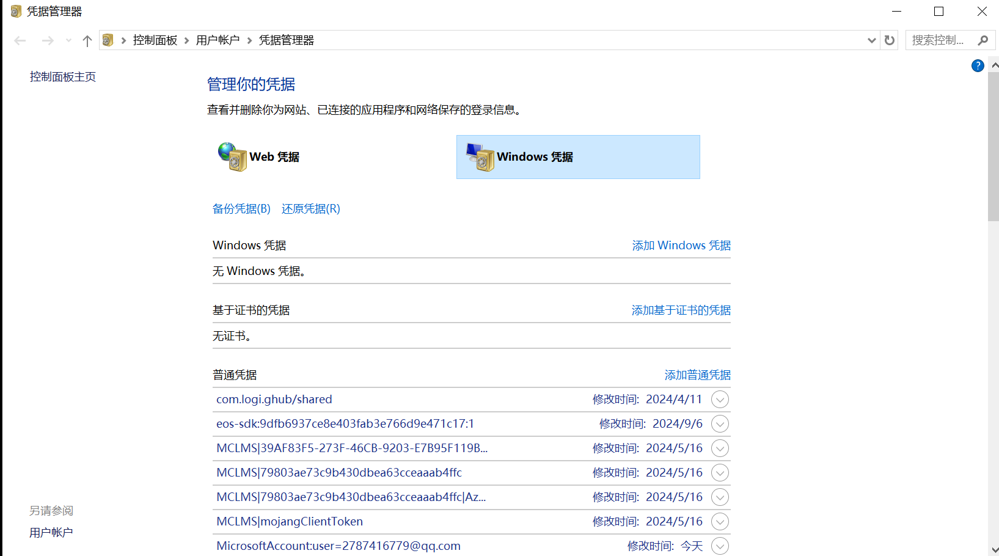


## 4.5团队内协作

* 在克隆下项目后，并且通过vim修改，保存暂存区以及commit操作后，**将新项目push到远程库中更新**

```shell
git push https:远程库链接 master
//master是分支
```

* 注意，推送push之前要先获取权限
* 加入团队获得权限

>使用主人的账号，在Github中邀请我们进入

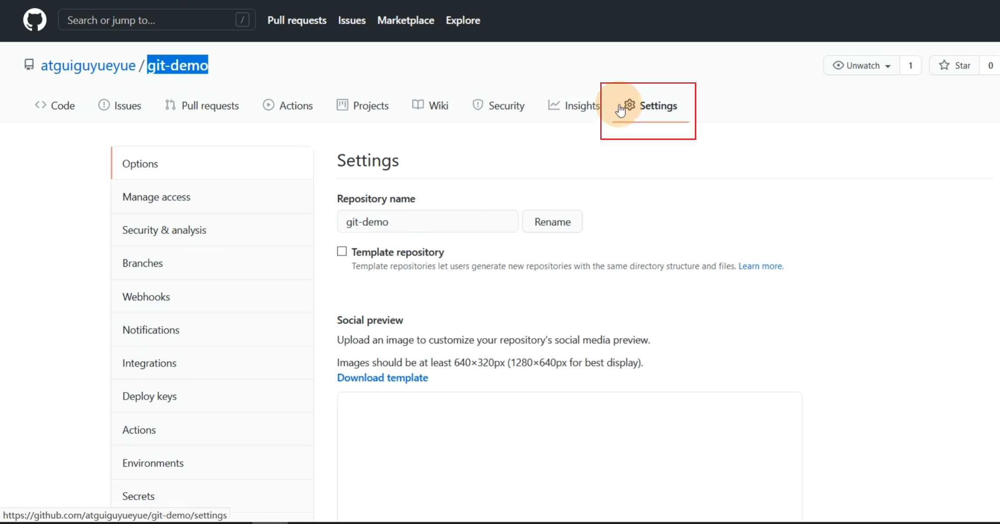

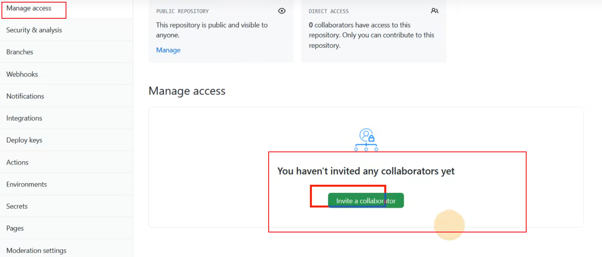

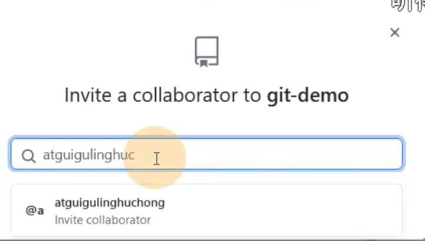

* 此时获得邀请函：

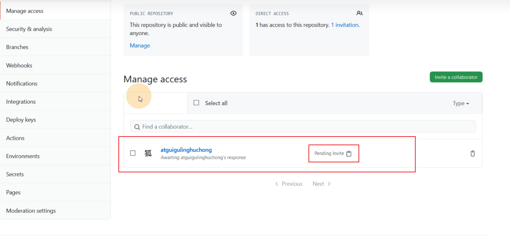

* 主人将这个链接地址发送给执行者

* 执行者登录自己的Github账号，在网页栏复制邀请函

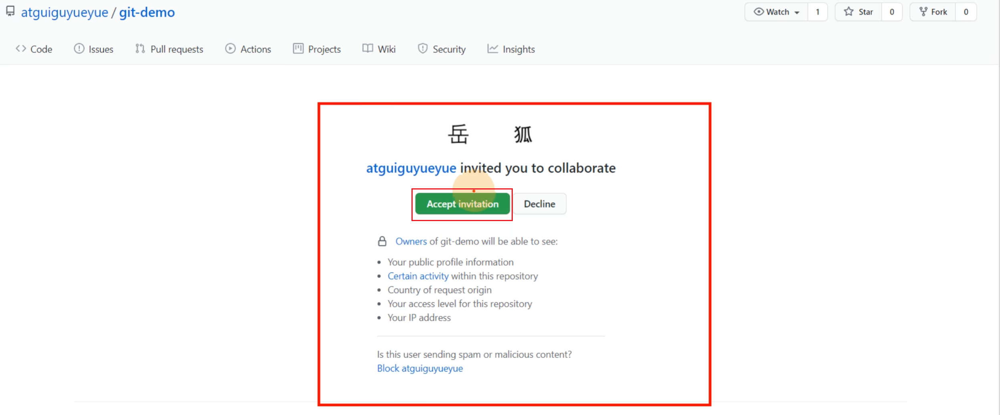

此时拥有权限，就可以进行代码的推送：

```
git push https:远程库链接 master
```


* 拉取对方的代码到本地库：

```shell
git pull git-demo master
//git-demo是别名 
```


## 4.6跨团队协作

* 在别人的项目中点击**Fork**

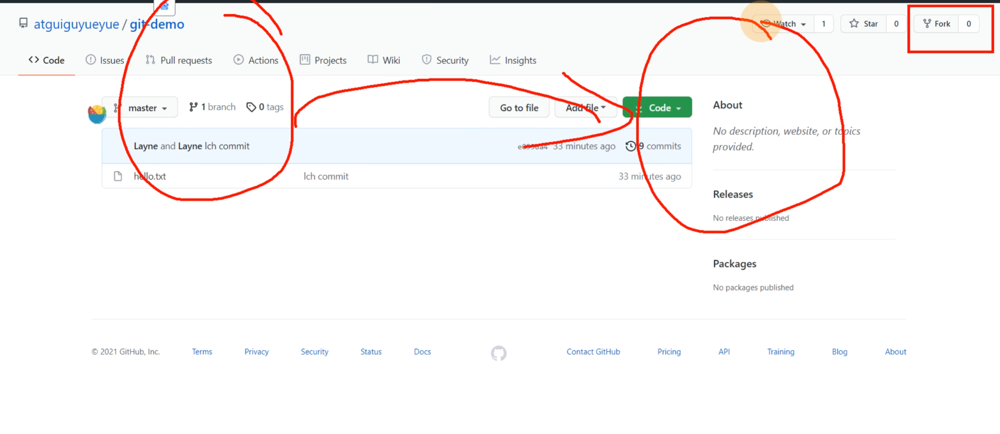

* 此时可以在线修改代码，或者也可以clone到本地库再提交

>
>
>注意，此时是在我的Fork下修改完成，在对方的原项目中并未修改

* 点击 Pull request 拉取请求

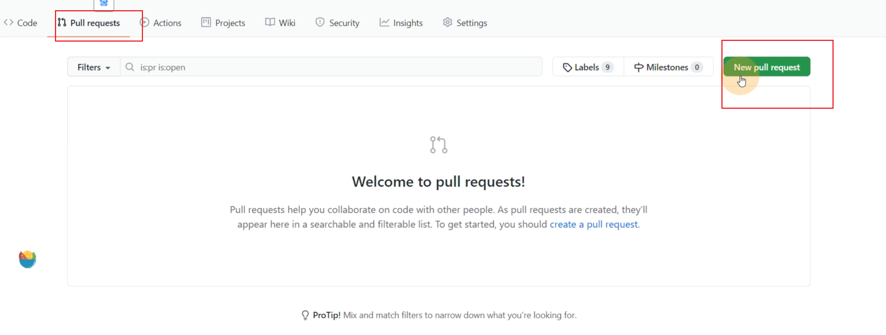

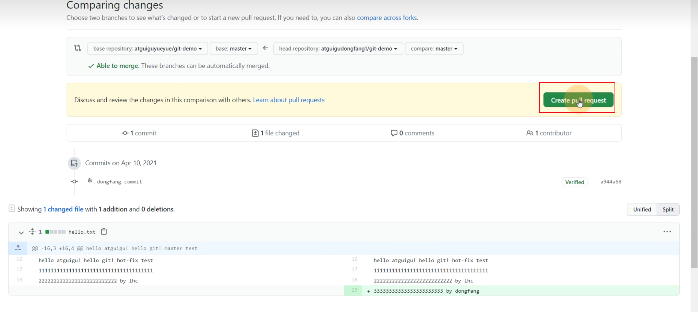


## 4.7SSH免密登录

* 打开gitbash，进入C盘下的用户盘中。

* 生成SSH公钥和私钥

```SHELL
$ ssh-keygen -t rsa -C 2787416779@qq.com
```

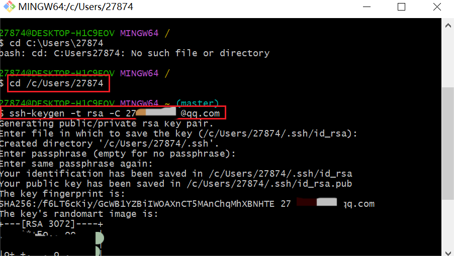

* 敲三下回车，即不使用密码登录验证


* 查看公钥：

```shell
进入 .ssh文件夹
cat id_rsa.pub
```

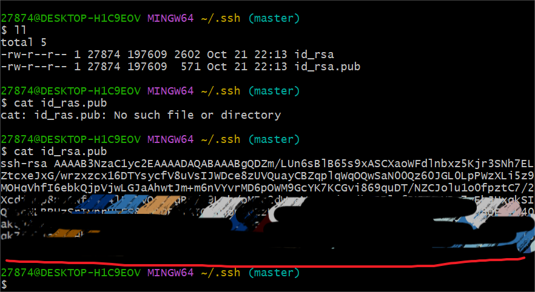

* 进入Github中的setting设置，点击SSH and GPG keys , 将复制的公钥粘贴一份

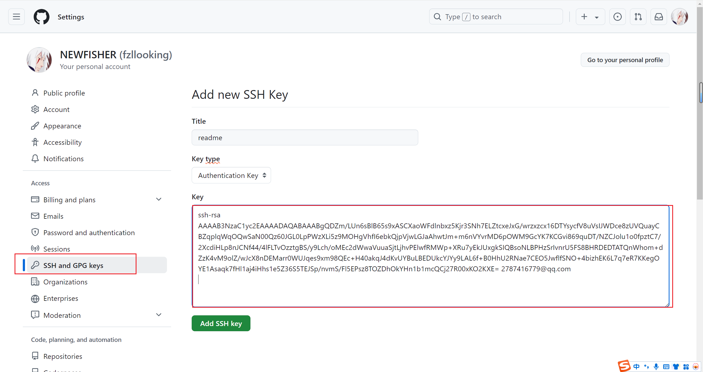

* 如图，此时已经添加成功

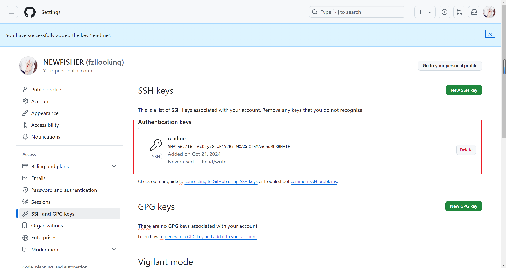

>
>
>这样每次提交就不需要验证身份了


## 4.8Markdown文档之图片push

>
>
>例如：在本地的**算法.md** 文档下通过
>
>1、“初始化本地库 **git init**” (在未创建.git文件夹的情况下)
>
>2、“将文件添加暂存区 **git add 算法.md** ”
>
>3、“提交本地库 **git commit -m "firtst commit for 算法" 算法.md** ”
>
>4、“在为新创建的远程仓库取**别名algorithm**后，使用push推送到远程库中”
>
>5、**git push algorithm master**
>
>此时已经将这个md文档提交到了github上，但是进入项目中发现，图片没有显示出来，此时需要使用相对路径记录图片的位置。（在typora中先设置成相对路径）
>
>6、例如：图片在相对路径：\typora图片\Leetcode算法，可以有： **git add typora图片/Leetcode算法/***
>
>(这里的*指的是使用通配																																						符添加该文件夹下的所有图片)
>
>7、使用 `git commit` 提交更改： **git commit -m "Add image files"** 
>
>8、使用 `git push` 将更改推送到 GitHub：**git push algorithm master**

